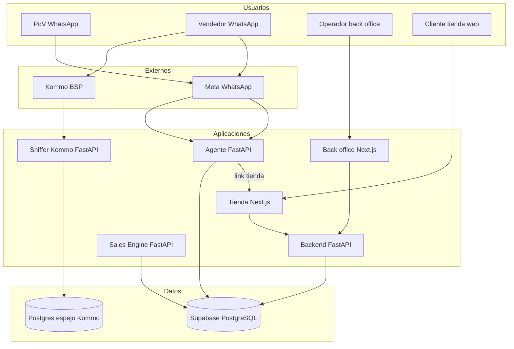

# Arquitectura Suplai Platform

## Visión general

Suplai Sales es un sistema multi-tenant para distribuidoras de consumo masivo. Un agente conversacional de WhatsApp atiende puntos de venta y vendedores; un back office configura catálogo y reglas; una tienda web complementa pedidos; un motor ML predice combos desde historial de compras; un sniffer analiza conversaciones reales de vendedores vía Kommo.

## Capas por repositorio

### Agente (`agent/`)

- Webhooks WhatsApp (Meta).
- Tenant por `agent_phone_number` → `public.distribuidoras.schema_name`.
- LangGraph: `llm → tools → llm`.
- Tools en schema tenant + `core`.
- Envía link fijo a tienda: `https://tienda.suplaisales.com/{schema}?wp={telefono}` (tool `get_catalog_link`, spec 026 post-pedido).

### Backend (`backend/`)

- API REST para back office, tienda y operaciones admin.
- Header tenant: `x-schema-name`.
- Migraciones SQL y snapshots en `docs/db-structure/`.
- Endpoints tienda: `/login-tienda`, `/{schema}/tienda/productos`, pedidos, promociones.

### Back office (`backoffice/`)

- Next.js: panel usuario (distribuidoras) y admin (implementadores).
- Proxy `app/api/*` al backend.
- OpenAPI local: `doc/openapi.json`.

### Tienda (`tienda/`)

- Catálogo mayorista B2B (Next.js, Vercel).
- URL pública por tenant: `tienda.suplaisales.com/{schema}?wp=...`
- Consume backend vía `lib/tienda-api.ts` (sin acceso directo a Supabase).
- Skill del repo: `.cursor/skills/suplai-tienda-api/SKILL.md`.

### Sales Engine (`sales-engine/`)

- FastAPI multi-tenant: recomienda combos por **co-ocurrencia** en pedidos.
- Entrena desde `{schema}.pedidos` + `items_pedido` (misma BD Supabase).
- Modelos persistidos: `{MODEL_DIR}/{schema_name}.pkl`.
- API: `POST /v1/tenants/{schema}/models/retrain`, `POST .../predict-combo`.
- Pedidos recientes (90 días) tienen peso extra en entrenamiento.

### Sniffer vendedores (`sniffer/`)

- FastAPI que recibe webhooks de **Kommo** (BSP WhatsApp de vendedores).
- Espejo en Postgres: `kommo_conversations`, `kommo_messages`.
- Objetivo: analizar tiempos de respuesta, cierre y estilo para mejorar entendimiento comercial.
- **Independiente** del agente Meta y del schema `core`; BD puede ser Postgres aparte.
- UI admin: `/admin/kommo/conversations`.

## Modelo de datos

### Supabase principal (agent, backend, tienda, sales-engine)

| Schema | Contenido típico |
|--------|------------------|
| `public` | `distribuidoras`, `tenant_secrets`, usuarios |
| `core` | `conversations`, `agent_turns`, memoria |
| `{tenant}` | productos, contactos, PDV, pedidos, tickets |

### Postgres sniffer (Kommo)

| Tabla | Contenido |
|-------|-----------|
| `kommo_accounts` | Cuentas Kommo detectadas |
| `kommo_conversations` | Un registro por `talk_id` |
| `kommo_messages` | Mensajes idempotentes |

## Despliegue

| Componente | Plataforma |
|------------|------------|
| Agente | Railway |
| Backend | Railway |
| Back office | Vercel |
| Tienda | Vercel |
| Sales Engine | Railway / Docker |
| Sniffer | Railway |
| n8n (automatización) | Railway (`n8n infra`: Primary + Worker + Postgres + Redis) |
| BD principal | Supabase |

## Documentación por repo

- Agente: `agent/docs/README.md`
- Backend: `backend/README.md`
- Back office: `backoffice/.cursor/rules/project-context.mdc`
- Tienda: `tienda/docs/specs/`
- Sales Engine: `sales-engine/docs/README.md`
- Sniffer: `sniffer/docs/arqui-kommo.md`
