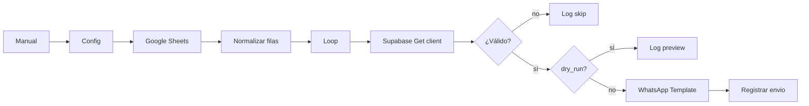

# Experimento del_corro — campaña Semana 23 (n8n manual)

**Alcance:** envío manual de plantillas WhatsApp personalizadas desde Google Sheets.  
**Fuera de alcance:** back office, agenda automática del backend, cambios en `agenda_sender.py`.

## Objetivo

El lunes (o el día previo configurado), contactar por WhatsApp a los PDV con **día de visita martes**, con un mensaje distinto por cliente según el Excel de Campi (párrafo + 3 productos sugeridos).

## Fuentes de datos

| Fuente | Uso |
|--------|-----|
| [Google Sheet](https://docs.google.com/spreadsheets/d/1pQV0uJmwhw3sX0idg9KjeIPXwhVCk2oihLITe8yZqU8/edit?gid=0#gid=0) | Personalización: `Cliente` (código ERP), `Razon_Social`, `Parrafo_Personalizado`, productos y códigos |
| Supabase `del_corro.clients` | Teléfono (`phone_number`), `dia_de_visita`, alta si falta el cliente |
| Meta WhatsApp | Envío de plantilla aprobada |

Columnas del sheet (fila 1):

- `Cliente`, `Razon_Social`, `Rubro`, `Parrafo_Personalizado`
- `Producto_1`, `Codigo_1`, `Producto_2`, `Codigo_2`, `Producto_3`, `Codigo_3`
- **Opcional (recomendada):** `Telefono` — solo si querés crear clientes que aún no están en BD

## Filtro por día de visita

En BD, `del_corro.clients.dia_de_visita` es enum (`lunes`, `martes`, `miercoles` / `miércoles`, …).

El workflow solo envía si:

1. El `Cliente` del sheet coincide con `clients.codigo`, y  
2. `LOWER(dia_de_visita::text)` = parámetro `dia_visita` (ej. `martes`).

Así el lunes podés correr con `dia_visita = martes` y solo salen los que visitás el martes.

## Plantilla Meta (obligatorio antes de enviar)

Las plantillas actuales de `del_corro` en `public.meta_plantillas` suelen tener solo variable `nombre`. Este experimento necesita **más variables** o un texto armado en Code.

Propuesta de plantilla nueva en Meta Business (nombre ejemplo: `campi_semana23_zona5`):

```text
Hola {{1}}!

{{2}}

Te sugerimos para tu góndola:
• {{3}} ({{4}})
• {{5}} ({{6}})
• {{7}} ({{8}})
```

| Variable | Origen |
|----------|--------|
| {{1}} | Primer nombre desde `Razon_Social` |
| {{2}} | `Parrafo_Personalizado` (truncado si supera límite Meta) |
| {{3}}–{{8}} | Producto y código 1..3 (si N/A → guión) |

Idioma sugerido: `es_AR` (igual que el backend).

**Importante:** la plantilla debe estar **aprobada** en Meta antes del envío masivo.

## Workflow n8n

Archivo importable:

`workflows/del_corro_campana_semana23_personalizada.json`

Nombre en n8n: `del_corro — campaña semana23 personalizada (manual)`

**ID en Railway (importado):** `9OI2Xx3k6aC3FiFQ` — [abrir en editor](https://primary-production-c1d08.up.railway.app/workflow/9OI2Xx3k6aC3FiFQ)

### Parámetros (nodo «Config»)

| Campo | Default | Descripción |
|-------|---------|-------------|
| `schema` | `del_corro` | Schema tenant |
| `dia_visita` | `martes` | Solo clientes con este día de visita |
| `spreadsheet_id` | (ID del sheet Campi) | |
| `sheet_name` | `Hoja 1` | Ajustar si cambia el nombre de la pestaña |
| `template_name` | `campi_semana23_zona5` | Nombre exacto en Meta |
| `language_code` | `es_AR` | |
| `dry_run` | `true` | `true` = no envía WhatsApp, solo arma filas de log |
| `crear_cliente_si_no_existe` | `false` | Si `true`, inserta en `clients` cuando hay `Telefono` en el sheet |

### Flujo (nodos)



### Credenciales en n8n

1. **Google Sheets** — OAuth con acceso al sheet (compartir el archivo con la cuenta del OAuth).
2. **Supabase** — URL + **service role** del proyecto `cvlbietibaaehgeimxgw`, schema `del_corro` en el nodo.
3. **WhatsApp Business Cloud** — mismas credenciales que usa `del_corro` (token + phone number ID del tenant).

No guardar tokens en el JSON del workflow; asignarlos en la UI de n8n.

## Uso operativo

1. Importar el JSON en n8n (Railway) o publicar con el script del repo.
2. Dejar el workflow **inactivo** (solo ejecución manual).
3. Primera corrida: `dry_run = true` → revisar salida del nodo «Log / preview».
4. Ajustar `template_name` y aprobación Meta.
5. Segunda corrida: `dry_run = false` para los PDV del día elegido.

### Calendario ejemplo

| Día | Acción | `dia_visita` |
|-----|--------|----------------|
| Lunes | Recordatorio visita del martes | `martes` |
| Martes | (otro sheet / otra plantilla) | `miercoles` |

## Relación con el backend (sin duplicar)

| Capacidad | Backend | Este workflow |
|-----------|---------|----------------|
| Sync precios/stock GEV | `erp_sync_service` + cron | No |
| Agenda recurrente + plantilla fija | `agenda_sender.py` | No (manual) |
| Pedido → ERP | `inject_order_to_erp` | No |
| Envío plantilla puntual experimento | No | Sí |

El backend sigue siendo la fuente de verdad para **agenda automática**; este flujo es **campaña manual** y no debe activarse en paralelo con una agenda n8n vieja para los mismos clientes el mismo día.

## Registro opcional

Si `dry_run = false`, el workflow inserta en:

- `del_corro.envios_plantillas` (session_id = teléfono)
- `del_corro.n8n_chat_histories` (mensaje tipo `ia` con texto renderizado)

Alineado con lo que hace `agenda_sender.py` para trazabilidad en el panel.

## Riesgos

- **Plantilla no aprobada** → error 400 de Meta en lote.
- **Cliente sin teléfono en BD** → skip (salvo columna `Telefono` + `crear_cliente_si_no_existe`).
- **Código ERP no coincide** → skip con motivo en log.
- **Límite de longitud** en variables Meta → el Code trunca párrafo y nombres de producto.

## Checklist antes de producción

- [ ] Plantilla `campi_semana23_zona5` (o nombre elegido) aprobada en Meta
- [ ] Sheet compartido con cuenta Google del credential n8n
- [ ] Credenciales Supabase + WhatsApp en n8n
- [ ] `dry_run` probado con 3–5 códigos conocidos
- [ ] Confirmar que no hay agenda automática n8n/backend el mismo día para los mismos PDV
