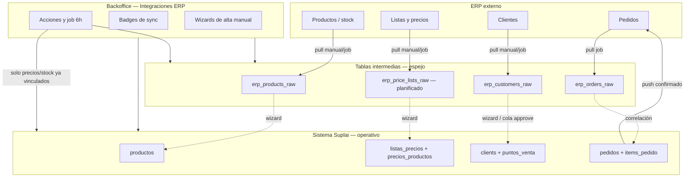

# Integraciones ERP — Funcionamiento esperado y roadmap de features

**Estado:** Documento de producto (referencia)  
**Fecha:** 2026-07-03  
**Audiencia:** Producto, implementación, operaciones  
**Prerequisito técnico:** [../specs/021-erp-aislamiento-conectores-decontaminacion.md](../specs/021-erp-aislamiento-conectores-decontaminacion.md)  
**Complementa:** [inventario-features-casos-negocio.md](./inventario-features-casos-negocio.md) (caso A — supervisor / backoffice)

---

## 1) Modelo mental

Suplai no reemplaza al ERP. Opera como **capa comercial** (agente, tienda, field) con un **espejo controlado** de datos maestros y un **puente de pedidos**. Toda integración sigue el mismo patrón de cuatro capas:

### 1.1 Regla rectora (no negociable)

> **Ningún job automático crea productos, clientes ni listas de precios en Suplai.**  
> La promoción ERP → Suplai es siempre **humana** vía Integraciones ERP (wizard o cola de approve).  
> Los jobs automáticos solo **actualizan** entidades ya vinculadas (precios, stock, espejo staging).

Excepciones históricas a corregir (estado actual):

- Sync de precios **crea listas** `ERP_*` automáticamente → **eliminar** post spec 021.
- Botón “Cargar clientes” **crea clientes** con teléfono → **deprecar** a favor de cola + approve.

---

## 2) Entidades y flujos esperados

### 2.1 Productos

| Capa | Tabla / UI | Clave de vínculo | Comportamiento esperado |
|------|------------|------------------|-------------------------|
| ERP | Catálogo externo | SKU / código artículo | Fuente de verdad de código |
| Espejo | `erp_products_raw` | `sku` | Pull manual (“Cargar productos”) + refresh periódico del espejo |
| Suplai | `productos` | `product_code` | Solo altas vía wizard o carga manual backoffice |
| UI catálogo | Sección Productos | `product_code == sku` | Badge **ERP** si vinculado; sin badge si solo Suplai |
| UI integraciones | Tabla productos crudos | diff vs `productos` | Columnas: en Suplai / solo ERP / sync |

**Flujo esperado**

1. Operador ejecuta **Cargar productos** → actualiza espejo.
2. En espejo, filtra “solo en ERP”.
3. **Wizard nuevo producto** prellena desde fila seleccionada (SKU, nombre, stock inicial opcional).
4. Job 6h: actualiza **stock** en `productos` solo para SKUs ya existentes; refresca filas del espejo.

**Estado actual (2026-07-03)**

| Feature | Estado |
|---------|--------|
| Espejo `erp_products_raw` | ✅ |
| Badge ERP en productos | ✅ (por presencia en espejo) |
| Eliminar producto Suplai | ✅ |
| Wizard alta desde espejo | ❌ |
| Diff solo ERP / solo Suplai en UI espejo | ❌ |
| Refresh espejo en job 6h | ❌ (solo manual) |

---

### 2.2 Listas de precios y precios

| Capa | Tabla / UI | Clave de vínculo | Comportamiento esperado |
|------|------------|------------------|-------------------------|
| ERP | Listas del distribuidor | `erp_list_id` (ID nativo) | Fuente de verdad del identificador |
| Espejo | `erp_price_lists_raw` *(planificado)* | `erp_list_id` | Pull manual + refresh job |
| Suplai | `listas_precios` | `erp_list_id` + `erp_connector` | Alta vía wizard con ID ERP |
| Precios | `precios_productos` | `(product_code, lista_precios_id)` | Job actualiza solo pares vinculados |
| UI | Administrar Listas de Precios | `erp_list_id` | Badge **ERP** si vinculada |

**Flujo esperado**

1. **Cargar listas ERP** → espejo con cabeceras (id, nombre, activa).
2. Operador crea lista en Suplai con wizard **desde espejo** o vincula lista existente ingresando `erp_list_id`.
3. Job 6h trae detalle de precios del ERP y hace upsert en `precios_productos` **solo** para:
   - productos que existen en `productos`, y
   - listas que tienen `erp_list_id` poblado.

**Estado actual**

| Feature | Estado |
|---------|--------|
| Sync precios desde ERP | ✅ (Odoo pricelist items; GEV detalle + IVA) |
| Tabla espejo listas | ❌ |
| UI espejo listas en Integraciones | ❌ |
| Badge ERP en Administrar Listas | ❌ |
| Wizard lista con `erp_list_id` | ❌ |
| Vínculo por ID (no por nombre `ERP_*`) | ❌ (hoy por nombre; auto-create) |
| Job respeta regla rectora (no auto-create listas) | ❌ |

---

### 2.3 Clientes

| Capa | Tabla / UI | Clave de vínculo | Comportamiento esperado |
|------|------------|------------------|-------------------------|
| ERP | Partners / cuentas | `erp_partner_id` | Fuente de verdad del ID |
| Espejo | `erp_customers_raw` | `erp_partner_id` | Pull manual + refresh |
| Suplai | `clients` (+ `puntos_venta`) | `partner_erp_id`, teléfono | Alta vía cola approve o wizard |
| UI clientes | Sección Clientes | match por ID o teléfono | Badge **ERP** / **Sin ERP** |
| Cola | `erp_customer_onboarding_queue` | partners sin match | Detect + approve humano |

**Flujo esperado**

1. Sync pedidos ERP detecta partners comprando sin fila en `clients` → **encola** (no inserta).
2. Operador revisa cola → **Approve** (con propuesta de teléfono si falta) o **Link** a cliente existente.
3. Export CSV sigue disponible para análisis offline; no reemplaza la cola.
4. Job 6h refresca espejo clientes; **no** crea filas en `clients`.

**Teléfono inventado (Odoo y similares)**

- Solo como **opción en el modal de approve**, propuesta por el conector.
- Nunca silencioso en sync.
- Cliente con teléfono sintético lleva badge distintivo en UI (ej. “Tel. ERP”).

**Estado actual**

| Feature | Estado |
|---------|--------|
| Espejo `erp_customers_raw` | ✅ (Odoo) |
| Cola onboarding + approve/link/dismiss | ✅ |
| Badge ERP / Sin ERP en clientes | ✅ |
| Export CSV con match | ✅ |
| Teléfono sintético bajo control operador | ❌ (hardcodeado en sync) |
| Wizard alta desde espejo (fuera de cola) | ❌ |
| Deprecar “Cargar clientes” auto-create | ❌ |
| GEV pull clientes | ❌ (conector retorna vacío) |
| Refresh espejo clientes en job 6h | ❌ |

---

### 2.4 Pedidos

| Capa | Tabla / UI | Clave de vínculo | Comportamiento esperado |
|------|------------|------------------|-------------------------|
| Suplai | `pedidos` | `id` | Origen comercial (agente, tienda, field) |
| Push ERP | `inject_order_to_erp` | `SUPPLAI-{id}` → `erp_reference_id` | Al confirmar, si push activo |
| Espejo | `erp_orders_raw` | `erp_order_id` | Pull incremental job 6h |
| UI pedidos | Backoffice + Field | `erp_reference_id`, estado | Badge **Enviado ERP** |

**Flujo esperado**

1. Pedido confirmado → pipeline push (si capability + toggle ON).
2. ERP devuelve referencia → `pedidos.estado = enviado_erp`, `erp_reference_id` poblado.
3. Job trae pedidos ERP (incl. externos) → espejo; correlaciona `suplai_pedido_id` vía `client_order_ref`.
4. UI muestra badge unificado; export CSV legacy (`exportado`) convive hasta deprecación explícita.

**Estado actual**

| Feature | Estado |
|---------|--------|
| Push Odoo (sale.order) | ✅ |
| Push GEV | ⏸ Pausado (mock) |
| Espejo `erp_orders_raw` + UI | ✅ |
| Cola fallback push | ✅ |
| Badge enviado ERP en field-app | ✅ |
| Badge enviado ERP en backoffice pedidos | ⚠️ Parcial (estado `exportado` manual vs `enviado_erp`) |
| Push aislado por conector + capability | ❌ (spec 021) |

---

### 2.5 Sync periódico (job ~6h)

**Comportamiento esperado del job**

| Paso | Acción | Tablas tocadas | ¿Crea entidades Suplai? |
|------|--------|----------------|-------------------------|
| 1 | Cola push pedidos pendientes | `pedidos` | No |
| 2 | Sync precios | `precios_productos` | **No** (solo listas con `erp_list_id`) |
| 3 | Sync stock | `productos.stock` | No |
| 4 | Refresh espejo productos | `erp_products_raw` | No |
| 5 | Refresh espejo listas | `erp_price_lists_raw` | No |
| 6 | Pull pedidos ERP | `erp_orders_raw` | No |
| 7 | Detect partners → cola clientes | `erp_customer_onboarding_queue` | No (solo encola) |
| 8 | Refresh espejo clientes | `erp_customers_raw` | No |

**Estado actual del job**

| Paso | Estado |
|------|--------|
| 1 Cola push | ✅ |
| 2 Precios | ✅ pero **crea listas** (viola regla) |
| 3 Stock | ✅ |
| 4–5 Refresh espejo productos/listas | ❌ |
| 6 Pull pedidos | ✅ (Odoo) |
| 7 Detect cola clientes | ✅ (post pull pedidos) |
| 8 Refresh espejo clientes | ❌ |

---

## 3) Matriz por conector (capacidades objetivo)

Post spec 021, cada conector declara capabilities en perfil. Estado **objetivo** vs **hoy**:

| Capability | Odoo | GEV | custom_rest |
|------------|------|-----|-------------|
| Pull productos → espejo | ✅ | ✅ | Según API |
| Pull precios | ✅ | ✅ (+ IVA 21%) | Según API |
| Pull clientes → espejo | ✅ | ❌ | Según API |
| Pull pedidos → espejo | ✅ | ❌ | Según API |
| Push pedidos | ✅ | ⏸ Reactivar | Según API |
| Cola onboarding clientes | ✅ | ❌ | Según API |
| Teléfono sintético (solo UI) | ✅ | ❌ | Configurable |
| Convención listas `ERP_{id}` | ✅ id/nombre | ✅ id numérico | Configurable |

---

## 4) Módulos de UI — Integraciones ERP (target)

| Módulo | Descripción | Estado |
|--------|-------------|--------|
| **Conexión** | Elegir conector, credenciales, frecuencia sync | ✅ |
| **Capabilities** | Mostrar qué soporta el conector conectado (read-only) | ❌ |
| **Acciones manuales** | Cargar productos/clientes/listas; sync precios/stock | ⚠️ Parcial (sin listas) |
| **Productos crudos** | Tabla espejo + diff + wizard alta | ⚠️ Tabla sin wizard/diff |
| **Listas crudas** | Tabla espejo + wizard alta | ❌ |
| **Clientes crudos / cola** | Cola approve + export CSV | ✅ cola; ❌ espejo UI dedicada |
| **Pedidos espejo** | Filtros origen/estado | ✅ |
| **Push pedidos** | Toggle por capability | ⚠️ Toggle global |

---

## 5) Badges y estados visibles (target)

| Entidad | Condición | Badge |
|---------|-----------|-------|
| Producto | `product_code` existe en espejo y en `productos` | **ERP** (verde) |
| Producto | Solo en Suplai | *(ninguno)* |
| Lista precios | `erp_list_id` poblado | **ERP** |
| Cliente | `partner_erp_id` o `erp_sync_status = linked` | **ERP** |
| Cliente | `erp_sync_status = not_in_erp` | **Sin ERP** (ámbar) |
| Cliente | Teléfono sintético confirmado | **Tel. ERP** (sub-badge) |
| Pedido | `estado = enviado_erp` + `erp_reference_id` | **Enviado ERP** |
| Pedido | Sin push | *(ninguno)* |

---

## 6) Roadmap de implementación (post decontaminación)

Orden recomendado **después** de mergear spec 021:

| # | Epic | Entregables | Repos |
|---|------|-------------|-------|
| **R1** | Listas de precios ERP | Migración `erp_list_id` en `listas_precios`; tabla `erp_price_lists_raw`; UI espejo + wizard; sync sin auto-create | backend, backoffice |
| **R2** | Productos — cierre loop | Diff en espejo; wizard prefill desde fila; refresh espejo en job | backend, backoffice |
| **R3** | Clientes — higiene | Deprecar load-customers auto-create; UI espejo; teléfono propuesto en approve (021); badge Tel. ERP | backend, backoffice |
| **R4** | Pedidos — UX unificada | Badge `enviado_erp` en backoffice; documentar convivencia con export CSV legacy | backoffice |
| **R5** | Job 6h completo | Pasos 4–5–8 del §2.5; métricas por tenant en logs | backend |
| **R6** | GEV fase 3 | Reactivar push real; evaluar pull clientes si API lo expone | backend, test-api-gev |

---

## 7) Criterios de “integración ERP madura” por tenant

Checklist operativo para dar por cerrada la integración de un distribuidor:

- [ ] Conector configurado; capabilities visibles en UI
- [ ] Productos operativos vinculados por SKU (espejo ↔ catálogo)
- [ ] Listas de precios vinculadas por `erp_list_id`
- [ ] Clientes activos en agente/field vinculados (cola vacía o justificada)
- [ ] Push pedidos probado en sandbox + toggle ON en prod
- [ ] Job 6h actualiza precios/stock sin crear entidades
- [ ] Operadores capacitados en wizards (no CSV manual como camino principal)

---

## 8) Referencias

| Documento | Ubicación |
|-----------|-----------|
| Spec decontaminación | `platform/docs/specs/021-erp-aislamiento-conectores-decontaminacion.md` |
| Engine ERP original | `backend/docs/specs/005-erp-integration-engine.md` |
| Inyección pedidos | `backend/docs/specs/012-inyeccion-pedidos-erp.md` |
| Cola clientes Odoo | `platform/docs/specs/015-odoo-clientes-nuevos-deteccion-cola-alta.md` |
| Tablas intermedias (IT ERP) | `backend/docs/erp-requisitos-tablas-intermedias.md` |
| Onboarding BenFresh | `platform/implementacion/benfresh/README.md` |
