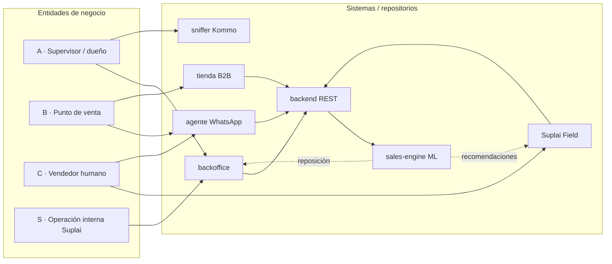

# Inventario de Features por Caso de Negocio — Suplai Sales

> Documento maestro que ordena las capacidades técnicas del ecosistema Suplai Sales
> en una jerarquía de negocio: **Entidad → Caso de negocio → Sistemas conectados → Features técnicas**.
>
> Fuente: relevamiento exhaustivo (multi-agente) de los 7 repositorios productivos.
> Última actualización del relevamiento: 2026-07-02.
> Objetivo: cobertura completa de features (otra IA se encarga de la presentación comercial).

---

## 1. Modelo mental

Suplai Sales es una **plataforma B2B multi-tenant para distribuidoras mayoristas**. Tres entidades
interactúan con la plataforma; una cuarta (interna) opera y mantiene el servicio.

| Código | Entidad | Quién es | Pregunta que responde |
|--------|---------|----------|-----------------------|
| **A** | Supervisor de ventas / dueño de la distribuidora | Cliente que contrata Suplai | "¿Cómo superviso, configuro y hago crecer mi operación comercial?" |
| **B** | Punto de venta (PdV) / cliente de la distribuidora | El comercio que compra al mayorista | "¿Cómo hago mi pedido rápido y bien?" |
| **C** | Vendedor humano de la distribuidora | Fuerza de ventas en calle | "¿Cómo cargo pedidos y vendo más con menos fricción?" |
| **S** | Operación interna Suplai | Staff Suplai | "¿Cómo implemento, opero y diagnostico cada tenant?" |

**Caso de negocio**: agrupación de features que resuelven un objetivo comercial concreto para una
entidad. Una misma feature técnica puede aparecer en varios casos de negocio y servir a más de una
entidad (ej. las promociones las configura **A**, las ve el **B** y las usa el **C**). Cuando eso
pasa se anota con la etiqueta `[también X]`.

**Sistemas / repositorios** que implementan las features:

| Repo (carpeta) | Rol | Acceso a BD |
|----------------|-----|-------------|
| `agente-conversacional-multi_tenant` (agente) | Agente WhatsApp multi-tenant (LangGraph) | Directo a Postgres/Supabase |
| `backend-supabase` (backend) | API REST multi-tenant; fuente de migraciones | Directo (asyncpg) |
| `product-management-app` (backoffice) | Back office Next.js del supervisor | Solo vía backend (proxy) |
| `wholesale-catalog-app` (tienda) | Catálogo web B2B / tienda virtual | Solo vía backend |
| `field-app` (field) | Suplai Field — app mobile del vendedor | Solo vía backend |
| `sniffer-vendedores` (sniffer) | Espejo Kommo — análisis de conversaciones de vendedores | Postgres propio |
| `sales-engine` (sales-engine) | ML de co-ocurrencia y frecuencia de compra | Lee `{tenant}.pedidos` / `items_pedido` |

---

## 2. Mapa entidad ↔ sistemas

Lectura rápida:

- **A** vive sobre todo en el **backoffice** (y consume analítica del sniffer).
- **B** interactúa con el **agente** y la **tienda**.
- **C** usa **Suplai Field** y el **agente** (canal vendedor).
- Todo pasa por el **backend REST**; el **sales-engine** alimenta recomendaciones a Field y al mapa del backoffice.

---

## 3. Índice de casos de negocio

**Entidad A — Supervisor / dueño**
- A1 · Copiloto comercial / inteligencia de negocio
- A2 · Supervisión de la red comercial (Field)
- A3 · Gestión de catálogo y pricing
- A4 · Estrategia comercial y campañas WhatsApp
- A5 · Territorio e inteligencia geográfica
- A6 · Gestión de clientes / PdV
- A7 · Operación de pedidos y fulfillment
- A8 · Integración ERP
- A9 · Monitoreo del agente y conversaciones
- A10 · Insights / tickets IA
- A11 · Configuración del agente y del tenant

**Entidad B — Punto de venta / cliente**
- B1 · Compra conversacional por WhatsApp
- B2 · Tienda virtual B2B self-service
- B3 · Promociones y precios personalizados
- B4 · Recomendaciones y aumento de ticket
- B5 · Onboarding y autogestión del cliente
- B6 · Fulfillment B2C
- B7 · Soporte, campañas y retención

**Entidad C — Vendedor humano**
- C1 · Automatización de carga de pedidos al ERP
- C2 · Suplai Field — jornada gamificada
- C3 · Inteligencia comercial de cartera
- C4 · Asistente vendedor por WhatsApp / omnicanal
- C5 · Gestión de clientes del vendedor
- C6 · Análisis de conversaciones del vendedor (coaching)

**Entidad S — Operación interna Suplai**
- S1 · Gestión de implementaciones / onboarding
- S2 · Administración multi-tenant
- S3 · Diagnóstico y calidad

Convención de cada feature: `**Nombre** — descripción. Sistema: repo. Evidencia: path`.

---

# Entidad A — Supervisor de ventas / dueño de la distribuidora

El actor principal del **backoffice** (`product-management-app`). Casi todas sus features consumen el
backend vía proxy `app/api/*`. Es quien configura la plataforma, supervisa a los vendedores y a los
clientes, y toma decisiones comerciales.

## A1 · Copiloto comercial / inteligencia de negocio

Asistente de IA conversacional del backoffice para analítica comercial en lenguaje natural.
Solo si `metadata.copilot_enabled`. Sistemas: backoffice, backend `copilot`.

- **Chat analítico en lenguaje natural** — preguntas de ventas/clientes/territorio con respuestas verificadas por tools; streaming SSE. Sistema: backoffice / backend. Evidencia: `components/copilot/CopilotPanel.tsx`, `lib/copilot/stream-client.ts`, backend `routers/copilot.py` (`POST /{schema}/copilot/chat`), `services/copilot/orchestrator.py`.
- **Thought stream (pasos de progreso)** — SSE determinístico "consultando datos…" antes de la respuesta. Sistema: backend. Evidencia: spec 014.
- **Follow-ups sugeridos (chips)** — 2–4 preguntas contextuales post-respuesta. Sistema: backoffice. Evidencia: spec 014 §2.
- **Top productos vendidos** — ranking por cantidad UMV, monto o pedidos distintos. Sistema: backend. Evidencia: `services/copilot/tools.py`, `GET /{schema}/copilot/metrics/top-productos`.
- **Mayor pedido del periodo** — cliente y monto del pedido más alto. Sistema: backend. Evidencia: `services/copilot/tools.py`.
- **Resumen desempeño del agente WhatsApp** — conversaciones, carritos, pedidos confirmados del bot. Sistema: backend. Evidencia: `services/copilot/tools.py`.
- **Comparación de periodos** — este mes vs anterior con % variación. Sistema: backend. Evidencia: `services/copilot/tools.py`.
- **Serie temporal de ventas** — evolución diaria/semanal/mensual. Sistema: backend. Evidencia: `services/copilot/tools.py`.
- **Ritmo de ventas por día de semana** — tool `sales_by_day_of_week`, desglose por vendedor. Sistema: backend. Evidencia: spec 014.
- **Mapa embebido en el chat** — GeoJSON de clientes por categoría (VIP, CHURN_RISK, etc.). Sistema: backoffice / backend. Evidencia: `components/copilot/CopilotArtifactMap.tsx`, `services/copilot/tools.py`.
- **Artefactos de respuesta** — tablas, KPIs, gráficos, mapas, descargas. Sistema: backoffice. Evidencia: `components/copilot/CopilotArtifacts.tsx`, `CopilotArtifactChart.tsx`, `CopilotArtifactDownload.tsx`.
- **Reportes PDF + envío por email** — genera, descarga y envía por email (Brevo). Sistema: backend. Evidencia: `POST /{schema}/copilot/reports/pdf`, `GET/POST .../reports/{id}/download|email`, `sql/34_copilot_reports.sql`.
- **Acciones confirmables (write actions)** — ej. crear agenda: preview → `confirm_token` → audit log. Sistema: backend. Evidencia: `POST /{schema}/copilot/actions/confirm`, `services/copilot/agenda_action.py`, `sql/35_copilot_actions.sql`.
- **Historial de conversaciones del copiloto** — list/get/delete. Sistema: backend. Evidencia: `GET/DELETE /{schema}/copilot/conversations/*`, `sql/33_copilot_tables.sql`.
- **Evals CI del copiloto por tenant** — suite golden de preguntas en pipeline CI. Sistema: backend. Evidencia: spec 014 §3. `[también S]`

## A2 · Supervisión de la red comercial (Field)

Panel de seguimiento y administración de la fuerza de ventas y su gamificación. Requiere
`sales_assistant_enabled`. Sistemas: backoffice, backend `field_admin`/`bff_vendedores`, field-app (destino).

- **Listado y rail de vendedores** — búsqueda, filtro activo/inactivo, métricas del período. Sistema: backoffice / backend. Evidencia: `components/vendedores/VendedorRailList.tsx`, `GET /{schema}/bff/vendedores`.
- **Alta / edición / desactivación de vendedor** — avatar, teléfono internacional, email, código de ruta. Sistema: backoffice / backend. Evidencia: `components/vendedores/use-vendedores-management.tsx`, backend `routers/vendedores.py` (CRUD).
- **Ficha detalle del vendedor (estilo FIFA)** — acciones: editar, zonas, clientes, WhatsApp, abrir Field. Sistema: backoffice. Evidencia: `components/vendedores/VendedorFichaDetailModal.tsx`.
- **Avatar del vendedor** — upload de foto → Storage. Sistema: backoffice / backend. Evidencia: `components/vendedores/VendedorAvatarField.tsx`, `sql/55_vendedor_avatar_url.sql`, `sql/56_vendedores_storage_buckets.sql`.
- **Dashboard del vendedor individual** — KPIs ventas, tareas, actividad por rango de fechas. Sistema: backend. Evidencia: `GET /{schema}/bff/vendedores/dashboard`, `routers/bff_vendedores.py`.
- **Seguimiento de tareas Field** — tabla de tareas diarias por vendedor con estado, SKUs combo, puntos; detalle expandible. Sistema: backoffice. Evidencia: `components/vendedores/VendedorMetricsTabs.tsx`, `VendedorTareaDetail.tsx`. `[también C]`
- **Seguimiento de objetivos comerciales** — progreso % de objetivos (unidades/SKUs) por rango. Sistema: backoffice / backend. Evidencia: `VendedorMetricsTabs.tsx`, `GET /{schema}/field/objetivos/progreso`. `[también C]`
- **Pedidos históricos del vendedor** — listado colapsable de pedidos generados/atendidos. Sistema: backoffice. Evidencia: `VendedorMetricsTabs.tsx`.
- **CRUD de plantillas de tareas gamificadas** — tipo, puntos, criterio JSON, reglas legibles. Sistema: backoffice / backend. Evidencia: `components/field/FieldTemplatesTable.tsx`, `GET/POST/PATCH /{schema}/field/templates`, `routers/field_admin.py`.
- **CRUD de objetivos comerciales** — metas por SKU/tag/grupo con vigencia y unidades; picker de productos. Sistema: backoffice / backend. Evidencia: `components/field/FieldObjetivosAdmin.tsx`, `GET/POST/PATCH /{schema}/field/objetivos`, `services/field_objetivo_service.py`, `sql/56_field_objetivos.sql`.
- **CRUD de torneos / rankings** — competencias con fechas, premio, participantes; cierre con ganador. Sistema: backoffice / backend. Evidencia: `components/field/FieldTournamentsView.tsx`, `GET/POST/PATCH /{schema}/field/tournaments`, `POST .../tournaments/{id}/cerrar`, `services/field_tournament_service.py`.
- **Dashboard Field diario** — completitud de tareas y puntos por vendedor/fecha. Sistema: backend. Evidencia: `GET /{schema}/field/dashboard`, `routers/field_admin.py`.
- **Config de podcast diario del vendedor** — voz TTS, horario, días, persona, formato del briefing WhatsApp. Sistema: backoffice / backend. Evidencia: `components/field/FieldPodcastConfigAdmin.tsx`, `GET/PATCH /{schema}/field/podcast/config`, `routers/field_podcast.py`.
- **Generación / reenvío de jobs de podcast** — manual/on-demand guion + TTS; reenvío WA. Sistema: backend. Evidencia: `POST /{schema}/field/podcast/jobs/generate`, `POST .../jobs/{id}/resend`, `sql/59_field_podcast_jobs.sql`.
- **Playback del podcast en Conversaciones** — reproductor + transcripción en la vista seller del backoffice. Sistema: backoffice. Evidencia: `components/conversations/podcast/PodcastBriefingBubble.tsx`, `PodcastPlayer.tsx`, `TranscriptionDrawer.tsx`.
- **Motor de generación diaria de tareas (CRON)** — pre-generación nocturna (5:30 AR) por vendedor/ruta. Sistema: backend. Evidencia: `services/field_daily_tasks_job.py`, `main.py` scheduler.
- **Evaluación automática de tareas al confirmar pedido** — completa tareas y suma puntos post-confirmación. Sistema: backend. Evidencia: `POST /{schema}/field/evaluate-pedido/{pedido_id}`, `services/field_task_service.py`. `[también C]`
- **WhatsApp del vendedor (instancia Evolution)** — QR, estado de conexión, debug de eventos, historial de chats espejo. Sistema: backoffice / backend. Evidencia: `components/vendedor-whatsapp-modal.tsx`, `routers/whatsapp_evolution.py` (`/v1/whatsapp/instances`), `sql/36_evolution_schema.sql`. `[también C]`
- **Sección Vendedores unificada** — fichas, WhatsApp, torneos, plantillas y objetivos en un solo módulo. Sistema: backoffice. Evidencia: `components/vendedores/VendedoresUnifiedSection.tsx`, spec 006.

## A3 · Gestión de catálogo y pricing

Administración del catálogo, precios, taxonomía y enriquecimiento para el RAG del agente.
Sistemas: backoffice, backend `productos`/`tags`/`categorias`/`lista_precios`.

- **Listado y búsqueda de productos** — tabla paginada, filtros, orden. Sistema: backoffice / backend. Evidencia: `components/product-table.tsx`, `GET /{schema}/productos`.
- **Alta de producto (wizard)** — creación guiada de SKU con validaciones. Sistema: backoffice / backend. Evidencia: `components/product-create-wizard.tsx`, `POST /{schema}/productos`.
- **Edición / detalle / baja de producto** — nombre, descripción, UMV, stock, tipo de venta, imágenes. Sistema: backoffice / backend. Evidencia: `components/product-table.tsx`, `PUT/DELETE /{schema}/productos/{product_code}`.
- **Carga masiva de productos (Excel/CSV)** — wizard de import + check de existencia + bulk upsert. Sistema: backoffice / backend. Evidencia: `components/product-upload-wizard.tsx`, `POST /{schema}/productos/check-existence`, `/bulk-upsert`.
- **Actualización masiva de stock** — import/update por archivo. Sistema: backoffice / backend. Evidencia: `components/stock-update-modal.tsx`, `POST /{schema}/productos/bulk-update-stock`.
- **Gestión de listas de precios** — CRUD de listas (flag `es_publica` para tienda), precios por producto. Sistema: backoffice / backend. Evidencia: `components/price-lists-modal.tsx`, `routers/lista_precios.py`, `sql/16_add_es_publica_listas_precios.sql`.
- **Precios por producto / bulk precios** — edición inline y carga masiva multi-lista con reporte de errores. Sistema: backoffice / backend. Evidencia: `components/product-prices-wizard.tsx`, `POST /{schema}/productos/bulk-update-precios(-multi)`.
- **Taxonomía / tags internos (CRUD + jerárquico)** — tags para promos, objetivos Field y Occasion Planner. Sistema: backoffice / backend. Evidencia: `components/tags-crud-modal.tsx`, `product-tags-editor.tsx`, `routers/tags.py`.
- **Propuesta y aplicación de taxonomía por IA** — LLM propone árbol de tags 4 niveles desde el catálogo. Sistema: backend. Evidencia: `POST /{schema}/tags/propose-taxonomy`, `/apply-proposed-taxonomy`, `/assign-hierarchical(-bulk)`.
- **Categorías externas (tienda + RAG)** — jerarquía navegable; populate desde tags/legacy; vectorización. Sistema: backoffice / backend. Evidencia: `components/categorias-crud-modal.tsx`, `routers/categorias.py`, `sql/65_categorias_table.sql`, `sql/66_product_categories_table.sql`. `[también B]`
- **Aliases de producto** — sinónimos/códigos alternativos para el matching del agente. Sistema: backoffice / backend. Evidencia: `app/api/productos/[id]/aliases/*`, `routers/productos.py`. `[también B]`
- **Tipo de venta (unidad/bulto/pesable)** — modalidad comercial del SKU. Sistema: backoffice. Evidencia: `components/product-tipo-venta-select.tsx`. `[también B]`
- **Vectorización de productos (embeddings RAG)** — indexado para búsqueda semántica del agente. Sistema: backend. Evidencia: `POST /{schema}/productos/vectorize`, agente `app/scripts/rebuild_category_rag.py`.
- **Enriquecimiento de descripciones comerciales** — optimiza fichas para el RAG (técnico B2B). Sistema: backend / skill. Evidencia: skill `phase-01.2-mejora-descripciones`.
- **Diagnóstico de catálogo** — reporte de inconsistencias (stock, precios, tags). Sistema: backend. Evidencia: `GET /{schema}/productos/diagnostico`.
- **Clasificación comercial A/B (tipo_venta rentable)** — SKUs tipo A (volumen) vs B (renta); alimenta motor Field V2. Sistema: backend / skill. Evidencia: spec 004. `[también C]`
- **Plantillas de importación ERP** — templates reutilizables para mapear columnas. Sistema: backoffice / backend. Evidencia: `components/import-templates-modal.tsx`, `routers/plantillas_erp.py`.
- **Vista / export de catálogo** — visualización y export del catálogo enriquecido. Sistema: backoffice / backend. Evidencia: `components/catalog-modal.tsx`, `GET /{schema}/productos/catalogo`.

## A4 · Estrategia comercial y campañas WhatsApp

Diseño y ejecución de acciones comerciales proactivas y personalización de la oferta.
Sistemas: backoffice, backend, agente.

- **Promociones semanales** — CRUD por SKU, grupo (mix-and-match), tag o categoría; descuentos fixed/percent/nominal; vigencia; por cliente. Sistema: backoffice / backend. Evidencia: `components/promotions-modal.tsx`, `promo-group-member-picker.tsx`, `routers/promociones.py`, `sql/62_promociones_grupo_mix_and_match.sql`, `sql/69_promociones_categoria_id.sql`. `[también B]`
- **Cross-sell (reglas manuales)** — asociar productos complementarios por SKU base. Sistema: backoffice / backend. Evidencia: `components/cross-sell-modal.tsx`, `routers/cross_upsell_mappings.py`. `[también B]`
- **Up-sell (reglas manuales)** — asociar versiones premium/superiores. Sistema: backoffice / backend. Evidencia: `components/up-sell-modal.tsx`, `routers/cross_upsell_mappings.py`. `[también B]`
- **Estrategias comerciales** — planes con vigencia, KPIs, wizard 5 pasos (audiencia, plantilla, schedule, follow-up, promos). Sistema: backoffice / backend. Evidencia: `components/strategies-view.tsx`, `create-strategy-modal.tsx`, `routers/estrategias.py`, `sql/60_add_estrategias.sql`.
- **Cobertura promocional de estrategia** — verifica qué promos aplican al grupo target. Sistema: backend. Evidencia: `GET /{schema}/estrategias/{id}/promociones-coverage`.
- **Agenda WhatsApp programada** — campañas recurrentes (día de semana) o puntuales a grupos/clientes con plantilla Meta. Sistema: backoffice / backend. Evidencia: `components/agenda-manager-modal.tsx`, `create-agenda-modal.tsx`, `routers/agenda.py`, `sql/05_add_agenda.sql`, job `services/agenda_sender.py` (*/15 min). `[también B]`
- **Plantillas Meta (WhatsApp Business / HSM)** — listado, sync con Meta, preview, creación; variables desde columnas de `clients`. Sistema: backoffice / backend. Evidencia: `components/meta-templates-modal.tsx`, `create-meta-template-modal.tsx`, `routers/plantillas_meta.py`.
- **Secuencias de follow-up** — automatización post-conversación con triggers/condiciones/acciones. Sistema: backoffice / backend. Evidencia: `components/followup-sequences-modal.tsx`, `routers/followup_sequences.py`, agente `app/agent/followups.py`. `[también B]`
- **Grupos comerciales de clientes** — segmentación por lista+días de visita o etiquetas; preview de miembros. Sistema: backoffice / backend. Evidencia: `components/grupos-modal.tsx`, `routers/grupos.py`, `sql/03_add_grupos.sql`, `sql/09_add_grupos_etiqueta_ids.sql`.
- **Etiquetas jerárquicas de clientes** — taxonomía de tags de PdV, asignación bulk, import spreadsheet. Sistema: backoffice / backend. Evidencia: `components/etiquetas-jerarquicas-modal.tsx`, `routers/etiquetas.py`, `sql/10_etiquetas_hierarchical.sql`.
- **Config de cross/up-sell del tenant (motor automático)** — pesos historial/promo/gap/rule, límite de sugerencias, exclusiones SKU. Sistema: backoffice / backend. Evidencia: `components/agent-config-form.tsx` (Cross & Up Sell), `sql/11_add_distribuidora_cross_upsell_config.sql`.
- **Reporte diario de agenda (Slack)** — observabilidad de envíos. Sistema: backend. Evidencia: `services/reports/agenda_report_job.py` (7:00 AR).

## A5 · Territorio e inteligencia geográfica

Visualización y gestión territorial de la operación comercial. Sistemas: backoffice, backend
`geo_zones`/`client_locations`, sales-engine.

- **Mapa comercial (Google Maps)** — clientes facturando y polígonos de zona sobre mapa. Sistema: backoffice. Evidencia: `components/commercial-map/CommercialMapDisplay.tsx`, `contexts/commercial-map-context.tsx`.
- **Sidebar de capas y filtros** — toggle clientes, filtro por vendedor, segmentación (VIP, churn, lost). Sistema: backoffice. Evidencia: `components/commercial-map/CommercialMapSidebar.tsx`.
- **Panel contextual (cliente / zona / prospecto)** — KPIs de facturación, segmentación, actividad reciente. Sistema: backoffice. Evidencia: `components/commercial-map/CommercialMapContextualPanel.tsx`, `analysis/ActivityList.tsx`.
- **Gestión de geo-zonas** — CRUD de polígonos (sales/delivery/route/opportunity/custom), día de visita, GeoJSON, stats por zona. Sistema: backoffice / backend. Evidencia: `routers/geo_zones.py`, `sql/32_territorio_geo_zonas_vendedores_pdv.sql`, `GET /{schema}/geo-zones/geojson|{id}/stats`.
- **Dibujo/edición de polígonos en mapa** — modo edición de geometría de zona. Sistema: backoffice. Evidencia: `CommercialMapDisplay.tsx` (`drawMode`).
- **Recompute de asignación PdV↔zona** — recalcula tras cambio de polígono. Sistema: backend. Evidencia: `POST /{schema}/geo-zones/recompute-pdv-assignments`.
- **Zonas blancas / prospección** — detecta oportunidades sin cobertura vía Google Places por tipo de negocio. Sistema: backoffice / backend. Evidencia: `components/commercial-map/modals/WhiteZonesModal.tsx`, `POST /{schema}/geo-zones/{zone_id}/white-zones`.
- **Prospectos y alta como cliente** — muestra prospects en mapa y los convierte en PdV. Sistema: backoffice. Evidencia: `components/commercial-map/modals/AddProspectAsClientModal.tsx`, `ProspectProfilePanel.tsx`.
- **GeoJSON de clientes con clasificación RFM/VIP** — puntos en mapa con segmentación. Sistema: backend. Evidencia: `GET /{schema}/client-locations/geojson`, `routers/client_locations.py`, `sql/27_add_client_rfm_class.sql`.
- **Ubicación de cliente (fijar/ajustar)** — pin en mapa (Google Maps), múltiples locations por cliente. Sistema: backoffice / backend. Evidencia: `components/contact-location-modal.tsx`, `PUT/PATCH /{schema}/clients/{id}/location(s)`. `[también B]`
- **Predicción de quiebre de stock (ML)** — integración sales-engine `predict-replenishment` para reposición territorial. Sistema: backoffice / backend / sales-engine. Evidencia: `components/commercial-map/analysis/StockOutPrediction.tsx`, `lib/sales-engine.ts`, `app/api/replenishment/route.ts` (nota: componente presente, UI de análisis del mapa no montada — ver anexo).

## A6 · Gestión de clientes / PdV

CRM operativo de puntos de venta y contactos. Sistemas: backoffice, backend
`clientes`/`pdv`/`bff_clientes`.

- **Listado de PdV y contactos (BFF)** — puntos de venta con contactos primarios/secundarios, paginación, búsqueda. Sistema: backoffice / backend. Evidencia: `components/contacts-table.tsx`, `GET /{schema}/bff/clients`, `routers/bff_clientes.py`, `routers/pdv.py`, `sql/30_add_puntos_venta_informativos.sql`.
- **Filtros avanzados de clientes** — estado WhatsApp, grupos, etiquetas, vendedor, zona geo. Sistema: backoffice. Evidencia: `components/pdv-clients-filters.tsx`.
- **Crear / editar / eliminar PdV y contacto** — razón social, teléfono, vendedor, zona, flags AI, WhatsApp profile. Sistema: backoffice / backend. Evidencia: `components/contact-create-dialog.tsx`, `contact-edit-dialog.tsx`, `routers/clientes.py`.
- **Contacto secundario** — teléfonos adicionales bajo un PdV. Sistema: backoffice / backend. Evidencia: `POST /{schema}/pdv/{id}/contacts`.
- **Perfil comercial del cliente (360)** — facturación, segmento, churn, actividad. Sistema: backoffice / backend. Evidencia: `components/client-commercial-profile-dialog.tsx`, `client-commercial-snapshot.tsx`, `GET /{schema}/clients/{id}/map-details`.
- **Estado WhatsApp del cliente** — validación/suscripción del número. Sistema: backoffice / backend. Evidencia: `components/whatsapp-estado-cell.tsx`, `POST /{schema}/clients/{id}/whatsapp/validar`, `services/whatsapp_cliente_estado_service.py`, `sql/31_add_clients_whatsapp_estado.sql`. `[también B]`
- **Carga masiva de clientes** — import Excel/CSV con preview, validación y bulk upsert. Sistema: backoffice / backend. Evidencia: `components/client-bulk-upload-modal.tsx`, `POST /{schema}/clients/check-existence`, `/bulk-upsert`.
- **Historial de compra (memoria del agente)** — frecuencia, última compra, cantidad habitual por SKU. Sistema: backend. Evidencia: `routers/historial_compra.py`, spec 010. `[también B]`
- **Modelo PDV (comercio 360)** — detalle + contactos + pedidos agregados de todos los contactos del comercio. Sistema: backend. Evidencia: `GET /{schema}/pdv/{id}`, `/{id}/pedidos`, `routers/pdv.py`.
- **Rutas comerciales** — CRUD de rutas de visita con clientes asignados (código presente; UI no montada en nav principal — ver anexo). Sistema: backoffice / backend. Evidencia: `components/routes-modal.tsx`, `routers/rutas.py`. `[también C]`

## A7 · Operación de pedidos y fulfillment

Bandeja operativa de pedidos y ciclo de vida (incluye flujo B2C). Sistemas: backoffice, backend `pedidos`.

- **Listado de pedidos** — tabla paginada con búsqueda, filtro por estado, expandir ítems; v2 con precios lista vs aplicado. Sistema: backoffice / backend. Evidencia: `components/pedidos-table.tsx`, `GET /{schema}/pedidos`, `/pedidos/v2`.
- **Cambio de estado / eliminar pedido** — actualización operativa del ciclo de vida; bulk update de estado. Sistema: backoffice / backend. Evidencia: `components/pedidos-table.tsx`, `POST /{schema}/pedidos/bulk-update-estado`.
- **Export CSV / plantilla ERP** — reporte descargable configurable por plantilla. Sistema: backoffice / backend. Evidencia: `components/pedidos-csv-export-modal.tsx`, `POST /{schema}/pedidos/exportar`, `services/pedidos_export/`.
- **Operación B2C post-confirmación** — máquina de estados (armado → listo → confirmado), confirmación manual, config de cierre. Sistema: backoffice / backend. Evidencia: `components/b2c-order-close-config-modal.tsx`, `lib/b2c-post-confirm.ts`, `POST /{schema}/pedidos/{id}/b2c-client-confirm`, `/transition`, `services/b2c_post_confirm_service.py`, spec 018. `[también B]`
- **Pesaje de productos variables (es_pesable)** — ajuste de kg reales antes de cobrar; total recalculado. Sistema: backoffice / backend. Evidencia: spec 018 §3, `POST /{schema}/pedidos/{id}/recalculate-total`.
- **Ticket / PDF de confirmación** — token firmado + descarga PDF; builder de plantilla (logo, colores, alias de pago). Sistema: backend. Evidencia: `POST /{schema}/pedidos/{id}/pdf-token`, `GET .../pdf`, `services/order_confirmation_pdf.py`, spec 019. `[también B]`
- **Pipeline de confirmación de pedido** — email Brevo + push ERP + notificaciones tras confirm. Sistema: backend. Evidencia: `services/order_confirmed_pipeline.py`. `[también B, C]`
- **Recálculo de total desde items + promos** — recomputa el pedido. Sistema: backend. Evidencia: `POST /{schema}/pedidos/{id}/recalculate-total`.
- **CRUD de items de pedido** — líneas individuales. Sistema: backend. Evidencia: `routers/items_pedidos.py`.

## A8 · Integración ERP

Sincronización bidireccional con el ERP de la distribuidora. Sistemas: backoffice, backend `erp`.

- **Conectar ERP** — config de credenciales; conectores Odoo, SAP, GEV, custom_rest. Sistema: backoffice / backend. Evidencia: `components/erp-integrations-section.tsx`, `POST /{schema}/erp/connect`, `erp/connectors/`.
- **Sync de productos/precios/stock** — job manual y programado (cada 6h). Sistema: backend. Evidencia: `POST /{schema}/erp/sync`, `erp/services/erp_sync_service.py`, `main.py` scheduler.
- **Toggle push de pedidos + push individual** — inyección automática/manual de pedidos confirmados al ERP. Sistema: backoffice / backend. Evidencia: `components/erp-sync-badge.tsx`, `PATCH /{schema}/erp/config/push-orders`, `POST .../push-order/{id}`, `sql/44_add_erp_push_orders_enabled.sql`.
- **Carga de productos/clientes raw** — import intermedio antes de merge; export CSV para reconciliación. Sistema: backend. Evidencia: `POST /{schema}/erp/load-products`, `/load-customers`, `GET .../products-raw/export`.
- **Espejo de pedidos ERP** — sync bidireccional de pedidos raw. Sistema: backoffice / backend. Evidencia: `components/erp-orders-raw-section.tsx`, `POST /{schema}/erp/sync-orders`, `sql/45_add_erp_orders_raw_mirror.sql`.
- **Cola de onboarding de clientes ERP** — detección de partners ERP sin fila en `clients`; aprobación + asignación a vendedores. Sistema: backoffice / backend. Evidencia: `components/erp-customer-onboarding-queue-section.tsx`, `GET/POST/PATCH /{schema}/erp/customer-onboarding/queue/*`, `sql/63_erp_customer_onboarding.sql`, spec 015, spec 020.

## A9 · Monitoreo del agente y conversaciones

Observabilidad del bot WhatsApp y bandeja de intervención humana. Sistemas: backoffice, backend
`metricas`/`conversaciones`, agente.

- **Dashboard del agente (embudo comercial)** — conversaciones iniciadas → entregadas → leídas → respondidas → carritos → pedidos confirmados, por rango. Sistema: backoffice / backend. Evidencia: `components/agent-metrics-dashboard.tsx`, `dashboard/general-funnel.tsx`, `routers/metricas.py` (`GET /{schema}/metricas/agente`).
- **Drill-down de métricas** — detalle paginado por etapa del funnel. Sistema: backoffice / backend. Evidencia: `components/dashboard/metrics-detail-modal.tsx`, `GET /{schema}/metricas/detalle/*`.
- **Análisis por plantilla Meta** — funnel por template HSM (entregas, lecturas, pedidos). Sistema: backoffice / backend. Evidencia: `components/dashboard/template-analysis.tsx`, `GET /{schema}/metricas/detalle/performance-plantillas`, spec 020.
- **Top productos vendidos (dashboard)** — ranking de SKUs por período. Sistema: backoffice / backend. Evidencia: `components/dashboard/top-products-table.tsx`, `GET /{schema}/metricas/detalle/top-productos`.
- **Clientes inactivos** — sin respuesta tras N plantillas. Sistema: backend. Evidencia: `GET /{schema}/metricas/detalle/clientes-inactivos`.
- **Bandeja de conversaciones WhatsApp** — lista paginada de chats agente↔cliente/vendedor con filtros (fecha, respondió hoy, vendedor, zona). Sistema: backoffice / backend. Evidencia: `components/conversations-view.tsx`, `routers/conversaciones.py`.
- **Hilo de mensajes + envío manual** — intervención humana en la conversación. Sistema: backoffice / backend. Evidencia: `components/conversations-view.tsx`, `POST /{schema}/conversaciones/enviar`.
- **Borrar contexto/memoria del agente** — purga eventos LangGraph de una conversación. Sistema: backoffice / backend. Evidencia: `DELETE /{schema}/conversaciones/{id}/context`.
- **Preview / simulador del agente** — chat embebido estilo WhatsApp para probar el agente como cliente o vendedor. Sistema: backoffice / backend. Evidencia: `components/agent-chat-preview.tsx`, `app/api/agent-chat/route.ts`. `[también B, C]`
- **Implementation Lab (trazas por turno)** — invocaciones de tools, latencias, candidatos RAG por `request_id`/`session_id`. Sistema: agente / backoffice. Evidencia: agente `app/api/implementation_lab.py`, `app/agent/implementation_trace.py`, backoffice `components/admin/implementations-lab-section.tsx`. `[también S]`
- **Observabilidad → Grafana desde texto** — dashboards generados desde consultas. Sistema: agente. Evidencia: agente `app/api/observability.py`, `app/observability/*`.
- **Reporte diario de vendedores (Slack)** — observabilidad de la red comercial. Sistema: backend. Evidencia: `services/reports/vendedores_report_job.py` (2:00 AR).

## A10 · Insights / tickets IA

Feedback estructurado generado por el agente o cargado manualmente. Sistemas: backoffice, backend
`tickets`, agente.

- **Bandeja de tickets IA** — issues escalados desde conversaciones del agente; estados open/closed; categorías Calidad/Logística/Comercial/Administración. Sistema: backoffice / backend. Evidencia: `components/tickets-table.tsx`, `routers/tickets.py` (`GET/POST/PUT/DELETE /{schema}/ia-tickets`). `[también B, C]`
- **Ver conversación del ticket** — hilo de mensajes asociado. Sistema: backoffice. Evidencia: `components/tickets-table.tsx`.
- **Creación de ticket desde el agente** — tool `create_distributor_ticket`. Sistema: agente / backend. Evidencia: agente `app/agent/tools/distributor_ticket.py`, `app/integrations/ia_tickets.py`. `[también B, C]`

## A11 · Configuración del agente y del tenant

Todos los ajustes que definen el comportamiento del bot y las reglas comerciales. Sistemas:
backoffice, backend `distribuidoras_config`/`system_prompt`, agente.

- **Config de empresa** — datos fiscales, schema, teléfono del agente, logo, brand sidebar, lista de precios default, modo de negocio B2B/B2C/híbrido, flags asistente ventas y low-friction. Sistema: backoffice / backend. Evidencia: `components/agent-config-form.tsx` (tab empresa), `routers/distribuidoras_config.py`.
- **System prompt v2 + prompts por perfil** — prompt unificado del tenant, base cliente vs vendedor, preview ensamblado. Sistema: backoffice / backend / agente. Evidencia: `components/system-prompt-preview-panel.tsx`, `routers/system_prompt.py` (`GET/PUT /{schema}/system-prompt`, `/preview`), `sql/42_split_agent_base_prompt_by_profile.sql`, agente `app/agent/system_prompt_builder.py`.
- **Reglas de negocio — mínimo de compra** — monto, base de cálculo, bloqueo de confirmación, mensaje custom. Sistema: backoffice / backend / agente. Evidencia: `components/reglas-negocio-collapsible-card.tsx`, agente `app/tenancy/business_rules.py` (`MinimumPurchasePolicy`). `[también B]`
- **Reglas — política de unidades comerciales** — modos strict/balanced/permissive; "caja semántica" según UMV. Sistema: agente. Evidencia: agente `app/agent/system_prompt_builder.py` (`_build_unit_policy_txt`), `app/agent/units.py`, spec 027. `[también B]`
- **Herramientas del agente (tools on/off)** — enable/disable de tools LangGraph, descripciones custom, mensajes post-success, backfill. Sistema: backoffice / backend / agente. Evidencia: `components/tools-config-section.tsx`, `routers/distribuidoras_tools_config.py`, `services/agent_tools_registry.py`, agente `app/agent/tool_activation_policy.py`.
- **Config Occasion Planner (B2C)** — escenarios (asado N personas), fórmulas de demanda, preview de catálogo, tags. Sistema: backoffice / backend / agente. Evidencia: `components/occasion-planner-config-section.tsx`, `GET .../occasion-planners/preview`, agente `app/tenancy/business_rules.py` (`OccasionPlannerPolicy`), spec 016. `[también B]`
- **Config B2C fulfillment** — zonas delivery, ubicaciones, preview geográfico. Sistema: backoffice / backend. Evidencia: `components/b2c-fulfillment-config-section.tsx`, `GET /{schema}/fulfillment/config/preview`, spec 017. `[también B]`
- **Follow-up system prompt por tenant** — prompt de secuencias de seguimiento. Sistema: agente. Evidencia: agente `app/tenancy/resolver.py` (`followup_system_prompt`).
- **Notificaciones por evento (config)** — plantillas WA disparadas por event_type (ej. order_confirmed). Sistema: backend. Evidencia: `routers/notifications.py`, `sql/13_add_notification_event_config.sql`.

---

# Entidad B — Punto de venta / cliente de la distribuidora

El comercio que compra al mayorista. Interactúa principalmente con el **agente WhatsApp** y la
**tienda virtual B2B**. Su objetivo: hacer pedidos rápido, con precios y promos correctos.

## B1 · Compra conversacional por WhatsApp

El PdV arma, edita y confirma pedidos por chat con el agente; reemplaza llamadas/planillas.
Sistema: agente, backend.

- **Grafo conversacional ReAct (perfil cliente)** — loop LLM → tools → LLM con set de tools y prompt de cliente. Sistema: agente. Evidencia: `app/agent/runtime.py` (`build_graph`, `run_turn(actor_type=client)`).
- **Búsqueda semántica de productos (RAG)** — pgvector + embeddings; devuelve SKU, precio según lista del cliente, disponibilidad. Sistema: agente. Evidencia: `app/agent/tools/rag.py` (`search_products`).
- **Búsqueda por categoría/tags** — RAG de categorías + SQL ordenable (rotación, stock, precio). Sistema: agente. Evidencia: `app/agent/tools/categories.py` (`search_products_by_category`).
- **Lookup por código de producto** — resolución exacta por SKU. Sistema: agente. Evidencia: `app/agent/tools/products.py` (`get_product_by_code`).
- **Política "solo productos en catálogo"** — filtra `en_catalogo=true` en búsquedas y recomendaciones. Sistema: agente. Evidencia: `app/agent/tools/catalog_policy.py`.
- **Crear pedido / carrito** — crea o reutiliza pedido abierto y carga ítems con normalización de unidades (UMV, caja, bulto, display, pallet). Sistema: agente / backend. Evidencia: `app/agent/tools/orders.py` (`create_order`).
- **Editar pedido** — agrega, reemplaza cantidades o quita SKUs del pedido abierto. Sistema: agente. Evidencia: `app/agent/tools/orders.py` (`edit_order`).
- **Confirmar pedido** — confirma el carrito; dispara inyección ERP, notificaciones y validaciones B2C. Sistema: agente / backend. Evidencia: `app/agent/tools/orders.py` (`confirm_order`).
- **Consultas de estado de pedido** — carrito abierto, pedido por ID, historial reciente. Sistema: agente. Evidencia: `app/agent/tools/orders.py` (`get_open_order_status`, `get_order_status`, `list_recent_orders`).
- **Snapshot de pedido abierto al inicio del turno** — inyecta SKUs + nombres + posición en el prompt para editar sin re-consultar. Sistema: agente. Evidencia: `app/agent/open_order_snapshot.py`.
- **Transcripción de audio (Whisper)** — nota de voz → texto para búsqueda/pedido; configurable por tenant. Sistema: agente. Evidencia: `app/services/whatsapp_inbound_media.py`, `app/integrations/openai_media.py` (`transcribe_audio_bytes`).
- **Descripción de imágenes (Vision)** — foto de góndola/lista → texto prefijado para búsqueda/pedido. Sistema: agente. Evidencia: `app/integrations/openai_media.py` (`describe_image_bytes`).
- **Formato de respuesta post-carga** — mensajes WhatsApp con ítems, subtotales y advertencias comerciales. Sistema: agente. Evidencia: `app/agent/tools/orders.py` (`_build_client_order_review_message_*`).
- **Batching de mensajes** — agrupa ráfagas de mensajes en una ventana antes de invocar al agente. Sistema: agente. Evidencia: `app/agent/batching.py`.
- **Segundo batch WhatsApp (`append_messages`)** — mensajes aclaratorios/link en burbuja separada. Sistema: agente. Evidencia: `app/agent/runtime.py` (`_strip_append_from_tool_content`).

## B2 · Tienda virtual B2B self-service

Catálogo web por tenant al que el PdV llega desde el link de WhatsApp. Canal alternativo/complementario
al agente. Sistema: tienda, backend `tienda`.

- **Multi-tenant por schema en URL** — `tienda.suplaisales.com/{schema}`; branding y datos por distribuidora. Sistema: tienda. Evidencia: `app/[schema]/page.tsx`, `components/catalog-client.tsx`.
- **Deep link desde WhatsApp (`?wp=`)** — teléfono precargado; auto-login sin tipear. Sistema: tienda. Evidencia: `components/catalog-client.tsx`, `login-form.tsx` (`initialPhoneNumber`). `[también C]`
- **Login por teléfono (cliente registrado)** — identidad B2B sin contraseña; bootstrap de sesión con cliente + distribuidora + pedido abierto. Sistema: tienda / backend. Evidencia: `components/login-form.tsx`, `POST /login-tienda`, backend `services/tienda_login.py`.
- **Modo invitado (explorar sin comprar)** — ve catálogo y precios de lista default; bloquea agregar hasta registrarse. Sistema: tienda. Evidencia: `components/login-form.tsx` (`handleGuestLogin`), `fetchDistribuidoraConfig`.
- **Persistencia y silent re-login** — sesión sobrevive recargas; re-autenticación tras confirmar para nuevo pedido vacío. Sistema: tienda. Evidencia: `lib/tienda-api.ts` (`silentLoginTienda`).
- **Catálogo con búsqueda, categorías y scroll infinito** — búsqueda con debounce, navegador jerárquico de categorías, paginación client-side. Sistema: tienda / backend. Evidencia: `components/catalog-client.tsx`, `category-navigator.tsx`, `GET /{schema}/tienda/productos`, `/tienda/categorias`.
- **Tarjeta de producto (grilla responsive)** — nombre, código, imagen con fallback, precio, stock, UMV; agregar por unidad o bulto completo; stepper inline. Sistema: tienda / backend. Evidencia: `components/product-card.tsx`.
- **Carrito = pedido abierto en servidor** — el carrito refleja líneas del `pedido_abierto` del backend (single source of truth); cola serial de PATCH + debounce. Sistema: tienda / backend. Evidencia: `components/catalog-client.tsx` (`syncOpenOrderFromServer`, `enqueuePatch`), `PATCH /{schema}/tienda/pedidos/{id}`.
- **Drawer de carrito + FAB flotante** — panel "Tu pedido" con líneas, totales y confirmación. Sistema: tienda. Evidencia: `components/cart.tsx`.
- **Confirmación de pedido (checkout)** — cierra el pedido abierto sin depender de WhatsApp; estados loading/error; disclaimer de precio. Sistema: tienda / backend. Evidencia: `components/cart.tsx`, `POST /{schema}/tienda/pedidos/{id}/confirmar`.
- **Política de mínimo de compra en tienda** — banner dinámico de faltante, barra de progreso, bloqueo de confirmación por mínimo. Sistema: tienda / backend. Evidencia: `components/catalog-client.tsx`, `GET /{schema}/tienda/order-policy`. `[también A]`
- **Historial de pedidos cerrados + repetir pedido** — panel paginado; copia líneas de un pedido pasado al abierto (bulk PATCH). Sistema: tienda / backend. Evidencia: `components/order-history-panel.tsx`, `GET /{schema}/tienda/pedidos`.
- **Modales "Último pedido" / "Pedido en curso"** — atajos desde el menú de perfil para retomar compras. Sistema: tienda. Evidencia: `components/last-order-modal.tsx`, `open-order-modal.tsx`.
- **Modal post-confirmación de éxito** — "¡Pedido confirmado!" con CTAs seguir comprando / ver historial. Sistema: tienda. Evidencia: `components/order-confirm-success-modal.tsx`.
- **Menú de perfil del cliente** — datos, día de visita, día de entrega, resumen de pedidos. Sistema: tienda. Evidencia: `components/profile-menu.tsx`.
- **Branding multi-tenant** — logo de distribuidora con normalización de URL (HTTPS, Storage) y fallback. Sistema: tienda. Evidencia: `lib/distribuidora-logo.ts`. `[también A]`
- **Metadata PWA / mobile** — viewport, appleWebApp, favicon, formato monetario ARS. Sistema: tienda. Evidencia: `app/layout.tsx`.

## B3 · Promociones y precios personalizados

Personalización comercial de la oferta según el cliente y su lista. Sistema: agente, tienda,
backend `promociones`.

- **Precios personalizados por lista del cliente** — cada PdV ve precios según su `lista_precios_id`. Sistema: tienda / agente / backend. Evidencia: tienda `components/catalog-client.tsx`, agente `app/agent/tools/rag.py`. `[también A]`
- **Promos vigentes en conversación** — el agente lista y aplica promos por SKU y grupos mix-and-match según la lista del cliente. Sistema: agente / backend. Evidencia: `app/agent/tools/promotions.py` (`list_promotions`), `app/agent/promotions/pricing.py`.
- **Motor de precio promocional en pedido** — selecciona la mejor promo (single SKU + grupos), recalcula ítems, valida mínimos. Sistema: agente. Evidencia: `app/agent/tools/orders.py` (`select_best_promo_price`, `_reprice_order_items`), `app/agent/promotions/loader.py`.
- **Promoción visible en tienda (precio tachado + % OFF)** — precio lista tachado, promocional y badge de descuento. Sistema: tienda / backend. Evidencia: tienda `components/product-card.tsx`, `context/promotions-context.tsx`, `GET /{schema}/tienda/promociones`.
- **Tipos de descuento** — fixed_price, percent, nominal + `precio_final_unidad` precalculado. Sistema: tienda / backend. Evidencia: tienda `context/promotions-context.tsx`, backend `services/promociones_pricing_service.py`. `[también A]`
- **Promo "Exclusivo para ti" (por código de cliente)** — badge dorado para promos segmentadas a nivel PdV. Sistema: tienda. Evidencia: `components/product-card.tsx` (`promotion?.codigo_cliente`).

## B4 · Recomendaciones y aumento de ticket

Sugerencias inteligentes para subir el valor del pedido. Sistema: agente, backend, sales-engine.

- **Boost de pedido (cerrar mínimo / subir ticket)** — sugiere productos para alcanzar el mínimo (`reach_minimum`) o aumentar el ticket (`increase_ticket`). Sistema: agente. Evidencia: `app/agent/tools/recommendations.py` (`suggest_order_boost`).
- **Motor cross/up-sell configurable** — combina reglas del tenant, historial de compra, promos y gap al mínimo. Sistema: agente. Evidencia: `app/tenancy/business_rules.py` (`CrossUpsellPolicy`), `app/agent/tools/recommendations.py`. `[también A]`
- **Cross-sell / up-sell conversacional** — sugiere complementarios y upgrades según mappings del tenant. Sistema: agente / backend. Evidencia: agente `app/agent/tools/recommendations.py`, backend `routers/cross_upsell_mappings.py`.
- **Occasion Planner (bundles B2C)** — arma bundles por ocasión (asado, evento): demanda por ratios, selección por tags, stock, precios, persistencia de carrito. Sistema: agente. Evidencia: `app/agent/tools/occasion_planner.py`, `app/agent/occasion_planner/engine.py`, `steps/*.py`, spec 016.
- **Combos ML (co-ocurrencia)** — `predict-combo` recomienda SKUs frecuentemente comprados juntos por el PdV. Sistema: sales-engine / backend. Evidencia: sales-engine `POST /v1/tenants/{schema}/predict-combo`, `predict.py`; backend `services/sales_engine_client.py`. `[también C]`

## B5 · Onboarding y autogestión del cliente

Alta y preferencias del cliente sin fricción. Sistema: agente, tienda, backend.

- **Subagente de registro (recepcionista)** — grafo separado que recolecta datos, valida y hace upsert del cliente antes del agente comercial. Sistema: agente. Evidencia: `app/agent/registration/runtime.py`, `tools.py` (`registration_get_state`, `check_client_exists`, `save_fields`, `upsert_client`).
- **Modo recepcionista low-friction** — solo pide razón social si el flag está activo. Sistema: agente. Evidencia: `app/agent/registration/tools.py` (`_required_fields_for_tenant`). `[también A]`
- **Registro self-service en tienda** — alta de comercio nuevo (razón social, teléfono, datos) creado vía API; retoma acción pendiente post-registro. Sistema: tienda / backend. Evidencia: tienda `components/registration-modal.tsx`, `POST /{schema}/clients`. `[también A]`
- **Agenda de contacto del cliente** — preferencias de cuándo contactar (franjas coloquiales tipo "siesta"), recordatorio pre-entrega con plantillas Meta. Sistema: agente / backend. Evidencia: `app/agent/tools/agenda_preferences.py` (`manage_contact_agenda`), `app/integrations/agenda_proxy.py`. `[también C]`
- **Registro de ubicación del cliente** — guarda ubicación desde pin WhatsApp, Google Maps o dirección textual; auto-registro al recibir pin nativo. Sistema: agente / backend. Evidencia: `app/agent/tools/client_locations.py` (`register_client_location`), `app/services/webhook_inbound.py`. `[también A]`

## B6 · Fulfillment B2C

Entrega a domicilio o retiro para tenants con modo B2C/híbrido. Sistema: agente, backend
`fulfillment`/`pedidos`.

- **Cotización de envío (delivery)** — quote por coordenadas GPS / distancia / zona / tarifas del tenant. Sistema: agente / backend. Evidencia: agente `app/agent/tools/fulfillment.py` (`quote_delivery`), backend `services/fulfillment_quote_service.py`, `POST /{schema}/fulfillment/quote`, spec 017.
- **Configurar entrega del pedido (retiro/delivery)** — registra retiro en sucursal o delivery con `quote_id` antes de confirmar. Sistema: agente. Evidencia: `app/agent/tools/fulfillment.py` (`configure_order_fulfillment`).
- **Guardrail B2C pre-confirmación** — bloquea `confirm_order` si falta configurar entrega. Sistema: agente. Evidencia: `app/tenancy/business_rules.py` (`B2cFulfillmentPolicy`).
- **Post-confirm operativo + ticket PDF** — estados armado/listo/confirmado; ticket PDF + link WhatsApp al cerrar. Sistema: backend. Evidencia: `services/b2c_post_confirm_service.py`, spec 018, spec 019. `[también A]`
- **Productos de peso variable con disclaimer** — flag `variable_weight` en propuestas del Occasion Planner. Sistema: agente. Evidencia: spec 016 §3.

## B7 · Soporte, campañas y retención

Atención, mensajería proactiva y recuperación del cliente. Sistema: agente, backend.

- **Ticket / escalamiento humano** — `create_distributor_ticket` registra casos fuera de automatización. Sistema: agente / backend. Evidencia: `app/agent/tools/distributor_ticket.py`. `[también A, C]`
- **Consulta por WhatsApp desde la tienda** — link al agente/distribuidora para dudas (no reemplaza el checkout). Sistema: tienda. Evidencia: `components/cart.tsx` (`contactWhatsAppPhone`). `[también C]`
- **Campañas proactivas (agenda)** — recibe plantillas Meta programadas por el supervisor. Sistema: backend. Evidencia: `services/agenda_sender.py`. `[también A]`
- **Secuencias de follow-up** — mensajes automáticos por condiciones (idle, pedido abierto, sin respuesta). Sistema: agente / backend. Evidencia: agente `app/agent/followups.py`, backend `routers/followup_sequences.py`. `[también A]`
- **Notificaciones por evento + email de confirmación** — plantilla WA por event_type; email con PDF vía Brevo tras order_confirmed. Sistema: backend. Evidencia: `routers/notifications.py`, `services/order_confirmation_email.py`, `brevo_send.py`. `[también A]`
- **Promoción automática de tienda post-pedido** — segundo mensaje con link a la tienda tras crear/editar/consultar pedido (opt-in). Sistema: agente. Evidencia: `app/agent/tools/catalog_store_promotion.py`.

---

# Entidad C — Vendedor humano de la distribuidora

Fuerza de ventas en calle. Usa **Suplai Field** (app mobile) y el **canal vendedor del agente**
(WhatsApp). Objetivo: cargar pedidos con menos fricción, vender más y competir/gamificar su jornada.

## C1 · Automatización de carga de pedidos al ERP

El vendedor carga pedidos de sus clientes por WhatsApp (texto/foto/audio) sin planillas.
Sistema: agente (perfil seller), backend `vendedor_app`/`erp`.

- **Carga de pedido por texto libre** — parsea texto literal (WhatsApp, audio transcrito, OCR de foto) y persiste el pedido del cliente sin que el LLM arme SKUs. Sistema: agente. Evidencia: `app/agent/tools/seller_order_text.py` → `app/agent/tools/free_text_order.py` (`load_seller_order_text`).
- **Parser tolerante de pedido** — soporta `NxSKU`, comas, cabeceras `Cliente …`, headers de foto WhatsApp. Sistema: agente. Evidencia: `app/agent/tools/free_text_order_parse.py`.
- **Resolución de productos en batch** — resuelve múltiples líneas contra catálogo con desambiguación y sustitución controlada. Sistema: agente. Evidencia: `app/agent/tools/product_resolution.py`, `app/agent/tools/sku_classifier.py`.
- **Guards determinísticos del vendedor** — fallbacks que fuerzan tools cuando el LLM no las invoca (carga, selección de cliente, confirmación). Sistema: agente. Evidencia: `app/agent/runtime.py` (`_run_seller_order_load_guard`, `_run_seller_confirm_order_guard`, etc.).
- **Editar / confirmar pedido del cliente** — edición y confirmación del pedido del cliente seleccionado desde el WhatsApp del vendedor. Sistema: agente. Evidencia: `app/agent/tools/seller.py` (`edit_order_for_client`, `confirm_order_for_client`).
- **Confirmar pedido desde Field** — confirma pedido de cartera + gamificación + pipeline ERP. Sistema: backend. Evidencia: `POST /{schema}/vendedor-app/pedidos/{pedido_id}/confirmar`, `routers/vendedor_app.py`.
- **Sync ERP del vendedor** — re-sincroniza pedidos de la cartera y re-evalúa tareas. Sistema: field / backend. Evidencia: field `lib/field-api.ts` (`syncErp`), `POST /{schema}/vendedor-app/sync-erp`.
- **Estado de sync ERP de pedidos** — badges Abierto/Confirmado/Pendiente sync/Enviado/Error; tool `check_order_sync_status`. Sistema: field / agente. Evidencia: field `app/[schema]/pedidos/page.tsx`, agente `app/agent/tools/seller_field.py`.
- **Inyección de pedido al ERP al confirmar** — POST configurable por tenant (`erp_order_api_url`). Sistema: agente / backend. Evidencia: agente `app/integrations/erp_orders_api.py`, backend `services/order_confirmed_pipeline.py`. `[también A]`
- **Canal determinístico de respuesta (vendedor)** — el texto visible sale de `user_facing_message` de las tools, no del LLM. Sistema: agente. Evidencia: `app/agent/deterministic_response_composer.py`, `app/tenancy/assistant_channels.py`.
- **Digest de tools en la respuesta** — resumen compacto de acciones ejecutadas en el turno. Sistema: agente. Evidencia: `app/agent/tool_execution_digest.py`.

## C2 · Suplai Field — jornada gamificada

App mobile-first del vendedor con ruta, tareas, puntos y torneos. Sistema: field-app,
backend `field_admin`/`vendedor_app`.

- **Auth por deep link `?wp=` + login por teléfono** — entra desde link del agente sin formulario; fallback manual; sesión persistente por tenant. Sistema: field / backend. Evidencia: `components/auth/FieldAuth.tsx`, `lib/field-session.ts`, `POST /api/login-vendedor`, backend `POST /login-vendedor`.
- **Home "Mi Día" (dashboard gamificado)** — fecha, puntos logrados vs posibles, barra de progreso, contadores de tareas. Sistema: field / backend. Evidencia: `components/home/DayDashboard.tsx`, `GET /{schema}/vendedor-app/home`.
- **Ruta del día** — PdVs a visitar hoy según territorio/zona/día de visita, con estados Pendiente/En curso/Hecho y preview de tareas. Sistema: field / backend. Evidencia: `components/home/RouteList.tsx`, `HomeResponse.ruta`.
- **Búsqueda en ruta + ayuda contextual** — filtra la ruta; modal "¿Por qué veo estos PdV?" explica la lógica. Sistema: field. Evidencia: `app/[schema]/home/page.tsx`, `components/help/RouteHelpDialog.tsx`.
- **Cache stale-while-revalidate de Home** — primera carga skeleton, revisitas instantáneas + revalidación en background. Sistema: field. Evidencia: `lib/home-cache.ts`, spec 003.
- **Puntos diarios (logrados / posibles)** — gamificación central del día. Sistema: field / backend. Evidencia: `components/home/DayDashboard.tsx`, `FieldTaskService.get_gamificacion_dia`.
- **Tareas activas en ficha PDV** — lista tareas pendientes/parciales con descripción, tipo, puntos. Sistema: field. Evidencia: `app/[schema]/pdv/[id]/page.tsx` (`TareaRow`).
- **Objetivos comerciales del vendedor** — dashboard de metas de unidades, % de cumplimiento, top 3 objetivos, ranking. Sistema: field / backend. Evidencia: `components/home/DayDashboard.tsx` (`ObjetivosPanel`), `GET /{schema}/vendedor-app/objetivos`.
- **Torneo activo + ranking** — nombre, días restantes, mis puntos, mi posición, líder, ranking completo, historial de torneos cerrados. Sistema: field / backend. Evidencia: `app/[schema]/torneo/page.tsx`, `GET /{schema}/vendedor-app/torneo`.
- **Perfil y logout del vendedor** — nombre, teléfono, email, distribuidora; cerrar sesión. Sistema: field. Evidencia: `app/[schema]/perfil/page.tsx`.
- **Navegación mobile (bottom nav 4 tabs)** — Mi Día · PDV · Pedidos · Torneo. Sistema: field. Evidencia: `components/layout/BottomNav.tsx`.

## C3 · Inteligencia comercial de cartera

Datos que ayudan al vendedor a vender mejor en cada PdV. Sistema: field-app, backend, sales-engine.

- **Cartera completa de PdV** — todos los clientes asignados, búsqueda, badges de segmentación (Perdido/En riesgo/Activo). Sistema: field / backend. Evidencia: `app/[schema]/pdv/page.tsx`, `components/pdv/PdvList.tsx`, `GET /{schema}/vendedor-app/pdv`.
- **Ficha comercial del PDV** — nombre, dirección, KPIs (pedidos, importe, unidades, cancelados). Sistema: field / backend. Evidencia: `app/[schema]/pdv/[id]/page.tsx`, `GET .../pdv/{id}/perfil`.
- **Top productos del cliente** — ranking de SKUs más vendidos por monto. Sistema: field. Evidencia: `app/[schema]/pdv/[id]/page.tsx` (`top_products`).
- **Frecuencia de compra (mediana + confianza)** — mediana de días entre pedidos y badge de confianza del modelo. Sistema: field / sales-engine. Evidencia: `app/[schema]/pdv/[id]/page.tsx` (`frecuencia`).
- **Gráfico de ventas semanales** — barras de importe por semana (tendencia). Sistema: field / backend. Evidencia: `app/[schema]/pdv/[id]/page.tsx`, `GET .../clients/{id}/ventas-semanales`.
- **Historial de pedidos del cliente** — hasta 8 pedidos con estado, total, ítems expandibles. Sistema: field / backend. Evidencia: `app/[schema]/pdv/[id]/page.tsx` (`fetchPdvPedidos`).
- **Tarea REPOSICION_HABITO (reposición predictiva)** — SKUs por agotarse con urgencia (sin stock, por agotarse, días de retraso). Sistema: field / backend / sales-engine. Evidencia: field `lib/task-labels.ts` (`sortReplenishmentItems`), backend `services/field_task_service.py`, sales-engine `predict-replenishment`, spec 010.
- **Tarea CROSS_SELL_COMBO (combo ML)** — combo `predict-combo` no comprado; progreso por SKU. Sistema: field / backend / sales-engine. Evidencia: field `app/[schema]/pdv/[id]/page.tsx`, backend `field_task_service.py`, sales-engine `predict-combo`.
- **Tarea REACTIVAR_CLIENTE** — impulsar recompra en clientes inactivos. Sistema: backend. Evidencia: `services/field_task_service.py`, `sql/54_field_tasks_v2.sql`.
- **Tareas MEJORAR_MIX_RENTABLE / CROSS_SELL_RENTABLE** — SKUs rentables del mix / cross-sell de alta rentabilidad. Sistema: backend. Evidencia: `services/field_task_service.py`, spec 005.
- **Labels humanizados de tipos de tarea** — traduce códigos a texto legible. Sistema: field. Evidencia: `lib/task-labels.ts` (`taskTipoLabel`).

## C4 · Asistente vendedor por WhatsApp / omnicanal

El vendedor consulta y opera por WhatsApp con las mismas fuentes de datos que Field. Opt-in
(`field_app_enabled` / `sales_assistant_enabled`). Sistema: agente (seller), backend.

- **Q&A de catálogo** — stock, precio para un cliente, novedades (sin armar pedido). Sistema: agente. Evidencia: `app/agent/tools/seller_queries/catalog.py` (`seller_catalog_query`).
- **Q&A de promos / pricing** — promos activas, por vencer, lista de precios, pedido mínimo. Sistema: agente. Evidencia: `app/agent/tools/seller_queries/promo_pricing.py`.
- **Q&A de cliente** — último pedido, resumen de compra, contacto, estado WhatsApp. Sistema: agente. Evidencia: `app/agent/tools/seller_queries/client.py`.
- **Mis métricas** — ruta, tareas, objetivos, torneo, ventas. Sistema: agente / backend. Evidencia: `app/agent/tools/seller_queries/my_metrics.py`. `[también A]`
- **Mis pedidos** — pedidos abiertos y fallos de sync ERP. Sistema: agente. Evidencia: `app/agent/tools/seller_queries/orders.py`.
- **Espejo de capacidades Field vía WhatsApp** — ruta del día, tareas, progreso, resumen de cliente, deep link Field. Sistema: agente / backend. Evidencia: `app/agent/tools/seller_field.py` (`get_seller_daily_route`, `get_seller_tasks`, `get_seller_progress`, `get_seller_client_summary`, `get_field_app_link`).
- **Deep link a Suplai Field** — abre la app con auth por teléfono desde el chat. Sistema: agente. Evidencia: `app/agent/tools/seller_field.py` (`get_field_app_link`).
- **Podcast / briefing diario proactivo (audio)** — audio 3–5 min con ruta, tareas, objetivos, torneo; TTS multi-proveedor (Azure/ElevenLabs/OpenAI) enviado por WhatsApp. Sistema: backend. Evidencia: `routers/field_podcast.py`, `services/field_podcast/cron.py`, spec 012, `sql/59_field_podcast_jobs.sql`.
- **Manual de uso del asistente** — `seller_help`. Sistema: agente. Evidencia: `app/agent/tools/seller.py` (`seller_help`).
- **Bypass de batching para media crítica** — no agrupa fotos/audios de pedido del vendedor. Sistema: agente. Evidencia: `app/tenancy/seller_assistant.py`.

## C5 · Gestión de clientes del vendedor

Selección y consulta de la cartera desde el chat. Sistema: agente (seller), backend.

- **Listar clientes asignados** — lista completa de la cartera del vendedor. Sistema: agente. Evidencia: `app/agent/tools/seller.py` (`list_seller_clients`).
- **Detalle y selección de cliente** — ficha completa + selección automática por nombre/código/teléfono. Sistema: agente. Evidencia: `app/agent/tools/seller.py` (`get_seller_client_details`).
- **Cliente activo persistido** — contexto de "cliente seleccionado" en `core.seller_context`. Sistema: agente. Evidencia: `app/agent/tools/seller.py` (`set/get_seller_selected_client`), `app/memory/store.py`.
- **Búsqueda avanzada de clientes** — trigramas, aliases comerciales, desambiguación con candidatos numerados. Sistema: agente. Evidencia: `app/agent/tools/utils.py` (`resolve_client_for_seller`).
- **Limpiar contexto del vendedor** — resetea cliente seleccionado, eventos core e historial de sesión. Sistema: agente. Evidencia: `app/agent/tools/seller.py` (`clear_seller_context`).

## C6 · Análisis de conversaciones del vendedor (coaching)

Espejo de las conversaciones vendedor↔cliente (Kommo) para análisis comercial. Sirve al supervisor
para coaching. Sistema: sniffer. `[también A]`

- **Espejo de conversaciones Kommo** — webhooks CRM → `kommo_conversations` / `kommo_messages`; procesamiento asíncrono e idempotente. Sistema: sniffer. Evidencia: `app/routers/kommo_webhooks.py`, `app/services/kommo_webhook_processor.py`, `alembic/versions/002_kommo_mirror.py`.
- **Atribución de vendedor en mensajes salientes** — persiste `seller_user_id`/`seller_name` para análisis por vendedor. Sistema: sniffer. Evidencia: `app/services/kommo_webhook_processor.py` (`_process_message_add`).
- **Clasificación inbound/outbound** — normaliza dirección para métricas de ratio y tiempos. Sistema: sniffer. Evidencia: `app/services/kommo_webhook_processor.py` (`_direction_from_type`).
- **API + UI admin de conversaciones Kommo** — listado y hilos vendedor↔cliente para inspección cualitativa. Sistema: sniffer. Evidencia: `app/routers/api.py` (`GET /api/kommo/conversations`), `app/routers/web.py`, `templates/kommo_conversations.html`.
- **Coexistencia Meta WhatsApp (legacy)** — recepción, historial, contactos y ecos SMB de la app WhatsApp Business del vendedor. Sistema: sniffer. Evidencia: `app/services/webhook_processor.py`, `app/services/meta_graph.py`.
- **Métricas de desempeño del vendedor (roadmap)** — tiempo de primera respuesta, longitud de hilo, ratio outbound/inbound, etiquetado ganada/perdida. Sistema: sniffer. Evidencia: `docs/arqui-kommo.md` (documentado, no implementado — ver anexo).

---

# Entidad S — Operación interna Suplai

Panel `/admin` del backoffice (`product-management-app`) + herramientas del backend para el staff
Suplai. No es cliente de la plataforma: la implementa, opera y diagnostica. Auth propia
(`admin-auth-context`), no la del tenant.

## S1 · Gestión de implementaciones / onboarding

Pipeline de puesta en producción de cada distribuidora nueva.

- **Pipeline Kanban de implementaciones (5 hitos)** — desde implementación agéntica hasta "En producción"; SLA y leaderboard. Sistema: backoffice / backend. Evidencia: `components/admin/projects-section.tsx`, `projects-kanban-board.tsx`, `implementation-pipeline-leaderboard.tsx`, `routers/admin_projects.py`, `sql/47_implementation_projects.sql`, spec 011.
- **Checklist de User Stories por hito** — backlog trazable con PM cliente + responsable técnico; preview de progreso `{cerradas}/{total}`. Sistema: backoffice / backend. Evidencia: `components/admin/project-detail.tsx`, `sql/57_implementation_user_stories.sql`.
- **Festejo "En producción"** — confetti + sonido al avanzar el hito final. Sistema: backoffice. Evidencia: `components/admin/production-celebration-overlay.tsx`.
- **Proyectos consultora/desarrollo (Kanban interno)** — board custom backlog → done, asignación de owner. Sistema: backoffice / backend. Evidencia: `components/admin/custom-projects-section.tsx`, `routers/admin_custom_projects.py`.
- **Pipeline de onboarding agéntico (fases 0–10)** — skill que configura catálogo, taxonomía, prompt, promos, cross/up-sell, red comercial, flags de clientes, pedidos, Field, conversaciones, insights, E2E y purga mock. Sistema: skills / scripts. Evidencia: `.cursor/skills/suplai-implementation/`, `docs/implementacion/flujo-agentico-resumen.md`.

## S2 · Administración multi-tenant

Gestión global de tenants, usuarios y secretos.

- **CRUD de distribuidoras (tenants)** — listado, detalle, patch, credenciales, tools por tenant. Sistema: backoffice / backend. Evidencia: `components/admin/distribuidoras-section.tsx`, `distribuidora-detail.tsx`, `distribuidora-credentials-modal.tsx`, `routers/admin.py` (`/admin/distribuidoras/*`).
- **Tenant secrets** — CRUD cifrado de secretos (token WhatsApp, WABA, webhook). Sistema: backend. Evidencia: `routers/admin.py` (`/admin/tenant-secrets/*`).
- **Gestión de usuarios por distribuidora** — list/get/create/patch/delete, reset password, suscripción WhatsApp. Sistema: backoffice / backend. Evidencia: `components/admin/distribuidora-users-panel.tsx`, `routers/admin.py` (`/admin/users/*`).
- **Provisioning de tenant** — crear schema completo desde template, owner, tablas faltantes. Sistema: backend. Evidencia: `routers/admin.py` (`/admin/provision/*`) (UI `provisioning-section.tsx` presente, no montada — ver anexo).
- **Signup / cleanup de distribuidora** — alta self-service (crea schema, distribuidora, owner, proyecto) y limpieza de signups fallidos. Sistema: backoffice / backend. Evidencia: `components/admin/cleanup-section.tsx`, `POST /distribuidoras/signup`, `POST /admin/cleanup-signup`, `routers/auth.py`.
- **RBAC de staff Suplai (RRHH)** — equipo interno, roles, áreas, matriz de permisos por sección admin. Sistema: backoffice / backend. Evidencia: `components/admin/users-section.tsx`, `hr-staff-editor.tsx`, `routers/admin_staff.py`, `sql/50_admin_permissions.sql`.
- **Config de tools del agente por tenant (admin)** — get/patch/backfill de herramientas. Sistema: backend. Evidencia: `routers/admin.py` (`/admin/distribuidoras/tools/*`), `components/admin/distribuidora-tools.tsx`.

## S3 · Diagnóstico y calidad

Observabilidad y aseguramiento de calidad multi-tenant.

- **Health & diagnóstico de tenants** — salud de schemas, columnas faltantes, auditoría de catálogo (tags, vectores, precios), export Excel. Sistema: backoffice / backend. Evidencia: `components/admin/health-section.tsx`, `routers/admin.py` (`/admin/health/*`).
- **Laboratorio de conversaciones (trazas)** — inspección de turns, events y traces del agente por tenant (debug producción). Sistema: backoffice / backend. Evidencia: `components/admin/implementations-lab-section.tsx`, `routers/admin_lab.py`, agente `app/api/implementation_lab.py`.
- **Evals de tools por tenant (CI)** — suite golden de casos por tenant en pipeline. Sistema: agente. Evidencia: agente `tests/evals/test_tenant_tool_evals.py`, spec 034.
- **Suite E2E por tenant** — casos conversacionales + healthcheck de schema. Sistema: agente / skill. Evidencia: agente `tests/integration/`, skill `phase-09-e2e-testing`, `agent-e2e-testing`.
- **Scripts operativos de mantenimiento** — backfill de flags/descripciones de tools, reindex RAG, índice de rotación, migración de credenciales, seed de cross-sell. Sistema: agente. Evidencia: agente `app/scripts/*`.

---

# Capacidades transversales del ecosistema

Fundamentos técnicos que habilitan a todas las entidades y casos de negocio.

- **Multi-tenant por schema PostgreSQL** — aislamiento `{tenant}` + maestro `public.distribuidoras`; header HTTP `x-schema-name`. Sistemas: todos. Evidencia: backend `core/db.py`, agente `app/tenancy/resolver.py`.
- **Resolución de tenant por número de agente** — cada distribuidora atiende por su línea WhatsApp. Sistema: agente. Evidencia: `app/tenancy/resolver.py` (`resolve_tenant_by_agent_phone`).
- **Resolución de actor (cliente / vendedor / desconocido)** — decide perfil por teléfono; prioriza vendedor ante conflicto. Sistema: agente. Evidencia: `app/agent/registration/db.py` (`resolve_actor_by_phone`), `app/services/webhook_inbound.py`.
- **Memoria conversacional (schema `core`)** — `core.conversations`, `core.conversation_events`, ventana de contexto del LLM; espejo tenant-scoped `{schema}.conversations` + `n8n_chat_histories`. Sistemas: agente, backend. Evidencia: agente `app/memory/store.py`, spec 013 (unificación).
- **Dedupe y batching de inbound** — `core.inbound_messages` por `provider_message_id`; `core.message_buffers`. Sistema: agente. Evidencia: `app/services/webhook_inbound.py`, `app/agent/batching.py`.
- **Webhooks WhatsApp (Meta Cloud API v1/v2)** — envelope multi-parte (texto, audio, imagen, ubicación), verify challenge, envío outbound, typing indicator, credenciales por tenant (Vault/DB). Sistema: agente. Evidencia: `app/api/webhook_v2.py`, `app/integrations/whatsapp_cloud_api.py`, `app/integrations/whatsapp_credentials.py`.
- **WhatsApp Evolution (vendedores)** — instancias por vendedor (QR, estado, mensajes, chats espejo). Sistema: backend. Evidencia: `routers/whatsapp_evolution.py`, `sql/36_evolution_schema.sql`.
- **Motor ML sales-engine** — co-ocurrencia (market basket) + frecuencia de compra; retrain diario (04:00 AR) y manual por tenant; modelos `.pkl` con cache LRU; scoring normalizado y urgencia. Sistemas: sales-engine, backend. Evidencia: sales-engine `train.py`, `predict.py`, `retrain_service.py`, `model_store.py`; backend `services/sales_engine_client.py`.
- **Jobs en background (APScheduler)** — agenda (*/15 min), sync ERP (6h), instancias WA (hourly), tareas Field (5:30), podcast (5:45–9:00), reportes Slack, pipeline de confirmación. Sistema: backend. Evidencia: `main.py` lifespan, `SCHEDULER_ENABLED` en `core/config.py`.
- **Feature flags por módulo** — `copilot_enabled`, `sales_assistant_enabled`, `field_app_enabled`, `field_podcast.enabled`, `business_mode` (B2B/B2C/híbrido), opt-in de tools. Sistemas: backend, agente. Evidencia: agente `app/agent/tool_activation_policy.py`, backend `distribuidoras_config`.
- **Segmentación comercial de clientes** — categorías VIP, CHURN_RISK, LOST, RFM para mapa, Copilot y Field. Sistemas: backend, backoffice, field. Evidencia: `sql/27_add_client_rfm_class.sql`.
- **Observabilidad y trazas** — logging estructurado con correlación, implementation trace por turno, health checks. Sistemas: agente, backend. Evidencia: agente `app/observability/logging.py`, `app/agent/implementation_trace.py`.

---

# Matriz de referencia cruzada (features multi-entidad / multi-sistema)

Features que aparecen en varios casos de negocio o cruzan repos. Útil para no duplicar esfuerzo al
presentar el producto.

| Feature | Entidades | Casos de negocio | Sistemas |
|---------|-----------|------------------|----------|
| Promociones semanales | A, B, C | A4, B3, C4 | backoffice, backend, agente, tienda |
| Cross-sell / up-sell | A, B, C | A4, B4, C3 | backoffice, backend, agente, sales-engine |
| Precios por lista del cliente | A, B, C | A3, B2, B3 | backend, agente, tienda |
| Combos / reposición ML (sales-engine) | B, C, A | B4, C3, A5 | sales-engine, backend, field, backoffice |
| Confirmación de pedido + pipeline ERP | A, B, C | A7, B1, B6, C1 | agente, tienda, field, backend |
| Historial de compra / de pedidos | A, B, C | A6, B2, C3 | backend, tienda, field, agente |
| Objetivos y tareas Field | A, C | A2, C2, C3 | backoffice, backend, field |
| Torneos / gamificación | A, C | A2, C2 | backoffice, backend, field |
| Deep link `?wp=` | B, C | B2, C2, C4 | agente, tienda, field |
| Tickets IA / escalamiento | A, B, C | A10, B7 | agente, backend, backoffice |
| Agenda / campañas / follow-up | A, B | A4, B5, B7 | backoffice, backend, agente |
| Ubicación de cliente | A, B | A5, B5, B6 | agente, backoffice, backend |
| Conversaciones / preview del agente | A, B, C | A9 | backoffice, backend, agente |
| Estado WhatsApp del cliente | A, B | A6, B2 | backoffice, backend |
| Podcast / briefing TTS | A, C | A2, C4 | backend, backoffice, field |

---

# Anexo — Features documentadas pero NO implementadas / deuda de wiring

Capacidades que existen en specs, diseño o código parcial pero **no están activas end-to-end** hoy.
Relevante para no vender lo que aún no está listo y para priorizar roadmap.

## Suplai Field (`field-app`) — gaps de V1

Field hoy es sólido en **consulta y ejecución parcial** (ruta, gamificación, objetivos, ficha PDV,
torneos, sync ERP) pero **le falta el corazón del diseño V1: captura de pedidos en campo**.

- **Crear / editar / confirmar pedido en Field** — no existe editor de pedidos ni rutas `pedidos/[id]`. Evidencia: spec 001 (planificado); ausente en `app/`.
- **Catálogo de productos para armar pedido** — proxy `GET /catalogo?cliente_id=` pendiente. Evidencia: skill API Field.
- **Botón "Cargar pedido" desde ficha PDV** — acción principal del diseño, ausente. Evidencia: spec diseño §7.3.
- **Aplicar promociones en Field** — sin UI ni proxy. Evidencia: diseño RF-PE03.
- **Toast "+N pts — tarea completada"** — feedback post-confirmación no implementado. Evidencia: spec 001 RF-PE08.
- **Frecuencia de compra 1/3/6/12 meses / KPI rentabilidad** — campos en tipos, sin render. Evidencia: `lib/types.ts`.
- **Filtros avanzados de cartera / paginación / badge "Mapeado"** — solo búsqueda textual hoy. Evidencia: diseño RF-P02/P06.
- **Podio visual top 3 / premio del torneo** — ranking en lista, sin podio ni visualización de premio. Evidencia: spec 002 §7.5.
- **Push notifications / PWA offline / copiloto embebido** — fuera de alcance V1. Evidencia: spec 001 "Fuera de alcance".

## Back office (`product-management-app`) — deuda de wiring

Código presente pero no expuesto en la navegación activa.

- **Rutas comerciales (UI)** — `components/routes-modal.tsx`, `routes-table.tsx` con APIs activas, sin entry en nav.
- **Análisis territorial ML del mapa** — `CommercialMapAnalysis.tsx` (cross-sell opportunities, triggers) removido del mapa activo.
- **Predicción de quiebre de stock (UI)** — `StockOutPrediction.tsx` existe pero `CommercialMapAnalysis` no se monta. Evidencia: spec 043.
- **Provisioning admin (UI)** — `provisioning-section.tsx` sin import en `app/admin/page.tsx`.
- **Tablas de pedidos cerrados / ítems legacy** — `closed-orders-table.tsx`, `order-items-table.tsx` importadas sin render.
- **Dashboard Field supervisor embebido** — `FieldShell.tsx`, `FieldDashboardView.tsx` presentes; hoy se usa link externo a Field. Evidencia: spec 044.

## Tienda (`wholesale-catalog-app`) — features ausentes

Buscadas y sin evidencia en el frontend:

- **Cross-sell / up-sell / recomendaciones / combos ML** — ausente (existe en el ecosistema, no se consume en tienda).
- **Favoritos / listas de compra** — ausente.
- **Página de detalle de producto dedicada** — solo tarjeta inline en grilla.
- **Checkout con pago online** — confirmación = cierre de pedido B2B, sin pasarela.
- **Notas/comentarios en pedido (UI)** — la API soporta `notas`, sin input en UI.
- **Selector manual de lista de precios** — la lista viene fija del cliente.
- **Toggle dark/light mode** — `ThemeProvider` existe pero no está montado en el layout.

## Sniffer (`sniffer-vendedores`) — analytics pendiente

Captura rica de datos (incl. `seller_user_id`, dirección, payloads crudos) pero **sin capa de
métricas/insights automatizados**.

- **Métricas por vendedor** — tiempo de primera respuesta, longitud de hilo, ratio outbound/inbound. Evidencia: `docs/arqui-kommo.md` (roadmap).
- **Etiquetado ganada/perdida** — sync con etapas del lead CRM. Evidencia: `docs/arqui-kommo.md`.
- **Export a warehouse / BI** — patrones de éxito para notebooks. Evidencia: `docs/arqui-kommo.md`.
- **Integración con el resto del ecosistema** — hoy standalone; el agente Meta no lee el sniffer.

## Sales-engine — integraciones pendientes

- **Consumo desde el agente WhatsApp** — el agente aún no llama a `predict-combo`/`predict-replenishment` (solo lo consumen backend Field y el mapa del backoffice). Evidencia: agente spec 035 (futuro).

## Copilot — roadmap

- **Secuencias multi-paso (Fase 3)** — seguimientos automatizados con delays; diseño, no MVP. Evidencia: spec 001 §Fases.

---

## Nota de mantenimiento

Este inventario es un snapshot del código y la documentación al 2026-07-02. Las rutas de evidencia
apuntan a paths relativos dentro de cada repo (`agente-conversacional-multi_tenant`, `backend-supabase`,
`product-management-app`, `wholesale-catalog-app`, `field-app`, `sniffer-vendedores`, `sales-engine`).
Para el detalle de cada spec, ver `docs/specs/` de cada repo y del meta-repo `suplai-platform`.
