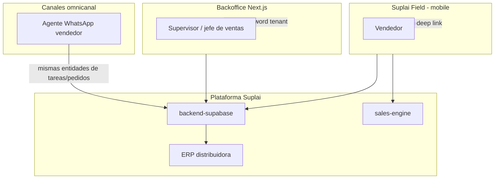
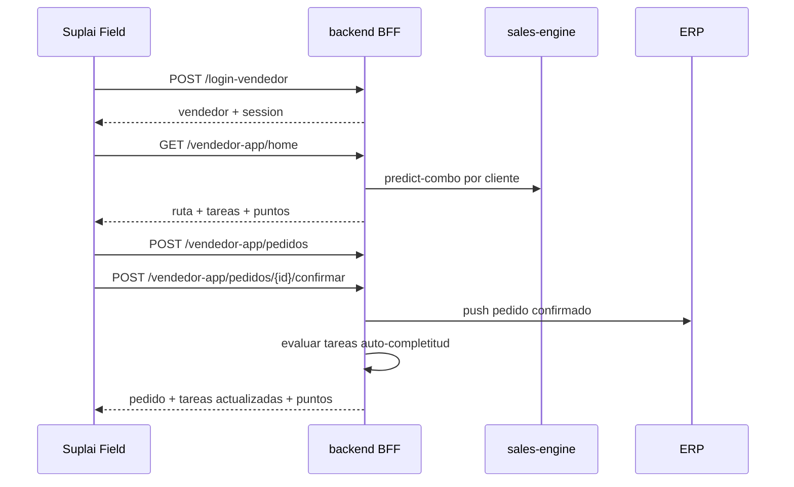
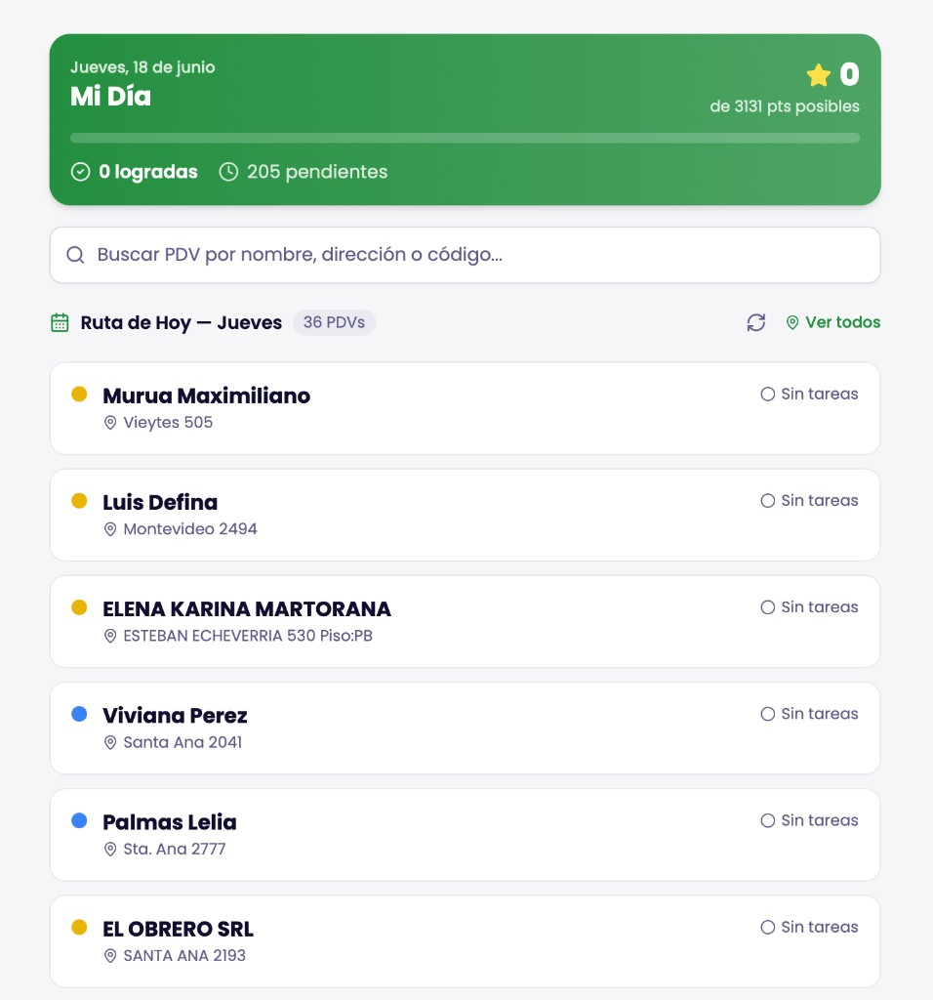
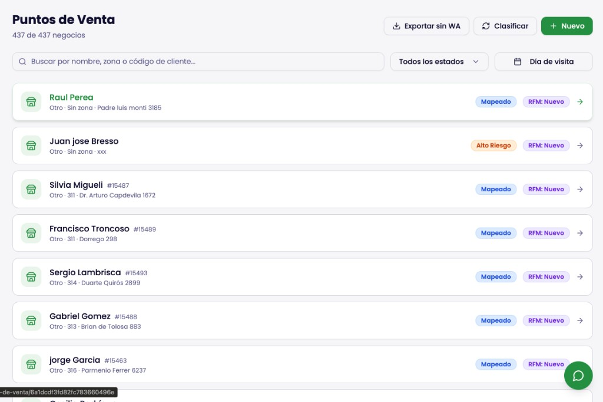
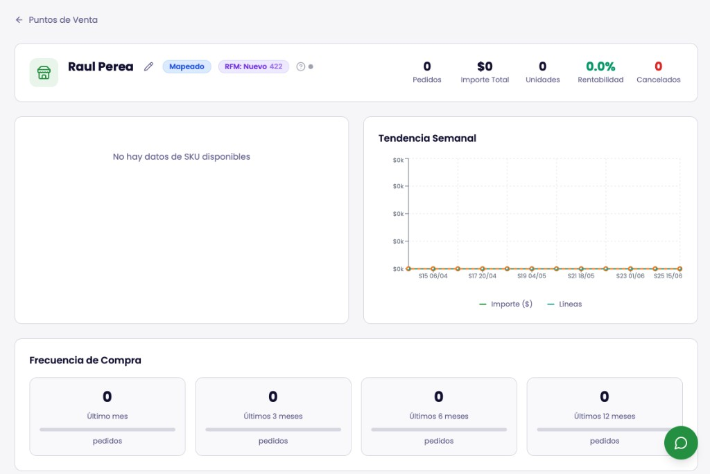
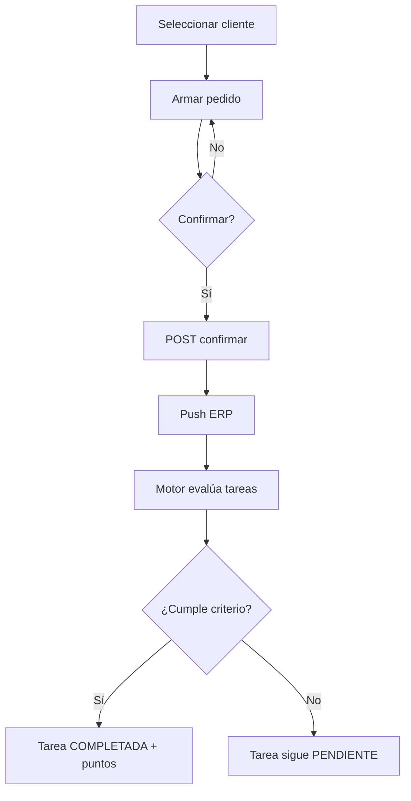
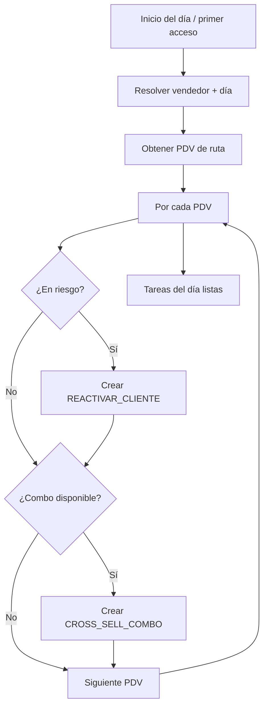
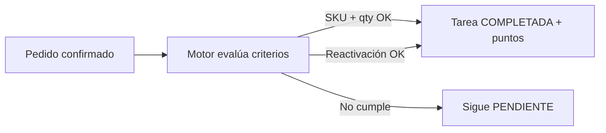
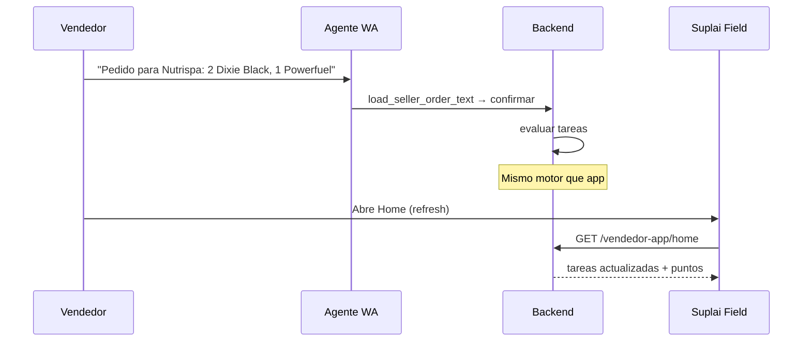

# Suplai Field — Documento de diseño de producto

**Estado:** Aprobado  
**Fecha:** 2026-06-18  
**Specs hijas:** [003-suplai-field-app.md](./003-suplai-field-app.md)  
**Tipo:** Diseño de producto (no spec de implementación)  
**Producto:** Suplai Field — app mobile-first para vendedores humanos  

---

## Índice

1. [Resumen ejecutivo](#1-resumen-ejecutivo)
2. [Alineación con visión existente](#2-alineación-con-visión-existente)
3. [Actores, roles y permisos](#3-actores-roles-y-permisos)
4. [Decisiones de producto cerradas](#4-decisiones-de-producto-cerradas)
5. [Principios de diseño UX](#5-principios-de-diseño-ux)
6. [Arquitectura técnica](#6-arquitectura-técnica)
7. [Pantallas y requerimientos funcionales](#7-pantallas-y-requerimientos-funcionales)
8. [Motor de tareas y gamificación](#8-motor-de-tareas-y-gamificación)
9. [Omnicanal](#9-omnicanal)
10. [Modelo de datos nuevo](#10-modelo-de-datos-nuevo)
11. [Requerimientos no funcionales](#11-requerimientos-no-funcionales)
12. [Alcance V1 vs. roadmap](#12-alcance-v1-vs-roadmap)
13. [Riesgos y dependencias](#13-riesgos-y-dependencias)
14. [Mapeo pantalla → datos → endpoints](#14-mapeo-pantalla--datos--endpoints)
15. [Próximos pasos](#15-próximos-pasos)

---

## 1. Resumen ejecutivo

### Problema

Los vendedores humanos de distribuidoras B2B operan con información fragmentada: rutas en planillas, historial de compra en el ERP o en la cabeza del vendedor, y poco seguimiento estructurado de lo que deben hacer en cada visita. Los supervisores no tienen visibilidad en tiempo real de la ejecución diaria ni herramientas simples para motivar y medir el desempeño del equipo.

### Solución

**Suplai Field** es una aplicación web mobile-first que convierte los procesos comerciales diarios en tareas concretas con puntos, permitiendo:

- Al **vendedor**: ver su ruta del día, saber qué hacer en cada punto de venta (PDV), cargar pedidos y sumar puntos al completar objetivos.
- Al **supervisor**: configurar tareas, puntos y torneos desde el backoffice existente, y monitorear el progreso del equipo.
- Al **ecosistema Suplai**: compartir la misma fuente de verdad con el agente WhatsApp del vendedor (omnicanal).

### Criterio de éxito V1

Un vendedor abre la app desde un link de WhatsApp, ve su ruta y tareas del día, entra a un PDV, carga y confirma un pedido que cumple una tarea (ej. reactivar cliente o vender un combo), y ve sus puntos actualizarse automáticamente. El supervisor puede ver el ranking del torneo activo y ajustar las reglas sin tocar código.

### Entregables futuros (fuera de este documento)

Este documento fue la **fuente única de diseño**. Las specs de implementación están en [003-suplai-field-app.md](./003-suplai-field-app.md).

**Nombre de producto:** Suplai Field  
**URL propuesta:** `https://field.suplaisales.com/{schema}?wp={telefono}`  
**Repo:** `field-app/` — Next.js en Vercel, mismo patrón que `product-management-app` (backoffice).

---

## 2. Alineación con visión existente

Suplai Field materializa la parte ejecutiva del **Módulo 04 — Vendedor Aumentado** del corpus de producto, sin pretender cubrir todo el módulo en V1.

| Fuente | Qué aporta al diseño |
|--------|----------------------|
| [uses-cases.txt — Módulo 04](../../agente-conversacional-multi_tenant/docs/uses-cases.txt) (L1042+) | Visión de copiloto comercial, briefing diario, tareas de campo, productividad |
| [report-use-cases.md](../../agente-conversacional-multi_tenant/docs/report-use-cases.md) | Gap analysis: existen vendedores, clientes, pedidos, geo-zonas; faltan tareas CRM, objetivos, briefing, gamificación |
| [Spec 040 territorio](../../backend-supabase/docs/specs/040-territorio-geo-zonas-vendedores-pdv.md) | Ruta del día = `geo_zones.dia_visita` + cartera `vendedores_clientes` |
| [seller-assistant.md](../../agente-conversacional-multi_tenant/docs/modules/seller-assistant.md) | Agente WhatsApp vendedor: scope por teléfono, pedidos por texto |
| Capturas de referencia (sección 7) | Wireframes de Home, listado PDV y ficha comercial |

**Posicionamiento:**

```text
Módulo 04 (visión completa)
├── 04.1 Briefing / podcast diario     → V2 (no V1)
├── 04.2 Tareas de campo + pedidos       → Suplai Field V1 (interfaz móvil)
├── 04.3 Observabilidad / coaching       → Backoffice + torneos V1 (parcial)
└── 04.4 Wiki / conocimiento             → V2

Canales V1:
  Suplai Field (app)  ←→  backend  ←→  Agente WA vendedor (omnicanal)
```

---

## 3. Actores, roles y permisos



| Rol | Acceso | Capacidades V1 |
|-----|--------|----------------|
| **Vendedor** | Deep link `https://field.suplaisales.com/{schema}?wp={telefono}` | Home, cartera PDV, ficha comercial, pedidos, torneo (lectura), configuración básica |
| **Supervisor** | Backoffice (`product-management-app`) con credenciales de distribuidora | Plantillas de tareas, puntos por tarea, umbrales, torneos, dashboard de progreso |
| **Agente WA** | Mismo tenant; actor `seller` por teléfono | Consultar ruta/tareas del día, progreso de puntos, estado de pedidos (lectura V1); cargar pedidos (tool existente) |

**Restricción de scope:** un vendedor solo ve y opera sobre clientes/PDV de su cartera (`vendedores_clientes`). No puede acceder a datos de otro vendedor ni de otro tenant.

---

## 4. Decisiones de producto cerradas

| # | Tema | Decisión |
|---|------|----------|
| 1 | Completitud de tareas V1 | **Automática** — se completa cuando un pedido **confirmado** cumple el criterio (SKU/cantidad o reactivación) |
| 2 | Pedidos V1 | **Carga completa** en la app (catálogo, carrito, confirmar) + botón **refresh/sync ERP** para distribuidoras que cargan por sistema externo |
| 3 | Configuración supervisor | Solo desde **backoffice existente** (nueva sección), no desde la app móvil |
| 4 | Auth vendedor | Login por **teléfono** vía deep link WhatsApp (`?wp=`), patrón tienda; sin email/password de distribuidora |
| 5 | Unidad de medida temporal | **Semana** como granularidad principal para tendencias y frecuencia de compra |
| 6 | Contrato de venta para tareas | Pedido en estado **`confirmado`** (alineado a Suplai Copilot spec 042) |
| 7 | Gamificación | Puntos por tarea completada; torneos por suma de puntos en ventana temporal |

---

## 5. Principios de diseño UX

El rubro (distribución de consumo masivo) no es muy tecnológico. La interfaz debe ser **simple, clara y accionable**.

| Principio | Aplicación |
|-----------|------------|
| Una acción principal por pantalla | Home = ruta del día; Pedidos = cargar/ver; Torneo = ranking |
| Textos cortos en español rioplatense | "Mi Día", "Sin tareas", "Actualizar desde ERP" |
| Estados vacíos explícitos | "Hoy no tenés visitas programadas", "No hay torneo activo" |
| Gamificación visible, no invasiva | Barra de progreso + estrella con "X de Y pts posibles"; sin animaciones complejas |
| Información comercial legible | Montos en ARS, fechas cortas, badges de estado con color + texto |
| Targets táctiles grandes | Mínimo 44×44 px; cards de PDV con área de tap amplia |
| Offline | **Diferido post-V1**; V1 asume conectividad intermitente con reintento y mensaje claro |

---

## 6. Arquitectura técnica

### 6.1 Diagrama de secuencia principal



### 6.2 Reutilización del ecosistema actual

| Capacidad | Fuente existente | Estado |
|-----------|------------------|--------|
| Territorio / ruta | `geo_zones.dia_visita`, `vendedor_geo_zones`, `vendedores_clientes` | Implementado (spec 040) |
| Segmentación churn | `clientCategory` en `client_locations_service` (`CHURN_RISK`, `LOST`, `VIP`) | Implementado |
| Perfil comercial parcial | `GET /{schema}/clients/{id}/map-details` | Implementado (top 90d, sin serie semanal) |
| ML combos | `POST /v1/tenants/{schema}/predict-combo` (sales-engine) | Implementado |
| ML reposición | `POST /v1/tenants/{schema}/predict-replenishment` | Implementado |
| Pedidos + ERP | Pipeline tienda (`login-tienda`, `tienda/pedidos`, `confirmar`, `erp/sync-orders`) | Implementado; adaptar para vendedor |
| Agente vendedor WA | `seller-assistant`, `load_seller_order_text` | Implementado |

### 6.3 Gaps a construir (bloqueantes V1)

| Gap | Descripción | Repo |
|-----|-------------|------|
| `POST /login-vendedor` | Auth por teléfono contra `vendedores.telefono` | backend |
| BFF `/{schema}/vendedor-app/*` | Home, tareas, torneo, pedidos scoped al vendedor | backend |
| `GET /clients/{id}/ventas-semanales` | Serie semanal 6 meses para gráfico | backend |
| Extensión `map-details` por PDV | Top 20 SKU (12m), frecuencia 1/3/6/12 meses | backend |
| Tablas field_* | Tareas, puntos, torneos | backend (migración) |
| App Next.js | 4 pantallas + auth | field-app (nuevo) |
| Sección supervisor | Plantillas, torneos, dashboard | backoffice |
| Tools omnicanal | `get_seller_daily_route`, `get_seller_tasks`, etc. | agent |

### 6.4 Stack propuesto `field-app/`

| Capa | Tecnología |
|------|------------|
| Framework | Next.js (App Router), React 19 |
| Estilos | Tailwind CSS (alineado a backoffice/tienda) |
| Auth | `sessionStorage` + deep link `?wp=` (patrón tienda) |
| API | Proxies BFF en `app/api/*` → backend Railway |
| Deploy | Vercel |
| Env | `BACKEND_URL`, `SALES_ENGINE_URL` (solo server-side en BFF) |

---

## 7. Pantallas y requerimientos funcionales

### 7.1 Home — "Mi Día"

**Referencia visual:** [01-home-mi-dia.png](../assets/field-app/01-home-mi-dia.png)



#### Descripción

Pantalla principal del vendedor. Combina un dashboard gamificado del día con la lista de PDV que debe visitar según su ruta (zona + día de visita).

#### Componentes UI

| Zona | Elementos |
|------|-----------|
| Header gamificado (card verde) | Fecha, título "Mi Día", puntos "X de Y pts posibles", barra de progreso, contadores "logradas / pendientes" |
| Búsqueda | Input: "Buscar PDV por nombre, dirección o código..." |
| Sección ruta | Título "Ruta de Hoy — {día}", badge cantidad PDV, botón refresh, link "Ver todos" |
| Lista PDV | Card por PDV: indicador de estado (color), nombre, dirección, resumen de tareas ("Sin tareas" / "2 tareas") |

#### Requerimientos funcionales

| ID | Requerimiento |
|----|---------------|
| RF-H01 | Mostrar fecha actual y saludo contextual ("Mi Día") |
| RF-H02 | Dashboard gamificado: puntos logrados vs. máximo posible del día, barra de progreso, contadores logradas/pendientes |
| RF-H03 | Calcular **ruta de hoy**: PDV del vendedor cuya zona tiene `dia_visita` = día actual |
| RF-H04 | Listar PDV de la ruta con nombre, dirección, indicador de estado y resumen de tareas |
| RF-H05 | Búsqueda en ruta por nombre, dirección o código de cliente |
| RF-H06 | Tap en fila o avatar → ficha comercial del PDV (sección 7.2) |
| RF-H07 | Pull-to-refresh / botón refresh: recalcula tareas, puntos y estado de pedidos |
| RF-H08 | Link "Ver todos" → pantalla Puntos de Venta (cartera completa) |

#### Lógica de ruta del día

```text
1. Obtener vendedor_id de la sesión
2. Obtener día de semana actual (enum core.dia_de_visita_enum)
3. Obtener geo_zones del vendedor donde dia_visita = hoy (vendedor_geo_zones)
4. Obtener PDV/clientes:
   - Primario: puntos_venta.geo_zone_id IN (zonas de hoy) AND vendedor_id
   - Fallback (tenant sin spec 040): clients.dia_de_visita = hoy AND vendedores_clientes
5. Generar/obtener tareas del día para cada PDV
6. Ordenar por prioridad (tareas pendientes primero, luego alfabético)
```

#### Cálculo de puntos del día

```text
pts_posibles = SUM(puntos de cada tarea activa del día para este vendedor)
pts_logrados = SUM(puntos de tareas con estado COMPLETADA hoy)
tareas_logradas = COUNT(estado = COMPLETADA)
tareas_pendientes = COUNT(estado = PENDIENTE)
```

---

### 7.2 Puntos de Venta — cartera completa

**Referencia visual:** [02-puntos-de-venta.png](../assets/field-app/02-puntos-de-venta.png)



#### Descripción

Listado de todos los clientes/PDV asignados al vendedor. En Home solo aparecen los de la ruta de hoy; aquí aparece la cartera completa con búsqueda y filtros.

#### Requerimientos funcionales

| ID | Requerimiento |
|----|---------------|
| RF-P01 | Listar todos los PDV/clientes asignados al vendedor (`vendedores_clientes`) |
| RF-P02 | Filtros: búsqueda por nombre/zona/código, estado (activo/churn), día de visita |
| RF-P03 | Badges de segmentación: Mapeado, categoría (`VIP`, `CHURN_RISK`, `LOST`, `DEFAULT`), RFM si disponible |
| RF-P04 | Tap en fila → ficha comercial del PDV |
| RF-P05 | Contador total: "N de N negocios" |
| RF-P06 | Paginación o scroll infinito (20 ítems por página) |

---

### 7.3 Ficha comercial del PDV (detalle)

**Referencia visual:** [03-ficha-pdv.png](../assets/field-app/03-ficha-pdv.png)



#### Descripción

Vista de inteligencia comercial de un PDV. Accesible desde el listado de PDV o tocando un cliente en Home. Muestra KPIs, historial de compra y tareas activas.

#### Bloques de información

| Bloque | Contenido | Fuente V1 |
|--------|-----------|-----------|
| Header | Nombre PDV, badges (Mapeado, RFM/categoría), KPIs: Pedidos, Importe total, Unidades, Rentabilidad*, Cancelados | Extender `map-details` + agregados por PDV |
| Top 20 SKU | Productos más comprados por monto o frecuencia (ventana default 12 meses) | **Nuevo query** (hoy `map-details` solo top 90d) |
| Tendencia semanal | Gráfico líneas: eje X = semanas (últimos 6 meses), eje Y = importe ($) y líneas (cantidad de ítems) | **Nuevo endpoint** `ventas-semanales` |
| Frecuencia de compra | Cards: pedidos en último mes, 3, 6 y 12 meses con barra comparativa | **Nuevo agregado** por ventanas |
| Tareas activas | Lista de tareas pendientes para este PDV con descripción y puntos | Motor de tareas |
| Acciones | Botón "Cargar pedido" → pantalla Pedidos con cliente preseleccionado | Navegación interna |

\* **Rentabilidad:** dependiente de datos de margen en ERP. Si el tenant no tiene costo/margen, el campo se **oculta** en V1 (no mostrar "0.0%" engañoso).

#### Requerimientos funcionales

| ID | Requerimiento |
|----|---------------|
| RF-F01 | Mostrar nombre, dirección y badges de estado del PDV |
| RF-F02 | KPIs de resumen: pedidos totales, importe, unidades, cancelados |
| RF-F03 | Top 20 SKU ordenado por monto (configurable: monto o frecuencia) |
| RF-F04 | Gráfico tendencia semanal (6 meses), granularidad semana ISO |
| RF-F05 | Cards de frecuencia: pedidos en 1, 3, 6 y 12 meses |
| RF-F06 | Listar tareas activas del PDV con tipo, descripción y puntos |
| RF-F07 | Navegación back → pantalla anterior (Home o listado PDV) |
| RF-F08 | FAB o botón WhatsApp (opcional V1): abrir chat con cliente si tiene WA |

---

### 7.4 Pedidos

#### Descripción

Gestión de pedidos del vendedor para clientes de su cartera. Soporta carga completa en la app y sincronización con ERP externo.

#### Requerimientos funcionales

| ID | Requerimiento |
|----|---------------|
| RF-PE01 | Ver pedidos abiertos y recientes del vendedor (scope: clientes asignados) |
| RF-PE02 | Crear/editar pedido: seleccionar cliente, buscar productos, cantidades, ver precios por lista del PDV |
| RF-PE03 | Aplicar promociones semanales vigentes |
| RF-PE04 | Confirmar pedido → dispara pipeline ERP (`inject_order_to_erp`) |
| RF-PE05 | Botón **"Actualizar desde ERP"**: ejecuta `sync-orders` + refresca estado + re-evalúa tareas |
| RF-PE06 | Tras confirmación (app o ERP), motor de tareas evalúa criterios y asigna puntos automáticamente |
| RF-PE07 | Mostrar estado de sync: `confirmado`, `enviado_erp`, `pendiente_sync`, `error_sync` |
| RF-PE08 | Indicar si un pedido confirmado completó alguna tarea ("+50 pts — Combo vendido") |

#### Flujo de pedido



---

### 7.5 Torneo local

#### Descripción

Ranking de vendedores del tenant competiendo por puntos en una ventana temporal definida por el supervisor (ej. "Torneo Julio 2026").

#### Requerimientos funcionales

| ID | Requerimiento |
|----|---------------|
| RF-T01 | Vista ranking de vendedores en torneo activo |
| RF-T02 | Torneo con ventana temporal (fecha inicio/fin); puntaje = suma de puntos de tareas completadas en el período |
| RF-T03 | Mostrar posición del vendedor logueado, top 3, y diferencia al líder |
| RF-T04 | Histórico de ganadores de torneos cerrados (solo lectura) |
| RF-T05 | Si no hay torneo activo, mensaje claro con fecha del próximo o último ganador |
| RF-T06 | Supervisor crea/edita/cierra torneos desde backoffice (RF-B05) |

#### UI propuesta

| Elemento | Descripción |
|----------|-------------|
| Header | Nombre del torneo, días restantes, mi posición |
| Podio | Top 3 con medallas (oro/plata/bronce) |
| Lista | Resto de participantes con puntos |
| Mi tarjeta | Destacada con barra de progreso hacia el líder |

---

### 7.6 Configuración vendedor (V1 mínima)

| ID | Requerimiento |
|----|---------------|
| RF-C01 | Ver perfil: nombre, teléfono, zonas asignadas |
| RF-C02 | Cerrar sesión |
| RF-C03 | Versión de la app |
| RF-C04 | Preferencias de notificación → **post-V1** |

---

### 7.7 Backoffice — extensión supervisor

Nueva sección en `product-management-app`, visible cuando `field_app_enabled = true` en metadata de distribuidora.

| ID | Requerimiento |
|----|---------------|
| RF-B01 | CRUD plantillas de tarea: tipo, criterio, texto sugerido, puntos default, activo |
| RF-B02 | Configurar puntos por tipo de tarea a nivel tenant |
| RF-B03 | Umbral "días sin compra" para tarea Reactivar (default 45, alineado a `CHURN_RISK`) |
| RF-B04 | Activar/desactivar generación automática diaria de tareas |
| RF-B05 | Gestión de torneos: nombre, fechas, vendedores participantes (todos o subset), nota/premio |
| RF-B06 | Dashboard supervisor: progreso del día por vendedor (% tareas, puntos logrados vs. posibles) |
| RF-B07 | Sugerencias de texto con AI para plantillas → **V1.1** (opcional) |
| RF-B08 | Vista histórica de torneos cerrados con ganador y ranking final |

---

## 8. Motor de tareas y gamificación

### 8.1 Tipos de tarea V1

| Tipo | Código | Disparador | Criterio de éxito (auto) | Puntos |
|------|--------|-----------|--------------------------|--------|
| Reactivar cliente | `REACTIVAR_CLIENTE` | `clientCategory` ∈ {`CHURN_RISK`, `LOST`} o `diasSinPedir` > umbral | Pedido **confirmado** en el día de la tarea para ese cliente | Configurable (default 100) |
| Cross-sell combo | `CROSS_SELL_COMBO` | `predict-combo` devuelve ≥2 SKU para el cliente | Pedido confirmado incluye **todos** los SKU del combo con qty ≥ mínima | Configurable (default 50) |

### 8.2 Generación diaria de tareas



**Reglas:**

1. Se ejecuta al primer acceso del vendedor al Home del día, o vía job nocturno (configurable por tenant).
2. Deduplicación: una instancia por `(vendedor_id, pdv_id, tipo, fecha)`.
3. Si el supervisor desactivó un tipo de tarea, no se genera.
4. El texto de la tarea se arma desde la plantilla + datos del cliente (nombre, combo sugerido, días sin pedir).

### 8.3 Estados de tarea

| Estado | Descripción | Transición |
|--------|-------------|------------|
| `PENDIENTE` | Creada, sin cumplir | → `COMPLETADA` (auto) o → `EXPIRADA` |
| `COMPLETADA` | Criterio cumplido; puntos asignados | Terminal |
| `EXPIRADA` | Fin del día sin cumplir | Terminal |
| `CANCELADA` | Supervisor canceló manualmente | Terminal |

### 8.4 Auto-completitud por pedido



**Eventos que disparan evaluación:**

- Confirmación de pedido desde Suplai Field
- Confirmación de pedido desde agente WA (`load_seller_order_text`)
- Sync ERP detecta pedido nuevo/confirmado (`sync-orders` + refresh)

**Criterios detallados:**

| Tipo | Evaluación |
|------|------------|
| `REACTIVAR_CLIENTE` | Existe pedido `confirmado` para `cliente_id` de la tarea, con `fecha` = hoy (o ventana del día) |
| `CROSS_SELL_COMBO` | Pedido `confirmado` contiene en `items_pedido` todos los `combo_skus` de `criterio_json` con `cantidad >= min_qty_per_sku` |

### 8.5 Libro de puntos

Cada completitud genera un registro en `field_point_ledger`:

```text
vendedor_id, task_id, puntos, fecha, torneo_id (si hay torneo activo)
```

Los puntos del torneo se calculan como `SUM(puntos)` del ledger en la ventana del torneo.

---

## 9. Omnicanal

### 9.1 Principio

**Una sola fuente de verdad** en base de datos. Suplai Field y el agente WhatsApp del vendedor son **vistas** sobre las mismas entidades: tareas, pedidos, puntos, torneos.

El patrón es análogo a la tienda virtual: el cliente puede armar un pedido en la PWA y confirmarlo por WhatsApp con el agente. Aquí, el vendedor puede ver su ruta en la app y consultar lo mismo por WhatsApp, o cargar un pedido por cualquier canal.

### 9.2 Matriz de capacidades por canal

| Capacidad | Suplai Field | Agente WA vendedor (V1) |
|-----------|--------------|-------------------------|
| Ruta del día | Home | Tool `get_seller_daily_route` (nueva) |
| Tareas pendientes | Home + ficha PDV | Tool `get_seller_tasks` (nueva) |
| Puntos del día | Home dashboard | Tool `get_seller_progress` (nueva) |
| Ranking torneo | Pantalla Torneo | Tool `get_seller_progress` (incluye posición) |
| Ficha comercial resumida | Ficha PDV completa | Tool `get_seller_client_summary` (nueva, resumen textual) |
| Cargar pedido | Pantalla Pedidos | Tool `load_seller_order_text` (existente) |
| Estado sync ERP | Botón refresh | Tool `check_order_sync_status` (nueva) |
| Configurar tareas/torneos | — | — (solo supervisor en backoffice) |

### 9.3 Contrato de tools nuevas (borrador)

#### `get_seller_daily_route`

```text
Input:  (vendedor implícito por sesión)
Output: { fecha, pts_logrados, pts_posibles, pdv_count, route: [{ pdv_id, nombre, direccion, tareas_count, tareas_resumen }] }
```

#### `get_seller_tasks`

```text
Input:  { cliente_id? (opcional), estado? (default PENDIENTE) }
Output: { tasks: [{ id, tipo, descripcion, puntos, pdv_nombre, cliente_id, estado }] }
```

#### `get_seller_progress`

```text
Input:  (vendedor implícito)
Output: { pts_hoy, pts_posibles, tareas_logradas, tareas_pendientes, torneo: { nombre, posicion, puntos, lider, dias_restantes } }
```

#### `get_seller_client_summary`

```text
Input:  { cliente_id }
Output: { nombre, categoria, dias_sin_pedir, ultimo_pedido, top_3_sku[], tareas_pendientes[] }
```

#### `check_order_sync_status`

```text
Input:  { pedido_id? | cliente_id? }
Output: { pedidos: [{ id, estado, erp_status, tareas_completadas[] }] }
```

### 9.4 Flujo omnicanal de pedido + tarea



**Regla crítica:** confirmar pedido por **cualquier canal** ejecuta el mismo motor de evaluación de tareas y asignación de puntos.

### 9.5 Deep link desde agente

El agente vendedor puede enviar el link de Suplai Field con el mismo patrón que la tienda:

```text
https://field.suplaisales.com/{schema}?wp={telefono_vendedor}
```

Tool propuesta: `get_field_app_link` (análoga a `get_catalog_link` de tienda).

---

## 10. Modelo de datos nuevo

Tablas en schema `{tenant}` (mismo patrón que `vendedores`, `pedidos`, etc.).

### 10.1 `field_task_templates`

Plantillas configuradas por el supervisor.

| Columna | Tipo | Notas |
|---------|------|-------|
| `id` | `serial` PK | |
| `tipo` | `text` NOT NULL | `REACTIVAR_CLIENTE`, `CROSS_SELL_COMBO` |
| `nombre` | `text` NOT NULL | Nombre visible en backoffice |
| `descripcion_template` | `text` | Texto con placeholders: `{cliente}`, `{combo}`, `{dias}` |
| `puntos_default` | `integer` NOT NULL DEFAULT 50 | |
| `criterio_json` | `jsonb` NOT NULL DEFAULT '{}' | Parámetros del criterio (ver 10.6) |
| `activo` | `boolean` DEFAULT true | |
| `created_at` / `updated_at` | `timestamptz` | |

### 10.2 `field_tasks`

Instancias diarias de tareas por vendedor/PDV.

| Columna | Tipo | Notas |
|---------|------|-------|
| `id` | `bigserial` PK | |
| `template_id` | `integer` FK → `field_task_templates` | |
| `vendedor_id` | `integer` NOT NULL FK → `vendedores` | |
| `pdv_id` | `integer` FK → `puntos_venta` | Nullable si solo hay cliente |
| `cliente_id` | `integer` FK → `clients` | Contacto primario del PDV |
| `tipo` | `text` NOT NULL | Denormalizado del template |
| `descripcion` | `text` NOT NULL | Texto renderizado para el vendedor |
| `puntos` | `integer` NOT NULL | Puntos al completar (copiado del template o override) |
| `estado` | `text` NOT NULL DEFAULT 'PENDIENTE' | `PENDIENTE`, `COMPLETADA`, `EXPIRADA`, `CANCELADA` |
| `criterio_json` | `jsonb` NOT NULL | Criterio concreto (combo SKUs, umbral, etc.) |
| `fecha` | `date` NOT NULL | Día de la tarea |
| `completada_at` | `timestamptz` NULL | |
| `pedido_id` | `integer` FK → `pedidos` NULL | Pedido que completó la tarea |
| `created_at` / `updated_at` | `timestamptz` | |

**UNIQUE** `(vendedor_id, pdv_id, tipo, fecha)` — deduplicación diaria.

### 10.3 `field_task_events`

Auditoría de transiciones.

| Columna | Tipo | Notas |
|---------|------|-------|
| `id` | `bigserial` PK | |
| `task_id` | `bigint` FK → `field_tasks` | |
| `evento` | `text` NOT NULL | `CREADA`, `COMPLETADA`, `EXPIRADA`, `CANCELADA` |
| `pedido_id` | `integer` NULL | Si aplica |
| `metadata` | `jsonb` | Detalle (SKUs encontrados, etc.) |
| `created_at` | `timestamptz` | |

### 10.4 `field_point_ledger`

Libro de puntos (inmutable, append-only).

| Columna | Tipo | Notas |
|---------|------|-------|
| `id` | `bigserial` PK | |
| `vendedor_id` | `integer` NOT NULL FK → `vendedores` | |
| `task_id` | `bigint` FK → `field_tasks` | |
| `puntos` | `integer` NOT NULL | |
| `fecha` | `date` NOT NULL | |
| `torneo_id` | `integer` FK → `field_tournaments` NULL | Si hay torneo activo |
| `created_at` | `timestamptz` | |

### 10.5 `field_tournaments`

| Columna | Tipo | Notas |
|---------|------|-------|
| `id` | `serial` PK | |
| `nombre` | `text` NOT NULL | Ej. "Torneo Julio 2026" |
| `fecha_inicio` | `date` NOT NULL | |
| `fecha_fin` | `date` NOT NULL | |
| `estado` | `text` NOT NULL DEFAULT 'ACTIVO' | `ACTIVO`, `CERRADO` |
| `premio_nota` | `text` NULL | Descripción del premio |
| `vendedor_ids` | `integer[]` NULL | NULL = todos los activos |
| `ganador_vendedor_id` | `integer` FK NULL | Set al cerrar |
| `created_at` / `updated_at` | `timestamptz` | |

### 10.6 `field_tournament_scores` (vista o tabla materializada)

Puede ser vista sobre `field_point_ledger` agrupado, o tabla actualizada por trigger:

| Columna | Tipo | Notas |
|---------|------|-------|
| `torneo_id` | `integer` | |
| `vendedor_id` | `integer` | |
| `puntos_total` | `integer` | SUM del ledger en ventana |
| `posicion` | `integer` | Ranking calculado |

### 10.7 Criterios JSON por tipo de tarea

#### `REACTIVAR_CLIENTE`

```json
{
  "tipo": "REACTIVAR_CLIENTE",
  "dias_sin_compra_min": 45,
  "categorias_elegibles": ["CHURN_RISK", "LOST"],
  "requiere_pedido_confirmado": true,
  "ventana": "dia"
}
```

#### `CROSS_SELL_COMBO`

```json
{
  "tipo": "CROSS_SELL_COMBO",
  "combo_skus": ["SKU_A", "SKU_B"],
  "min_qty_per_sku": 1,
  "source": "sales_engine",
  "requiere_todos": true
}
```

### 10.8 Configuración tenant

En `public.distribuidoras.metadata`:

```json
{
  "field_app_enabled": true,
  "field_task_generation": "on_access",
  "field_default_dias_reactivar": 45
}
```

---

## 11. Requerimientos no funcionales

| ID | Categoría | Requerimiento |
|----|-----------|---------------|
| RNF-01 | UX | **Mobile-first:** diseño optimizado 360–430px; desktop secundario (max-width centrado) |
| RNF-02 | Performance | Home carga en < 2s en 4G; listas paginadas (20 ítems); gráficos lazy-load |
| RNF-03 | Seguridad | Auth por teléfono validado contra `vendedores.telefono`; scope estricto a cartera del vendedor |
| RNF-04 | Multi-tenant | Header `x-schema-name` en todas las llamadas; un vendedor pertenece a un solo tenant |
| RNF-05 | Despliegue | Vercel (field-app); variables `BACKEND_URL`, `SALES_ENGINE_URL` solo server-side |
| RNF-06 | Accesibilidad | Contraste WCAG AA; targets táctiles ≥ 44px; labels en iconos |
| RNF-07 | Observabilidad | Logs estructurados: completitud de tareas, errores ERP, latencia BFF |
| RNF-08 | Idioma | Español (Argentina); formatos moneda ARS; fechas `dd/mm/yyyy` |
| RNF-09 | Disponibilidad | Graceful degradation si sales-engine no responde (tareas sin combo, no bloquear Home) |
| RNF-10 | Consistencia | Misma lógica de evaluación de tareas en app, agente y sync ERP |

---

## 12. Alcance V1 vs. roadmap

### 12.1 V1 — MVP

| Área | Incluido |
|------|----------|
| Pantallas | Home, Puntos de Venta (+ ficha), Pedidos, Torneo, Config básica |
| Tareas | 2 tipos (`REACTIVAR_CLIENTE`, `CROSS_SELL_COMBO`) con auto-completitud |
| Auth | Deep link WhatsApp + login por teléfono |
| Pedidos | Carga completa + confirmar + refresh ERP |
| Gamificación | Puntos diarios + torneo simple |
| Supervisor | Sección backoffice: plantillas, torneos, dashboard día |
| Omnicanal | Tools de lectura en agente WA + pedido existente |
| Datos | Top 20 SKU, frecuencia 1/3/6/12m, tendencia semanal 6m |

### 12.2 V1.1 — mejoras rápidas

| Mejora | Descripción |
|--------|-------------|
| AI en plantillas | Sugerencias de texto para tareas (RF-B07) |
| Filtro día de visita en backoffice | Ya soportado en BFF, falta dropdown en UI |
| Link desde agente | Tool `get_field_app_link` |
| Notificación WA | "Completaste 3 de 5 tareas hoy" al cierre del día |

### 12.3 V2 — evolución Módulo 04

| Mejora | Descripción | Dependencia |
|--------|-------------|-------------|
| Briefing diario / podcast | Resumen de audio al iniciar el día (04.1) | TTS + datos objetivos |
| Tareas manuales | Vendedor marca visita con nota de voz → CRM | Tabla `field_visit_notes` |
| Offline | Cache de ruta y catálogo para zonas sin señal | Service Worker + IndexedDB |
| Push notifications | Alertas de tareas pendientes a última hora | Web Push API |
| Rentabilidad por PDV | KPI real de margen | Datos de costo en ERP |
| Torneos por zona/equipo | Competencia entre subgrupos | Filtro en `field_tournaments` |
| Wiki comercial | Artículos aprobados consultables en app (04.4) | Tabla `wiki_articles` |
| Heatmap objeciones | Mapa de objeciones por zona (04.3) | Sniffer + clasificación |
| RFM persistido | Job que popula `client_rfm_class` | ML/analytics batch |
| Voice-to-order en app | Dictado de pedido (04.2) | Web Speech API |
| Coaching automático | Feedback post-visita basado en playbook | Tabla `playbook_tips` |

---

## 13. Riesgos y dependencias

| Riesgo | Impacto | Mitigación |
|--------|---------|------------|
| No existe `login-vendedor` | Bloquea toda la app | Spec backend 043 prioritaria |
| `map-details` sin serie semanal | Ficha PDV incompleta | Endpoint `ventas-semanales` antes de UI de gráfico |
| `predict-combo` sin proxy en backend | App no debe exponer API key de sales-engine | BFF llama sales-engine server-side |
| Territorio spec 040 no en todos los tenants | Ruta del día incorrecta | Fallback a `clients.dia_de_visita` + `vendedores_clientes` |
| Auto-completitud depende de sync ERP | Tareas no se completan si ERP tarda | Botón refresh visible + estados `pendiente_sync` |
| Sin tablas field_* | No hay gamificación | Migración backend bloqueante |
| Vendedor sin teléfono en BD | No puede loguearse | Validación en backoffice al crear vendedor |
| Sales-engine sin modelo entrenado | No hay combos sugeridos | Omitir tarea `CROSS_SELL_COMBO`; solo `REACTIVAR_CLIENTE` |
| Complejidad pedidos | UX pesada para vendedor | Reutilizar componentes de tienda; flujo simplificado |

### Dependencias entre repos (orden sugerido)

```text
1. backend: migración field_* + login-vendedor + BFF
2. backend: ventas-semanales + extensión map-details
3. field-app: scaffold + auth + Home
4. field-app: PDV + ficha + pedidos + torneo
5. backoffice: sección supervisor
6. agent: tools omnicanal
```

---

## 14. Mapeo pantalla → datos → endpoints

### 14.1 Home — Mi Día

| Dato UI | Tabla / servicio | Endpoint V1 | Estado |
|---------|------------------|-------------|--------|
| Fecha, día semana | — | — | Cliente |
| Puntos logrados/posibles | `field_tasks`, `field_point_ledger` | `GET /{schema}/vendedor-app/home` | **Nuevo** |
| Lista PDV ruta | `puntos_venta`, `geo_zones`, `vendedores_clientes` | Incluido en `/home` | **Nuevo** (compone existentes) |
| Tareas por PDV | `field_tasks` | Incluido en `/home` | **Nuevo** |
| Búsqueda | — | `GET /home?search=` | **Nuevo** |

### 14.2 Puntos de Venta — listado

| Dato UI | Tabla / servicio | Endpoint V1 | Estado |
|---------|------------------|-------------|--------|
| Cartera completa | `vendedores_clientes`, `puntos_venta` | `GET /{schema}/vendedor-app/pdv` | **Nuevo** |
| Categoría/badge | `client_locations` (cálculo) | Incluido en `/pdv` | Existente (lógica) |
| Filtro día visita | `geo_zones.dia_visita` | `GET /pdv?dia_de_visita=` | **Nuevo** |
| Filtro estado | `clientCategory` | `GET /pdv?categoria=` | **Nuevo** |

### 14.3 Ficha comercial PDV

| Dato UI | Tabla / servicio | Endpoint V1 | Estado |
|---------|------------------|-------------|--------|
| KPIs header | `pedidos`, `items_pedido` | `GET /{schema}/vendedor-app/pdv/{id}/perfil` | **Nuevo** |
| Top 20 SKU | `items_pedido` | Incluido en `/perfil` | **Nuevo** |
| Tendencia semanal | `pedidos` (agrupado por semana) | `GET /{schema}/clients/{id}/ventas-semanales?meses=6` | **Nuevo** |
| Frecuencia 1/3/6/12m | `pedidos` | Incluido en `/perfil` | **Nuevo** |
| Tareas activas | `field_tasks` | Incluido en `/perfil` | **Nuevo** |
| Datos parciales hoy | — | `GET /{schema}/clients/{id}/map-details` | Existente (referencia) |

### 14.4 Pedidos

| Dato UI | Tabla / servicio | Endpoint V1 | Estado |
|---------|------------------|-------------|--------|
| Pedidos abiertos | `pedidos` | `GET /{schema}/vendedor-app/pedidos` | **Nuevo** |
| Catálogo | `productos`, `lista_precios` | `GET /{schema}/vendedor-app/catalogo?cliente_id=` | **Nuevo** (adaptar tienda) |
| Crear/editar | `pedidos`, `items_pedido` | `POST/PATCH /vendedor-app/pedidos` | **Nuevo** |
| Confirmar | `pedidos` → ERP | `POST /vendedor-app/pedidos/{id}/confirmar` | **Nuevo** (adaptar tienda) |
| Sync ERP | `erp_orders_raw` | `POST /{schema}/erp/sync-orders` + refresh | Existente |
| Evaluación tareas | `field_tasks` | Trigger interno post-confirmar | **Nuevo** |

### 14.5 Torneo

| Dato UI | Tabla / servicio | Endpoint V1 | Estado |
|---------|------------------|-------------|--------|
| Torneo activo | `field_tournaments` | `GET /{schema}/vendedor-app/torneo` | **Nuevo** |
| Ranking | `field_point_ledger` | Incluido en `/torneo` | **Nuevo** |
| Histórico | `field_tournaments` | `GET /torneo/historial` | **Nuevo** |

### 14.6 Auth

| Dato UI | Tabla / servicio | Endpoint V1 | Estado |
|---------|------------------|-------------|--------|
| Login vendedor | `vendedores` | `POST /login-vendedor` | **Nuevo** |
| Sesión | `sessionStorage` | Patrón tienda | Cliente |

### 14.7 Backoffice supervisor

| Dato UI | Tabla / servicio | Endpoint V1 | Estado |
|---------|------------------|-------------|--------|
| Plantillas | `field_task_templates` | `GET/POST/PATCH /{schema}/field/templates` | **Nuevo** |
| Torneos | `field_tournaments` | `GET/POST/PATCH /{schema}/field/tournaments` | **Nuevo** |
| Dashboard día | `field_tasks`, `field_point_ledger` | `GET /{schema}/field/dashboard` | **Nuevo** |
| Config tenant | `distribuidoras.metadata` | `PATCH /distribuidoras/{id}` | Existente |

### 14.8 Sales-engine (server-side desde BFF)

| Dato | Endpoint | Estado |
|------|----------|--------|
| Combo sugerido | `POST /v1/tenants/{schema}/predict-combo` | Existente |
| Reposición | `POST /v1/tenants/{schema}/predict-replenishment` | Existente |

---

## 15. Próximos pasos

### 15.1 Revisión de este documento

1. Revisar y aprobar con stakeholders (producto, operaciones, 1–2 vendedores piloto).
2. Validar nombres de pantallas, puntos default y umbrales de reactivación.
3. Confirmar URL de producción (`field.suplaisales.com`) y tenant piloto.

### 15.2 Specs de implementación (derivadas)

Índice maestro: [003-suplai-field-app.md](./003-suplai-field-app.md)

| # | Repo | Archivo | Contenido |
|---|------|---------|-----------|
| 1 | `field-app/` | `docs/specs/001-project-overview.md` | Scaffold Next.js, auth, navegación, pantallas |
| 2 | `backend-supabase` | `docs/specs/047-field-app-auth-y-bff.md` | `login-vendedor`, BFF `/vendedor-app/*`, ventas-semanales |
| 3 | `backend-supabase` | `docs/specs/048-field-tasks-gamificacion.md` | Migración field_*, motor de tareas, torneos |
| 4 | `product-management-app` | `doc/specs/044-field-app-supervisor.md` | UI supervisor, plantillas, torneos, dashboard |
| 5 | `agente-conversacional-multi_tenant` | `docs/specs/032-seller-field-omnicanal.md` | Tools omnicanal, deep link |

### 15.3 Registro en workspace

- Agregar `field-app/` a [AGENTS.md](../../AGENTS.md) y [platform-overview.mdc](../../.cursor/rules/platform-overview.mdc).
- Crear repositorio `field-app` e inicializar con spec 001.

---

## Referencias

- [ARCHITECTURE.md](../ARCHITECTURE.md)
- [001-suplai-copilot.md](./001-suplai-copilot.md) — índice cross-repo (patrón a seguir)
- [CROSS-REPO-QUERIES.md](../CROSS-REPO-QUERIES.md)
- Módulo 04: [uses-cases.txt](../../agente-conversacional-multi_tenant/docs/uses-cases.txt)
- Territorio: [040-territorio](../../backend-supabase/docs/specs/040-territorio-geo-zonas-vendedores-pdv.md)
- Agente vendedor: [seller-assistant.md](../../agente-conversacional-multi_tenant/docs/modules/seller-assistant.md)
- Auth tienda (patrón): [tienda-api.ts](../../wholesale-catalog-app/lib/tienda-api.ts)

---

## Historial

| Fecha | Versión | Cambio |
|-------|---------|--------|
| 2026-06-18 | 0.1 | Borrador inicial desde plan de diseño aprobado |
| 2026-06-18 | 1.0 | Aprobado; derivadas specs en [003](./003-suplai-field-app.md) |
