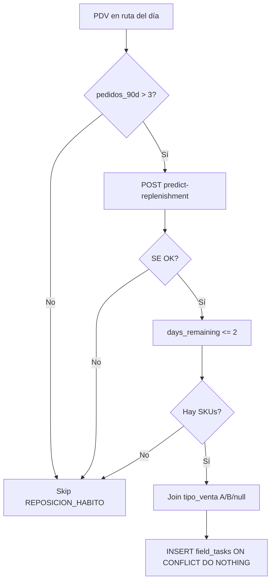

# Suplai Field — Tarea `REPOSICION_HABITO` (reposición por hábito)

**Estado:** Aprobado (diseño) · **Implementado** backend + field-app (2026-06-23)  
**Índice:** [003-suplai-field-app.md](./003-suplai-field-app.md)  
**Depende de:** [005-field-tareas-v2-diseno.md](./005-field-tareas-v2-diseno.md), sales-engine `predict-replenishment`  
**Implementación backend:** `backend/docs/specs/052-field-reposicion-habito.md`  
**Implementación field-app:** `field-app/app/[schema]/pdv/[id]/page.tsx` + `lib/types.ts`

---

## 1) Resumen

Nueva tarea diaria para vendedores humanos que usa **sales-engine** (`POST /v1/tenants/{schema}/predict-replenishment`) para detectar SKUs con **hábito de recompra** y avisar cuándo el PdV **se está por quedar sin stock** (ventana 0–2 días) o **ya debería haberse quedado sin stock** (retraso vs ciclo).

No reemplaza `MEJORAR_MIX_RENTABLE` (top B del historial sin urgencia temporal) ni `CROSS_SELL_RENTABLE` (standby legacy). Es un **tercer eje temporal por SKU**.

---

## 2) Decisiones cerradas

| # | Tema | Decisión |
|---|------|----------|
| 1 | Código tarea | `REPOSICION_HABITO` |
| 2 | Fuente datos | sales-engine `predict-replenishment` (no SQL ad-hoc en backend) |
| 3 | Generación | **Híbrido:** CRON ~05:00–05:30 TZ tenant + lazy en primer `GET /vendedor-app/home` del día |
| 4 | Alcance PDV | Solo PDVs de la **ruta del día** del vendedor que cumplan elegibilidad |
| 5 | Elegibilidad PDV | **> 3 pedidos** `confirmado`/`descargado` en los **últimos 3 meses** (90 días) |
| 6 | Filtro SKU | **Ninguno** — todos los hábitos urgentes del cliente (sin filtrar A/B) |
| 7 | Ventana urgencia | `days_remaining <= 2` (incluye vencidos: `days_remaining < 0`) |
| 8 | Hábito mínimo | ≥ 3 compras en fechas distintas (regla sales-engine; no configurable en V1) |
| 9 | Tipo comercial en copy | Mostrar `(A)`, `(B)` o `(—)` junto al nombre del SKU en descripción y BFF |
| 10 | Criterio éxito | Igual motor V2: match de `combo_skus` en **un solo pedido del día**; puntos por SKU + bonus completitud; segundo pedido no suma |
| 11 | Degradación | Si sales-engine no responde → **no generar** tarea para ese PDV (no bloquear Home) |
| 12 | Deduplicación | UNIQUE `(vendedor_id, cliente_id, tipo, fecha)` — una instancia por PDV/día |

---

## 3) Relación con sales-engine

### 3.1 Endpoint

```http
POST /v1/tenants/{schema}/predict-replenishment
Content-Type: application/json
X-API-Key: {SALES_ENGINE_API_KEY}   # si está configurado

{"cliente_id": "123"}
```

Respuesta relevante (por ítem):

```json
{
  "predictions": [
    {
      "product_code": "295",
      "avg_interval_days": 7.0,
      "last_purchase_date": "2026-06-16",
      "predicted_next_purchase": "2026-06-23",
      "days_remaining": 0,
      "urgency_score": 1.0,
      "is_custom_interval": true
    }
  ]
}
```

Referencia algoritmo: `sales-engine/docs/05-reposicion.md`, función `predict_replenishment` en `predict.py`.

### 3.2 Filtro de urgencia (backend)

Tras recibir `predictions[]`:

```text
urgentes = [p for p in predictions if p.days_remaining <= days_ahead_max]
```

Default `days_ahead_max = 2`. Incluye:

| `days_remaining` | Copy sugerido |
|------------------|---------------|
| `< 0` | **Ya debería estar sin stock** (retraso de \|N\| días vs ciclo) |
| `0` | **Hoy** debería recomprar / sin stock estimado |
| `1` | Se queda sin stock en **~1 día** |
| `2` | Se queda sin stock en **~2 días** |
| `> 2` | **No generar** tarea para ese SKU |

Ordenar por `urgency_score` desc, luego `days_remaining` asc. Tomar hasta `max_items` (default **5**).

### 3.3 Enriquecimiento `tipo_venta`

Join con `{schema}.productos.tipo_venta` para cada SKU urgente:

| `tipo_venta` | Sufijo en texto |
|--------------|-----------------|
| `'A'` | `(A)` |
| `'B'` | `(B)` |
| `NULL` | `(—)` |

---

## 4) Elegibilidad del PDV (> 3 pedidos / 90 días)

Antes de llamar a sales-engine:

```sql
SELECT COUNT(*)::int AS pedidos_90d
FROM {schema}.pedidos p
WHERE p.cliente_id = $cliente_id
  AND lower(trim(p.estado::text)) IN ('confirmado', 'descargado')
  AND p.fecha >= (CURRENT_DATE - INTERVAL '90 days');
```

| Resultado | Acción |
|-----------|--------|
| `pedidos_90d <= 3` | **No generar** `REPOSICION_HABITO` |
| `pedidos_90d > 3` | Continuar con `predict-replenishment` |

**Nota:** este umbral es independiente del hábito por SKU (≥ 3 compras del producto).

---

## 5) Generación de tareas

### 5.1 Cuándo corre

| Mecanismo | Implementación actual | Esta tarea |
|-----------|----------------------|------------|
| CRON | `run_field_daily_tasks_job` — `CronTrigger(hour=5, minute=30)` en `main.py` | Mismo job; alinear a **05:00** si el tenant lo requiere |
| Lazy | `VendedorAppService.get_home` → `ensure_daily_tasks` | Idempotente; captura PDVs nuevos post-CRON |

Ambos invocan `FieldTaskService.ensure_daily_tasks(schema, vendedor_id, fecha)`.

### 5.2 Flujo por PDV en ruta



### 5.3 Plantilla (`field_task_templates`)

Seed sugerido:

| Campo | Valor |
|-------|-------|
| `tipo` | `REPOSICION_HABITO` |
| `nombre` | Reposición por hábito |
| `activo` | `true` (tras implementación) |
| `puntos_default` | 50 |
| `descripcion_template` | Ver §5.4 |
| `criterio_json` | Ver §6 |

Migración: extender `CHECK (tipo IN (...))` en `field_task_templates` / `field_tasks`.

### 5.4 Texto renderizado (`descripcion`)

Plantilla base (supervisor editable):

```text
{cliente}: reposición urgente — {detalle_skus}
```

`detalle_skus` — un fragmento por SKU, unidos por ` · `:

```text
COLA 3l MANAOS (A) — cada 7 d · última 16/06 · hoy sin stock estimado
AGUA 2l VILLA (B) — cada 14 d · última 09/06 · ~2 días
GALLETITA GAONA (—) — cada 10 d · última 01/06 · ya debería estar sin stock (4 d retraso)
```

Reglas de copy:

- Siempre: nombre comercial corto + `(A|B|—)`.
- Siempre: `cada {avg_interval_days} d` (redondeo entero).
- Siempre: `última {DD/MM}` desde `last_purchase_date`.
- Cierre según `days_remaining`:
  - `> 0`: `~{N} días` o `en ~{N} días`
  - `== 0`: `hoy sin stock estimado`
  - `< 0`: `ya debería estar sin stock ({abs(N)} d retraso)`

---

## 6) `criterio_json` de instancia

```json
{
  "source": "sales_engine_replenishment",
  "days_ahead_max": 2,
  "max_items": 5,
  "min_habit_purchases": 3,
  "pedidos_90d": 6,
  "puntos_por_sku": 10,
  "bonus_completitud": 20,
  "min_qty_per_sku": 1,
  "combo_skus": ["295", "318"],
  "replenishment_items": [
    {
      "product_code": "295",
      "nombre": "COLA 3 lts. X 6 MANAOS",
      "tipo_venta": "A",
      "avg_interval_days": 7.0,
      "last_purchase_date": "2026-06-16",
      "predicted_next_purchase": "2026-06-23",
      "days_remaining": 0,
      "urgency_score": 1.0,
      "estado_reposicion": "hoy"
    }
  ],
  "evaluacion_cerrada": false,
  "skus_cumplidos": []
}
```

`estado_reposicion` enum sugerido: `por_agotarse` | `hoy` | `agotado` (derivado de `days_remaining`).

Defaults tenant (override en plantilla):

| Clave | Default |
|-------|---------|
| `days_ahead_max` | 2 |
| `max_items` | 5 |
| `puntos_por_sku` | 10 |
| `bonus_completitud` | 20 |
| `min_qty_per_sku` | 1 |

---

## 7) Criterio de éxito y evaluación

Reutilizar motor V2 existente (`evaluate_pedido`):

1. Pedido `confirmado` del **mismo día** que la tarea.
2. **Primer pedido evaluado** del día cierra la tarea (`evaluacion_cerrada: true`).
3. `combo_skus_matched` sobre `combo_skus` (= códigos de `replenishment_items`).
4. Puntos = `matched × puntos_por_sku` + `bonus_completitud` si todos los SKUs en un solo pedido.
5. Estado: `PARCIAL` o `COMPLETADA`.

Incluir `REPOSICION_HABITO` en el mismo branch que `MEJORAR_MIX_RENTABLE` en `evaluate_pedido`.

---

## 8) BFF / UI vendedor

### 8.1 Home y ficha PDV

Extender `tareas_activas` en `GET /vendedor-app/pdv/{id}/perfil` (y resumen en home):

```json
{
  "id": 42,
  "tipo": "REPOSICION_HABITO",
  "descripcion": "Dulce Sorpresa: reposición urgente — …",
  "puntos": 70,
  "estado": "PENDIENTE",
  "combo_skus": ["295", "318"],
  "combo_skus_detalle": [
    {"code": "295", "nombre": "COLA 3 lts. X 6 MANAOS", "tipo_venta": "A"}
  ],
  "replenishment_items": [
    {
      "product_code": "295",
      "nombre": "COLA 3 lts. X 6 MANAOS",
      "tipo_venta": "A",
      "avg_interval_days": 7,
      "last_purchase_date": "2026-06-16",
      "days_remaining": 0,
      "estado_reposicion": "hoy",
      "label": "COLA 3l MANAOS (A) — cada 7 d · última 16/06 · hoy sin stock estimado"
    }
  ]
}
```

Field app: en `TareaRow`, si `tipo === 'REPOSICION_HABITO'`, listar `replenishment_items` con badges de estado (`hoy` / `por agotarse` / `sin stock estimado`).

### 8.2 Backoffice supervisor

Bloque “Reglas de negocio” auto-generado:

> Se activa en PDVs con más de 3 pedidos en 90 días. Sugiere SKUs con hábito de recompra (≥ 3 compras) que vencen en 0–2 días o ya están retrasados. Muestra tipo comercial (A/B/—). Puntos: 10 por SKU + 20 bonus por completar todos en un pedido.

---

## 9) Cambios por repo (implementación)

| Repo | Cambio |
|------|--------|
| `backend-supabase` | `predict_replenishment()` en `sales_engine_client.py`; rama en `ensure_daily_tasks`; evaluación; migración tipo + seed plantilla; query `pedidos_90d` |
| `field-app` | Tipos TS + UI `replenishment_items` |
| `product-management-app` | Copy plantilla + reglas en ficha tarea |
| `sales-engine` | Sin cambios de algoritmo V1 (solo retrain tras seed) |
| `suplai-platform` | Esta spec + actualizar índice 003 |

Variables backend:

```bash
SALES_ENGINE_URL=http://127.0.0.1:8001   # puerto local distinto al backend 8000
SALES_ENGINE_API_KEY=...                  # opcional; mismo valor en sales-engine
```

---

## 10) Plan de pruebas en localhost

### 10.1 Prerrequisitos

| Servicio | Puerto | Comando |
|----------|--------|---------|
| Backend | `8000` | `cd backend && uvicorn main:app --reload --port 8000` |
| Sales-engine | `8001` | `cd sales-engine && uvicorn main:app --reload --port 8001` |
| Field app | `3001` | `cd field-app && BACKEND_URL=http://localhost:8000 npm run dev -- -p 3001` |

Backend `.env`:

```bash
SALES_ENGINE_URL=http://127.0.0.1:8001
# SALES_ENGINE_API_KEY=dev-local-key
```

Sales-engine `.env` (pooler **6543**, `statement_cache_size=0` vía código):

```bash
DATABASE_URL=postgresql://...@...supabase.co:6543/postgres
MODEL_DIR=models
# SALES_ENGINE_API_KEY=dev-local-key
```

Tenant: **`el_gigante`** (`sales_assistant_enabled = true`, tablas `field_*` migradas).

### 10.2 Secuencia de prueba

#### Paso 0 — Seed de datos (§11)

Ejecutar scripts SQL de la sección 11 en Supabase (solo `el_gigante`).

#### Paso 1 — Retrain sales-engine

```bash
curl -s -X POST "http://127.0.0.1:8001/v1/tenants/el_gigante/models/retrain" \
  -H "Content-Type: application/json" \
  -d '{"since_days": 365}'
```

Esperado: `200` y archivo `sales-engine/models/el_gigante.pkl`.

#### Paso 2 — Verificar predicción cruda

Obtener `cliente_id` del cliente de prueba (Dulce Sorpresa):

```sql
SELECT id, razon_social, phone_number
FROM el_gigante.clients
WHERE phone_number = '5493587905250';
```

```bash
CLIENTE_ID=<id_del_paso_anterior>

curl -s -X POST "http://127.0.0.1:8001/v1/tenants/el_gigante/predict-replenishment" \
  -H "Content-Type: application/json" \
  -d "{\"cliente_id\": \"${CLIENTE_ID}\"}" | jq .
```

**Criterio de aceptación:** al menos un ítem con `product_code = "295"`, `days_remaining <= 2`, `avg_interval_days` ≈ 7.

Debug opcional:

```bash
curl -s "http://127.0.0.1:8001/v1/tenants/el_gigante/models/debug?cliente_id=${CLIENTE_ID}" | jq .
```

#### Paso 3 — Generar tareas

**Opción A — Lazy (recomendada):**

```bash
# Login vendedor Juan Pérez
curl -s -X POST "http://127.0.0.1:8000/login-vendedor" \
  -H "Content-Type: application/json" \
  -H "x-schema-name: el_gigante" \
  -d '{"telefono": "5493716123456"}'

# Home (dispara ensure_daily_tasks)
curl -s "http://127.0.0.1:8000/el_gigante/vendedor-app/home" \
  -H "x-schema-name: el_gigante" \
  -H "Authorization: Bearer <token>" | jq '.ruta.items[] | select(.tareas_count > 0)'
```

**Opción B — CRON manual:**

```python
# Desde backend/, python -c async snippet o pytest
from services.field_daily_tasks_job import run_field_daily_tasks_job
import asyncio
asyncio.run(run_field_daily_tasks_job())
```

**Nota día de ruta:** Juan Pérez tiene clientes con `dia_de_visita = lunes` (zona NORTE). Probar un **lunes** o temporalmente ajustar `dia_visita` de la geo_zone / cliente de prueba.

#### Paso 4 — Verificar instancia en BD

```sql
SELECT id, tipo, descripcion, estado, criterio_json
FROM el_gigante.field_tasks
WHERE tipo = 'REPOSICION_HABITO'
  AND fecha = CURRENT_DATE
ORDER BY id DESC
LIMIT 5;
```

**Criterio:** fila para cliente Dulce Sorpresa; `criterio_json.replenishment_items` no vacío; `descripcion` contiene `(A)` en SKU 295.

#### Paso 5 — UI Field

1. Abrir `http://localhost:3001/el_gigante?wp=5493716123456`
2. Home → PDV **Dulce Sorpresa** → ficha → bloque tareas activas
3. Ver lista de SKUs con frecuencia y estado “hoy” / “~2 días” / “sin stock”

#### Paso 6 — Evaluación por pedido

1. Crear pedido confirmado para el cliente con al menos un SKU de `combo_skus` (ej. `295`).
2. Verificar `field_tasks.estado` → `PARCIAL` o `COMPLETADA` y `field_point_ledger` con puntos.

```bash
# Tras confirmar pedido desde app o API vendedor-app
curl -s "http://127.0.0.1:8000/el_gigante/vendedor-app/pdv/<pdv_id>/perfil" \
  -H "x-schema-name: el_gigante" \
  -H "Authorization: Bearer <token>" | jq '.tareas_activas'
```

### 10.3 Casos negativos

| Caso | Setup | Esperado |
|------|-------|----------|
| PDV con ≤ 3 pedidos / 90 d | Cliente nuevo sin historial | Sin tarea `REPOSICION_HABITO` |
| Sales-engine caído | `SALES_ENGINE_URL` inválida | Home OK; sin tarea de este tipo |
| SKU sin hábito | Cliente con 1–2 compras del SKU | No aparece en predicción |
| `days_remaining = 5` | Última compra reciente | No genera tarea |
| Segundo pedido del día | Tras evaluación parcial | No suma SKUs extra (`evaluacion_cerrada`) |

### 10.4 Checklist final

- [ ] Plantilla `REPOSICION_HABITO` activa en `el_gigante`
- [ ] Retrain OK; `predict-replenishment` devuelve SKU 295 urgente
- [ ] Tarea generada solo si `pedidos_90d > 3`
- [ ] Descripción incluye `(A)`, `(B)` o `(—)`
- [ ] Ventana 0–2 días respetada
- [ ] Pedido confirmado evalúa PARCIAL/COMPLETADA
- [ ] CRON 05:30 + lazy idempotente (sin duplicados)

---

## 11) Scripts de seed — tenant `el_gigante` (localhost)

> **Schema:** `el_gigante` únicamente. Ejecutar en Supabase SQL Editor o vía MCP `execute_sql`.  
> **Archivos:** `scripts/field-reposicion-habito/seed_el_gigante.sql` y `scripts/field-reposicion-habito/smoke_el_gigante.sh`  
> **Fecha relativa:** usa `CURRENT_DATE` para que las fechas sigan siendo válidas al probar.  
> **Cliente de prueba:** Dulce Sorpresa (`5493587905250`) — vendedor **Juan Pérez** (`5493716123456`), ruta **lunes**.

### 11.1 Activar módulo Field + plantilla

```sql
-- 11.1 Activar sales assistant
UPDATE public.distribuidoras
SET sales_assistant_enabled = true
WHERE schema_name = 'el_gigante';

-- 11.1 Extender CHECK de tipos (si aún no incluye REPOSICION_HABITO)
ALTER TABLE el_gigante.field_task_templates
  DROP CONSTRAINT IF EXISTS field_task_templates_tipo_check;

ALTER TABLE el_gigante.field_task_templates
  ADD CONSTRAINT field_task_templates_tipo_check
  CHECK (tipo IN (
    'REACTIVAR_CLIENTE',
    'MEJORAR_MIX_RENTABLE',
    'CROSS_SELL_RENTABLE',
    'CROSS_SELL_COMBO',
    'REPOSICION_HABITO'
  ));

ALTER TABLE el_gigante.field_tasks
  DROP CONSTRAINT IF EXISTS field_tasks_tipo_check;

-- field_tasks.tipo no suele tener CHECK separado; si existe, agregar REPOSICION_HABITO

INSERT INTO el_gigante.field_task_templates (
  tipo, nombre, descripcion_template, puntos_default, criterio_json, activo
)
SELECT
  'REPOSICION_HABITO',
  'Reposición por hábito',
  '{cliente}: reposición urgente — {detalle_skus}',
  50,
  '{
    "source": "sales_engine_replenishment",
    "days_ahead_max": 2,
    "max_items": 5,
    "min_habit_purchases": 3,
    "puntos_por_sku": 10,
    "bonus_completitud": 20,
    "min_qty_per_sku": 1
  }'::jsonb,
  true
WHERE NOT EXISTS (
  SELECT 1 FROM el_gigante.field_task_templates WHERE tipo = 'REPOSICION_HABITO'
);
```

### 11.2 Tipo comercial A/B en productos de prueba

```sql
-- SKU principal del hábito semanal → tipo A
UPDATE el_gigante.productos SET tipo_venta = 'A' WHERE product_code = '295';

-- SKU secundario opcional en predicciones → tipo B
UPDATE el_gigante.productos SET tipo_venta = 'B' WHERE product_code = '318';

-- Sin clasificar (control copy "—")
UPDATE el_gigante.productos SET tipo_venta = NULL WHERE product_code = '6';
```

### 11.3 Pedidos semanales — hábito SKU `295` (COLA MANAOS)

Inserta **3 pedidos** espaciados 7 días, último **`CURRENT_DATE - 7`** → próxima recompra **hoy** (`days_remaining = 0`).

```sql
DO $$
DECLARE
  v_cliente_id integer;
  v_pedido_id bigint;
  v_fechas date[] := ARRAY[
    CURRENT_DATE - 21,
    CURRENT_DATE - 14,
    CURRENT_DATE - 7
  ];
  v_fecha date;
  v_total numeric := 9720.00;
BEGIN
  SELECT id INTO v_cliente_id
  FROM el_gigante.clients
  WHERE phone_number = '5493587905250'
  LIMIT 1;

  IF v_cliente_id IS NULL THEN
    RAISE EXCEPTION 'Cliente Dulce Sorpresa no encontrado (5493587905250)';
  END IF;

  -- Limpiar pedidos seed previos de este script (idempotente)
  DELETE FROM el_gigante.items_pedido ip
  USING el_gigante.pedidos p
  WHERE ip.pedido_id = p.id
    AND p.cliente_id = v_cliente_id
    AND p.notas = 'SEED REPOSICION_HABITO test';

  DELETE FROM el_gigante.pedidos
  WHERE cliente_id = v_cliente_id
    AND notas = 'SEED REPOSICION_HABITO test';

  FOREACH v_fecha IN ARRAY v_fechas LOOP
    INSERT INTO el_gigante.pedidos (
      cliente_id, fecha, total, estado, notas
    ) VALUES (
      v_cliente_id,
      v_fecha + TIME '10:00:00',
      v_total,
      'confirmado',
      'SEED REPOSICION_HABITO test'
    )
    RETURNING id INTO v_pedido_id;

    INSERT INTO el_gigante.items_pedido (
      pedido_id, product_code, cantidad_solicitada, precio_unitario
    ) VALUES (
      v_pedido_id, '295', 2, v_total / 2
    );
  END LOOP;

  RAISE NOTICE 'Seed OK: cliente_id=%, 3 pedidos semanales SKU 295', v_cliente_id;
END $$;
```

### 11.4 Verificación post-seed

```sql
-- Elegibilidad PDV (> 3 pedidos / 90 d)
SELECT c.id, c.razon_social, COUNT(p.id) AS pedidos_90d
FROM el_gigante.clients c
JOIN el_gigante.pedidos p ON p.cliente_id = c.id
WHERE c.phone_number = '5493587905250'
  AND lower(trim(p.estado::text)) IN ('confirmado', 'descargado')
  AND p.fecha >= CURRENT_DATE - INTERVAL '90 days'
GROUP BY c.id, c.razon_social;

-- Hábito SKU 295 (≥ 3 fechas distintas)
SELECT p.cliente_id, ip.product_code, COUNT(DISTINCT p.fecha::date) AS compras
FROM el_gigante.pedidos p
JOIN el_gigante.items_pedido ip ON ip.pedido_id = p.id
WHERE ip.product_code = '295'
  AND p.cliente_id = (SELECT id FROM el_gigante.clients WHERE phone_number = '5493587905250' LIMIT 1)
  AND lower(trim(p.estado::text)) NOT IN ('cancelado', 'cancelada', 'anulado', 'anulada')
GROUP BY p.cliente_id, ip.product_code;

-- Vendedor y ruta (lunes)
SELECT v.id, v.nombre, v.telefono
FROM el_gigante.vendedores v
WHERE v.telefono = '5493716123456';
```

Resultados esperados:

| Query | Esperado |
|-------|----------|
| `pedidos_90d` | **> 3** (mock Fase 6 + 3 seed) |
| Compras SKU 295 | **≥ 3** fechas distintas |
| Vendedor | `id` asignado a Dulce Sorpresa vía `vendedores_clientes` / geo_zones |

### 11.5 Retrain + smoke test (shell)

```bash
#!/usr/bin/env bash
# Guardar como: scripts/field-reposicion-habito/smoke_el_gigante.sh
set -euo pipefail

SE_URL="${SALES_ENGINE_URL:-http://127.0.0.1:8001}"
CLIENTE_ID=$(psql "$DATABASE_URL" -tA -c \
  "SELECT id FROM el_gigante.clients WHERE phone_number='5493587905250' LIMIT 1")

echo "== Retrain =="
curl -sf -X POST "$SE_URL/v1/tenants/el_gigante/models/retrain" \
  -H "Content-Type: application/json" \
  -d '{"since_days": 365}'

echo ""
echo "== Predict replenishment cliente_id=$CLIENTE_ID =="
curl -sf -X POST "$SE_URL/v1/tenants/el_gigante/predict-replenishment" \
  -H "Content-Type: application/json" \
  -d "{\"cliente_id\": \"$CLIENTE_ID\"}" | jq '.predictions[] | select(.product_code=="295")'
```

### 11.6 Datos mínimos resumidos

| Entidad | Valor |
|---------|-------|
| Tenant | `el_gigante` |
| Vendedor | Juan Pérez — `5493716123456` |
| Cliente / PDV | Dulce Sorpresa — `5493587905250` |
| SKU hábito | `295` (COLA 3l MANAOS), `tipo_venta = A` |
| Intervalo | ~7 días (3 pedidos seed) |
| Urgencia | `days_remaining = 0` el día del test |
| Día ruta | **Lunes** (zona NORTE) |

---

## 12) Criterios de aceptación (implementación)

- [ ] Tipo `REPOSICION_HABITO` en migración + plantilla activa
- [ ] `predict_replenishment` en `sales_engine_client.py`
- [ ] Elegibilidad `pedidos_90d > 3` antes de llamar SE
- [ ] Filtro `days_remaining <= 2`; sin filtro A/B
- [ ] Copy con `(A)`, `(B)`, `(—)`
- [ ] Evaluación PARCIAL/COMPLETADA igual V2
- [ ] BFF expone `replenishment_items`
- [ ] Field app muestra detalle por SKU
- [ ] Seed §11 + plan §10 reproducible en localhost

---

## 13) Referencias

- Motor tareas V2: [005-field-tareas-v2-diseno.md](./005-field-tareas-v2-diseno.md)
- Reposición ML: `sales-engine/docs/05-reposicion.md`
- Job CRON: `backend/services/field_daily_tasks_job.py`
- Implementación mock tenant: `implementacion/el_gigante/`
