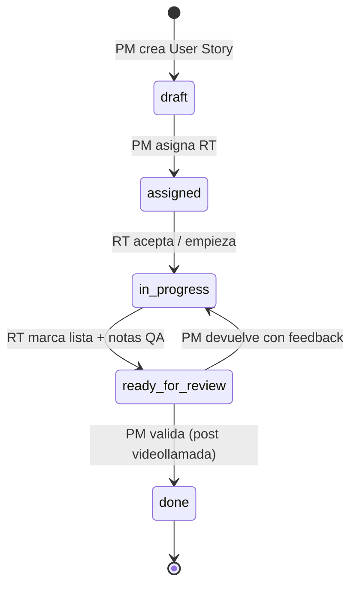

# Admin — Implementaciones: checklist de User Stories y roles dual

**Estado:** Draft  
**Fecha:** 2026-06-24  
**Repos:** `product-management-app`, `backend-supabase`  
**Precede a:** [045-gestor-proyectos-kanban-ui.md](../../product-management-app/doc/specs/045-gestor-proyectos-kanban-ui.md) (UI), [049-gestor-proyectos-hitos-kanban.md](../../backend-supabase/docs/specs/049-gestor-proyectos-hitos-kanban.md) (API), [046-admin-permisos-roles-areas-ui.md](../../product-management-app/doc/specs/046-admin-permisos-roles-areas-ui.md) (permisos)

---

## 1) Contexto y problema

Las primeras implementaciones de clientes (hasta lograr un flujo estable y PMF) son en la práctica **pequeños proyectos internos** con muchas customizaciones: integraciones ERP, reglas comerciales, ajustes de agente, excepciones de catálogo, etc.

El gestor actual en `/admin` → **Implementaciones** (SPEC-045/049) resuelve bien el **pipeline comercial de 4 hitos** y el SLA de 14 días, pero el trabajo diario se registra como **avances textuales por día** (`implementation_project_updates`) y un único **Responsable** (`owner_user_id`). Eso no modela:

- La separación entre quien gestiona la relación con el cliente y quien ejecuta la customización técnica.
- Un backlog de requerimientos trazable (User Stories) con asignación, QA y cierre formal.
- La visibilidad rápida en la tarjeta Kanban de qué falta cerrar en el hito actual.

### Estado actual (referencia)

| Capa | Ubicación |
|------|-----------|
| Tablero Kanban | `components/admin/projects-section.tsx`, `project-kanban-card.tsx` |
| Detalle | `components/admin/project-detail.tsx` — timeline por hito + avance diario + archivos |
| API | `POST /admin/projects/*` — `routers/admin_projects.py` |
| Tablas | `implementation_projects`, `_updates`, `_files`, `_milestone_log` |
| Rol único | `owner_user_id` → UI label "Responsable" |

---

## 2) Objetivo

Evolucionar el planner de implementaciones para operar implementaciones tempranas como **proyectos internos de customización**, con:

1. **Responsable de proyecto de cara al cliente** — gestiona expectativas, scope, tiempos y relación; define requerimientos; puede adjuntar documento de requerimientos.
2. **Responsable técnico** — asignado **por User Story** (variable); traduce requerimientos en trabajo técnico, ejecuta, hace QA y presenta solución.
3. **Checklist de User Stories** por hito — reemplaza el timeline de avances diarios como unidad principal de seguimiento.
4. **Preview en tarjeta Kanban** — progreso del checklist del hito actual visible sin abrir el detalle.
5. **Leaderboard** superior — conteos de implementaciones por hito + cerradas + resumen SLA.
6. **Hito final En producción** (`in_production`) — quinto estado del pipeline, con **animación de festejo y sonido** al avanzar.

### Métricas de éxito

- 100 % de proyectos abiertos tienen al menos un responsable de cara al cliente asignado antes de avanzar del hito 1.
- Cada User Story cerrada tiene trazabilidad: creador, responsable técnico, fechas de asignación / entrega / cierre.
- La tarjeta Kanban muestra `{cerradas}/{total}` User Stories del hito actual.
- Los avances diarios (si se mantienen) pasan a ser opcionales / secundarios, no el eje del seguimiento.

---

## 3) Conceptos y roles

### 3.1 Responsable de proyecto de cara al cliente

| Aspecto | Definición |
|---------|------------|
| Campo DB | Renombrar semánticamente `owner_user_id` → **`client_pm_user_id`** (migración con alias temporal en API) |
| Label UI | **Responsable de proyecto (cliente)** — tooltip: "Gestiona expectativas, scope, tiempos y relación con el cliente" |
| Responsabilidades | Crear/editar User Stories; adjuntar doc de requerimientos; asignar responsable técnico; validar entrega y **cerrar** User Story |
| Quién puede serlo | Staff con área `implementaciones` o founder; típicamente el owner actual del proyecto |

### 3.2 Responsable técnico

| Aspecto | Definición |
|---------|------------|
| Campo DB | **`technical_owner_user_id`** en cada User Story (nullable hasta asignación) |
| Label UI | **Responsable técnico** |
| Responsabilidades | Aceptar asignación; desarrollar/customizar; registrar notas de implementación y evidencia QA; marcar **Lista para revisión**; presentar en videollamada (fuera de sistema) |
| Variabilidad | Distinto colaborador por User Story; puede ser de área `tecnica` o `implementaciones` con perfil técnico |

### 3.3 User Story (ítem del checklist)

Unidad de trabajo derivada de un requerimiento del cliente dentro de un **hito** (`milestone_code`).

Campos mínimos:

| Campo | Tipo | Notas |
|-------|------|-------|
| `title` | TEXT | Obligatorio, ≤ 200 chars — resumen del requerimiento |
| `description` | TEXT | Detalle / criterios de aceptación |
| `milestone_code` | TEXT | Catálogo existente (4 hitos) |
| `status` | ENUM | Ver §4 |
| `client_pm_user_id` | UUID | Hereda del proyecto al crear; editable solo por PM/founder |
| `technical_owner_user_id` | UUID | Asignado por PM |
| `sort_order` | INT | Orden manual en checklist |
| `requirements_file_id` | UUID FK nullable | Link opcional a archivo de requerimientos del proyecto |
| `due_date` | DATE nullable | Opcional — sugerido por PM |
| `review_notes` | TEXT nullable | PM al cerrar o devolver |
| `tech_notes` | TEXT nullable | RT al entregar / QA |

---

## 4) Flujo de trabajo



### Pasos operativos

1. **PM de cara al cliente** crea ítems en el checklist del **hito actual** (sección que hoy es "Timeline por hito").
2. Opcionalmente adjunta o vincula **documento de requerimientos** (PDF/Doc/MD) a nivel proyecto o por User Story.
3. PM **asigna responsable técnico** a una o varias User Stories (bulk assign permitido).
4. **Responsable técnico** desarrolla, documenta en `tech_notes`, adjunta evidencia (capturas, links) y marca **Lista para revisión**.
5. **Videollamada** de presentación (fuera del sistema) — PM registra opcionalmente link de reunión o nota en la User Story.
6. PM **valida y cierra** (`done`) o **devuelve** a `in_progress` con `review_notes`.

### Reglas de negocio

- User Stories solo se crean/editan en el **hito actual** del proyecto (mismo patrón que avances diarios en SPEC-049).
- Al **avanzar hito** (super admin / manager): User Stories abiertas del hito anterior quedan **bloqueadas** (solo lectura); no impiden avanzar hito en v1.
- Proyecto **cerrado**: checklist completo en solo lectura.
- Una User Story `done` no se reabre en v1 (crear nueva si hay cambio de scope).

---

## 5) Pipeline — hitos v2 (5 columnas)

| Orden | `milestone_code` | Label UI |
|------:|------------------|----------|
| 1 | `agentic_implementation` | Implementación agéntica |
| 2 | `platform_whatsapp_tests` | Pruebas plataforma + WhatsApp |
| 3 | `final_tests` | Pruebas finales |
| 4 | `production` | Salida a producción |
| 5 | `in_production` | **En producción** |

- **En producción** es el hito final operativo: el cliente ya está live; el proyecto sigue abierto hasta cierre administrativo.
- Al avanzar a `in_production`, la API responde `celebrate: true` y la UI dispara festejo (§5.0).
- SLA: considerar meta cumplida si el proyecto está en `production` o `in_production`.

### 5.0 Leaderboard y festejo

**Leaderboard** (`implementation-pipeline-leaderboard.tsx`): barra superior en Implementaciones con chips `{count} {label}` por hito, chip **Cerradas**, y resumen SLA. Datos de `POST /admin/projects/pipeline-stats`. Click en chip → scroll a columna Kanban.

**Festejo En producción** (`production-celebration-overlay.tsx`): confetti (`canvas-confetti`) + audio `/sounds/production-celebration.mp3` al recibir `celebrate: true`. Respetar `prefers-reduced-motion` y preferencia de silencio en localStorage.

Detalle UI: [047-admin-implementaciones-checklist-ui.md](../../product-management-app/doc/specs/047-admin-implementaciones-checklist-ui.md).

---

## 6) UX / UI

### 6.1 Tarjeta Kanban (`project-kanban-card.tsx`)

Reemplazar la fila **"{N} avances en hito"** por:

```
Checklist: 3/7 cerradas
[=======---] 43%
```

- `3/7` = User Stories `done` / total del `current_milestone`.
- Barra de progreso compacta; color verde si 100 %, ámbar si hay ítems `ready_for_review`, gris default.
- Icono `ListChecks` en lugar de `MessageSquareText`.
- Mantener: SLA, días, monto, **Responsable de proyecto (cliente)** (renombrado).

Si no hay User Stories en el hito: mostrar **"Sin requerimientos"** en muted.

### 6.2 Detalle del proyecto (`project-detail.tsx`)

#### Panel administración (columna lateral)

| Control actual | Cambio |
|----------------|--------|
| Label "Responsable" | **Responsable de proyecto (cliente)** |
| Select owner | Sin cambio funcional; nuevo copy y tooltip |
| — | Nuevo bloque **Documento de requerimientos** — upload / ver / reemplazar archivo marcado `file_role = 'requirements'` |

#### Sección principal — reemplazar "Timeline por hito"

**Antes:** tabs por hito → lista de avances diarios.  
**Después:** tabs por hito → **Checklist de User Stories** + sección colapsable "Avances diarios (legado)".

**Checklist (hito seleccionado):**

```
[+ Agregar User Story]                    [Asignar RT a seleccionadas]

☐  US-12  Integración lista precios ERP     [Ana · técnica]  En progreso
☑  US-11  Prompt agente tono formal         [Lucas · técnica]  Cerrada ✓
☐  US-10  Regla mínimo pedido $50k         Sin asignar         Borrador

Al expandir ítem:
  Descripción · Criterios de aceptación
  Responsable técnico [select] · Fecha objetivo
  Notas técnicas · Notas de revisión
  [Marcar lista para revisión] (RT)  |  [Cerrar] [Devolver] (PM)
```

Estados con badge de color:

| Status | Label ES | Badge |
|--------|----------|-------|
| `draft` | Borrador | secondary |
| `assigned` | Asignada | outline |
| `in_progress` | En progreso | default |
| `ready_for_review` | Lista para revisión | amber |
| `done` | Cerrada | green/success |

**Permisos UI (ver §7):** ocultar acciones no permitidas.

#### Avances diarios (legado)

- Mantener textarea "Avance de hoy" **colapsado por defecto** bajo accordion "Registro diario (opcional)".
- No eliminar en v1 — algunos PM pueden seguir usándolo como bitácora; deprecar en UI copy.

### 6.3 Responsive y accesibilidad

- Checklist usable en mobile (ítems apilados, acciones en menú `...`).
- Checkbox de selección múltiple para bulk assign con área táctil ≥ 44 px.
- Progress en tarjeta con `aria-label`: "3 de 7 user stories cerradas en hito actual".

---

## 7) Modelo de datos (backend)

### 7.1 Cambios en `implementation_projects`

```sql
-- Renombrar columna (migración)
ALTER TABLE public.implementation_projects
  RENAME COLUMN owner_user_id TO client_pm_user_id;

-- Índice
CREATE INDEX IF NOT EXISTS idx_implementation_projects_client_pm
  ON public.implementation_projects (client_pm_user_id);
```

API mantiene compatibilidad una versión: aceptar `owner_user_id` en request, persistir en `client_pm_user_id`, responder ambos campos deprecated.

### 7.2 Nueva tabla `implementation_project_user_stories`

```sql
CREATE TABLE public.implementation_project_user_stories (
  id uuid PRIMARY KEY DEFAULT gen_random_uuid(),
  project_id uuid NOT NULL REFERENCES public.implementation_projects(id) ON DELETE CASCADE,
  milestone_code text NOT NULL,
  title text NOT NULL,
  description text,
  status text NOT NULL DEFAULT 'draft',
  client_pm_user_id uuid REFERENCES public.profiles(id),
  technical_owner_user_id uuid REFERENCES public.profiles(id),
  sort_order int NOT NULL DEFAULT 0,
  requirements_file_id uuid REFERENCES public.implementation_project_files(id),
  due_date date,
  tech_notes text,
  review_notes text,
  assigned_at timestamptz,
  ready_at timestamptz,
  closed_at timestamptz,
  created_at timestamptz NOT NULL DEFAULT now(),
  updated_at timestamptz NOT NULL DEFAULT now(),
  created_by uuid REFERENCES public.profiles(id),
  CONSTRAINT implementation_project_user_stories_status_check
    CHECK (status IN ('draft','assigned','in_progress','ready_for_review','done')),
  CONSTRAINT implementation_project_user_stories_milestone_check
    CHECK (milestone_code IN ('agentic_implementation','platform_whatsapp_tests','final_tests','production','in_production'))
);

CREATE INDEX idx_impl_user_stories_project_milestone
  ON public.implementation_project_user_stories (project_id, milestone_code, sort_order);
CREATE INDEX idx_impl_user_stories_technical_owner
  ON public.implementation_project_user_stories (technical_owner_user_id)
  WHERE status NOT IN ('done');
```

### 7.3 Archivos — rol de requerimientos

Agregar a `implementation_project_files`:

```sql
ALTER TABLE public.implementation_project_files
  ADD COLUMN file_role text NOT NULL DEFAULT 'general'
  CHECK (file_role IN ('general', 'requirements', 'evidence'));
```

- Un proyecto puede tener **un** archivo activo `requirements` (último upload gana o flag `is_primary`).
- User Story puede referenciar `requirements_file_id` o subir evidencia con `file_role = 'evidence'`.

### 7.4 Agregados para list/board y pipeline-stats

**`POST /admin/projects/pipeline-stats`:**

```json
{
  "total_open": 12,
  "total_closed": 8,
  "by_milestone": {
    "agentic_implementation": 4,
    "platform_whatsapp_tests": 3,
    "final_tests": 2,
    "production": 2,
    "in_production": 1
  },
  "sla_summary": { "on_track": 7, "at_risk": 2, "overdue": 3 }
}
```

### 7.5 Agregados por proyecto (list/board)

En `/admin/projects/list` y `/board`, incluir por proyecto:

```json
{
  "user_stories_current_milestone_total": 7,
  "user_stories_current_milestone_done": 3,
  "user_stories_ready_for_review": 1
}
```

---

## 8) API

Prefijo existente `/admin/projects`. Nuevos endpoints:

| Método | Ruta | Descripción |
|--------|------|-------------|
| POST | `/user-stories/list` | `{ project_id, milestone_code? }` — default hito actual |
| POST | `/user-stories/create` | PM / founder / manager impl |
| POST | `/user-stories/update` | Campos editables según rol y status |
| POST | `/user-stories/assign` | `{ story_ids[], technical_owner_user_id }` — PM |
| POST | `/user-stories/bulk-status` | Transiciones válidas (ver máquina de estados) |
| POST | `/user-stories/reorder` | `{ project_id, milestone_code, ordered_ids[] }` |
| POST | `/user-stories/delete` | Solo `draft`, solo PM/founder |
| POST | `/pipeline-stats` | Leaderboard — conteos por hito + SLA |

Ajustes existentes:

| Endpoint | Cambio |
|----------|--------|
| `/assign-owner` | Renombrar a `/assign-client-pm` (alias deprecated `/assign-owner`) |
| `/get` | Incluir `user_stories_by_milestone`, `requirements_file`, renombrar campos owner |
| `/files/register` | Aceptar `file_role` |
| `/advance-milestone` | Secuencia 5 hitos; respuesta incluye `celebrate: true` si destino es `in_production` |

### Matriz de permisos

| Acción | Founder / manager impl | PM del proyecto (`client_pm_user_id`) | RT asignado | Staff admin (solo view) |
|--------|:----------------------:|:-------------------------------------:|:-----------:|:-----------------------:|
| Ver checklist | ✓ | ✓ | ✓ (sus ítems + resto read-only) | ✓ |
| Crear / editar US | ✓ | ✓ | ✗ | ✗ |
| Asignar RT | ✓ | ✓ | ✗ | ✗ |
| Trabajar (`in_progress`, notas técnicas) | ✓ | ✗ | ✓ (asignado) | ✗ |
| Marcar lista para revisión | ✓ | ✗ | ✓ (asignado) | ✗ |
| Cerrar / devolver US | ✓ | ✓ | ✗ | ✗ |
| Subir doc requerimientos | ✓ | ✓ | ✗ | ✗ |
| Avance diario (legado) | ✓ | ✓ | ✓ si RT en proyecto* | ✗ |

\* Opcional v1: restringir avance diario solo a PM; baja prioridad.

Transiciones validadas en backend (400 `INVALID_STATUS_TRANSITION` si no aplica).

---

## 9) Migración y compatibilidad

### 9.1 Datos existentes

- `owner_user_id` → `client_pm_user_id` sin pérdida.
- `implementation_project_updates` se **mantienen**; visibles en accordion legado.
- No crear User Stories automáticas desde avances (backfill manual si hace falta).

### 9.2 Tipos frontend

Actualizar `lib/admin/projects-types.ts`:

```ts
export type UserStoryStatus =
  | "draft"
  | "assigned"
  | "in_progress"
  | "ready_for_review"
  | "done"

export interface ImplementationUserStory {
  id: string
  title: string
  description?: string | null
  milestone_code: MilestoneCode
  status: UserStoryStatus
  technical_owner_nombre?: string | null
  technical_owner_user_id?: string | null
  // ...
}

// ImplementationProjectSummary — agregar:
user_stories_current_milestone_total?: number
user_stories_current_milestone_done?: number
user_stories_ready_for_review?: number

// Renombrar en UI (no breaking en API v1):
owner_* → client_pm_* con alias
```

---

## 10) Fuera de alcance (v1)

- Integración con Linear/Jira/Notion.
- Notificaciones Slack/email al asignar o al pasar a `ready_for_review`.
- Drag & drop de User Stories entre hitos.
- Subtareas técnicas dentro de una User Story (backlog anidado).
- Grabación automática de videollamadas.
- Automatizar avance de hito cuando checklist 100 % (sugerencia UI sí, acción sigue manual).
- Cambios en sección **Proyectos** (consultora / `custom-projects`) — tablero separado.

---

## 11) Plan de implementación sugerido

```text
Fase A — Backend (backend-supabase)
  sql/XX_implementation_user_stories.sql
  services/implementation_projects.py — CRUD + agregados board/list
  routers/admin_projects.py — endpoints §7
  tests/test_admin_projects_user_stories.py

Fase B — UI checklist detalle (product-management-app)
  project-detail.tsx — checklist + renombres roles
  lib/admin/projects-types.ts
  components/admin/project-user-story-item.tsx (nuevo)

Fase C — UI leaderboard + Kanban 5 columnas
  implementation-pipeline-leaderboard.tsx
  project-kanban-card.tsx — progreso checklist
  projects-section.tsx — stats + board

Fase D — Festejo En producción
  production-celebration-overlay.tsx + public/sounds/production-celebration.mp3

Fase E — Pulido
  Permisos según SPEC-046/050
  Copy ES en toda la sección Implementaciones
  Deprecar visualmente avances diarios
```

### Specs por repo

| Repo | Archivo |
|------|---------|
| `backend-supabase` | [054-admin-implementaciones-user-stories-api.md](../../backend-supabase/docs/specs/054-admin-implementaciones-user-stories-api.md) |
| `product-management-app` | [047-admin-implementaciones-checklist-ui.md](../../product-management-app/doc/specs/047-admin-implementaciones-checklist-ui.md) |

---

## 12) Criterios de aceptación

### Producto

- **AC-1:** PM puede crear User Story en hito actual con título y descripción.
- **AC-2:** PM puede subir PDF de requerimientos y vincularlo al proyecto.
- **AC-3:** PM asigna RT; RT ve la User Story en su lista (filtro "Mis asignaciones" opcional v1.1).
- **AC-4:** RT marca `ready_for_review`; PM cierra con un click post validación.
- **AC-5:** PM devuelve con `review_notes`; RT vuelve a `in_progress`.

### UI

- **AC-UI-1:** Tarjeta Kanban muestra `X/Y cerradas` del hito actual.
- **AC-UI-2:** Label "Responsable" desaparece; figura "Responsable de proyecto (cliente)".
- **AC-UI-3:** Sección "Timeline por hito" pasa a llamarse **Checklist de requerimientos** (subtítulo: hito activo).
- **AC-UI-4:** Usuario sin permiso de edición ve checklist en solo lectura.
- **AC-UI-5:** Leaderboard muestra conteos por hito incl. **En producción**.
- **AC-UI-6:** Avanzar a `in_production` dispara confetti + sonido (salvo reduced-motion / mute).

### API / seguridad

- **AC-API-1:** RT no puede cerrar User Story que no tiene asignada.
- **AC-API-2:** No se crean User Stories en hito distinto al `current_milestone`.
- **AC-API-3:** Transiciones inválidas retornan 400 con código estable.
- **AC-API-4:** `pipeline-stats` coherente con `/board`.
- **AC-API-5:** `celebrate: true` al avanzar a `in_production`.

---

## 13) Glosario UI (copy ES)

| Término interno | Copy en producto |
|-----------------|------------------|
| User Story | **Requerimiento** o **User Story** (preferir "Requerimiento" en UI principal, "User Story" en tooltips técnicos) |
| client_pm | Responsable de proyecto (cliente) |
| technical_owner | Responsable técnico |
| ready_for_review | Lista para revisión |
| done | Cerrada |
| checklist | Checklist de requerimientos |

---

## 14) Referencias

- Pipeline hitos y SLA: [049-gestor-proyectos-hitos-kanban.md](../../backend-supabase/docs/specs/049-gestor-proyectos-hitos-kanban.md)
- UI Kanban actual: [045-gestor-proyectos-kanban-ui.md](../../product-management-app/doc/specs/045-gestor-proyectos-kanban-ui.md)
- Permisos admin: [050-admin-permisos-roles-areas.md](../../backend-supabase/docs/specs/050-admin-permisos-roles-areas.md)
- Onboarding agéntico (contexto operativo): [implementacion/README.md](../../implementacion/README.md)
