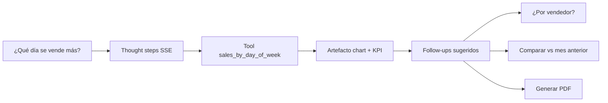

# Suplai Copilot — Ritmo de ventas por supervisor (índice cross-repo)

**Estado:** Aprobado (diseño)  
**Fecha:** 2026-06-25  
**Epic:** Fase 2.5 — analítica conversacional para jefe/supervisor de ventas  

Documento maestro que enlaza specs para el **caso de uso #3 (ritmo de ventas)**: el supervisor pregunta en lenguaje natural *“¿Qué día de la semana se vende más?”* (generalmente **por vendedor**), recibe datos verificados con visualización, ve **pasos de progreso** (“qué está pensando”) para reducir ansiedad, y obtiene **follow-ups sugeridos** para seguir explorando sin perder el hilo.

---

## 1) User story

**Como** jefe o supervisor de ventas en el back office,  
**quiero** conversar con los datos de pedidos confirmados de mi distribuidora,  
**para** detectar patrones de demanda (día de semana, vendedor) y decidir acciones comerciales sin armar reportes a mano.

### Journey de referencia

---

## 2) Decisiones de producto (cerradas)

| Tema | Decisión |
|------|----------|
| Caso piloto | **Ritmo de ventas por día de semana** (ISO lunes=1 … domingo=7), desglose **por vendedor** cuando el usuario no acota uno |
| Contrato venta | Mismo [SPEC-042](../../backend-supabase/docs/specs/042-suplai-copilot-contrato-ventas.md): pedidos **`confirmado`**, montos `pedidos.total`, cantidades UMV en tools que las usen |
| Asignación vendedor | `COALESCE(c.vendedor_id, vc.vendedor_id)` vía `clients` + `vendedores_clientes` activo; ver SPEC-043 |
| “Chain of Thought” | **No** exponer razonamiento interno del LLM. **Sí** emitir **pasos de progreso determinísticos** (`thought_step`) antes/durante tools — mock-friendly, auditables |
| Follow-ups | **Reglas determinísticas** post-tool en v1; el LLM **no** redacta números ni follow-ups libres. Opcional v2: LLM solo para parafrasear texto de chips |
| Cantidad follow-ups | **2–4** chips por turno; clic = envía mensaje prefilled al chat |
| Evals CI | Suite **por tenant** con casos golden en manifest; gate en PR backend; tenants configurables vía secrets/matrix |
| Fuera de alcance | Sniffer/Kommo; SQL libre del modelo; historial compartido; secuencias multi-paso WhatsApp (Fase 3 original) |

---

## 3) Specs hijas

| Repo | Archivo | Contenido |
|------|---------|-----------|
| `backend-supabase` | [043-suplai-copilot-sales-by-day-of-week.md](../../backend-supabase/docs/specs/043-suplai-copilot-sales-by-day-of-week.md) | Tool `sales_by_day_of_week`, SQL, artefactos, heurística |
| `backend-supabase` | [044-suplai-copilot-thought-stream-followups.md](../../backend-supabase/docs/specs/044-suplai-copilot-thought-stream-followups.md) | SSE `thought_step`, `follow_up_suggestions`, orquestador |
| `backend-supabase` | [045-suplai-copilot-evals-ci.md](../../backend-supabase/docs/specs/045-suplai-copilot-evals-ci.md) | Eval harness pytest, manifest por tenant, job CI |
| `backend-supabase` | [042-suplai-copilot-contrato-ventas.md](../../backend-supabase/docs/specs/042-suplai-copilot-contrato-ventas.md) | §4.7 agregación por día de semana (extensión) |
| `product-management-app` | [050-suplai-copilot-thought-followups-ui.md](../../product-management-app/doc/specs/050-suplai-copilot-thought-followups-ui.md) | UI pasos de progreso + chips dinámicos |
| `suplai-platform` | [scripts/copilot-evals/README.md](../../scripts/copilot-evals/README.md) | Manifest de casos golden y guía operativa |

**Índice Copilot existente:** [001-suplai-copilot.md](./001-suplai-copilot.md)

---

## 4) Fases de entrega

| Fase | Entregable | Repo |
|------|------------|------|
| **2.5a** | Tool `sales_by_day_of_week` + tests unitarios SQL | backend |
| **2.5b** | SSE thought steps (mock determinístico) | backend + backoffice |
| **2.5c** | Follow-ups post-respuesta | backend + backoffice |
| **2.5d** | Evals por tenant en CI | backend + platform manifest |
| **2.5e** | Actualizar guía producto + chips iniciales supervisor | platform docs (opcional post-merge) |

Orden recomendado: **2.5a → 2.5b → 2.5c → 2.5d** (2.5b y 2.5c pueden ir en el mismo PR si comparten cambios en orquestador/SSE).

---

## 5) Catálogo de preguntas (supervisor — ritmo de ventas)

Usar en chips iniciales, evals y demos:

1. ¿Qué día de la semana se vende más? (últimos 90 días)  
2. ¿Qué día vendemos más **por vendedor**?  
3. ¿Qué vendedor concentra ventas los **viernes**?  
4. Compará ventas de **lunes vs viernes** este mes.  
5. Mostrá un gráfico de ventas por día de la semana del **trimestre anterior**.  
6. *(Follow-up)* ¿Y si lo vemos solo para el vendedor 3?  
7. *(Follow-up)* Generá PDF de este análisis.

---

## 6) Criterios de aceptación (epic)

### `AC-EPIC-1` Día de semana global

- **Given** tenant con ≥30 pedidos confirmados distribuidos en varios días de semana en los últimos 90 días.  
- **When** el supervisor pregunta “¿Qué día de la semana se vende más?”.  
- **Then** la respuesta incluye tool `sales_by_day_of_week`, artefacto `chart` (bar) con 7 buckets, KPI con el día líder, y disclaimer SPEC-042.

### `AC-EPIC-2` Desglose por vendedor

- **When** la misma pregunta sin acotar vendedor.  
- **Then** la tool devuelve `breakdown_by_vendedor: true` y tabla/gráfico secundario con top vendedores por día líder (o heatmap simplificado tabla vendedor × día).

### `AC-EPIC-3` Thought steps visibles

- **When** el usuario envía cualquier mensaje al Copilot.  
- **Then** el panel muestra ≥3 pasos de progreso antes del texto final; el último paso pasa a `done` al recibir `done`.

### `AC-EPIC-4` Follow-ups contextuales

- **When** termina un turno con `sales_by_day_of_week`.  
- **Then** aparecen 2–4 chips (ej. “¿Por vendedor?”, “Comparar con mes anterior”, “Generar PDF”); al clic, se envía el mensaje prefilled.

### `AC-EPIC-5` CI evals por tenant

- **When** PR a `main`/`staging` del backend.  
- **Then** job `copilot-evals` ejecuta manifest con tenants golden; falla si algún caso crítico no pasa.

---

## 7) Riesgos

| Riesgo | Mitigación |
|--------|------------|
| Pedidos sin vendedor asignado | Bucket `Sin asignar`; documentar en respuesta |
| TZ distinta al negocio | Default `America/Argentina/Buenos_Aires`; param `timezone` en tool |
| Usuario confunde “progreso” con razonamiento real | Copy UI: “Consultando datos…” no “Pensando en…” |
| CI flaky por datos live | Umbral mínimo de pedidos + skip tenant con `min_orders` no cumplido (warn, no fail) |
| Costo LLM en evals | Evals validan **tools + artefactos**; OpenAI opcional desactivado en CI |

---

## 8) Referencias

- Guía producto: [suplai-copilot-guia-completa.md](../suplai-copilot-guia-completa.md)  
- Plataforma Copilot: [041](../../backend-supabase/docs/specs/041-suplai-copilot-plataforma.md)  
- UI artefactos: [039](../../product-management-app/doc/specs/039-suplai-copilot-ui-artefactos.md)  
- Territorio vendedor: [040-territorio-geo-zonas-vendedores-pdv.md](../../backend-supabase/docs/specs/040-territorio-geo-zonas-vendedores-pdv.md)
