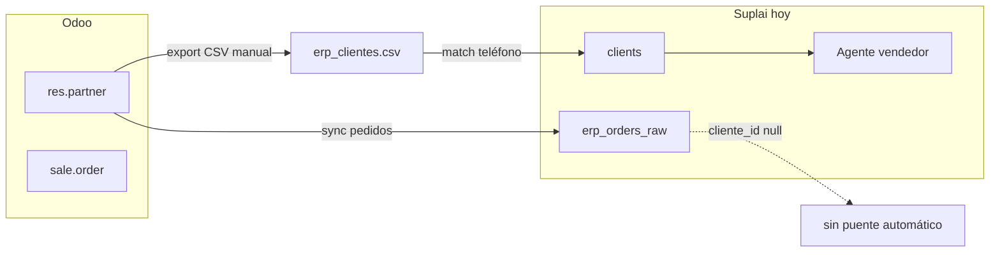
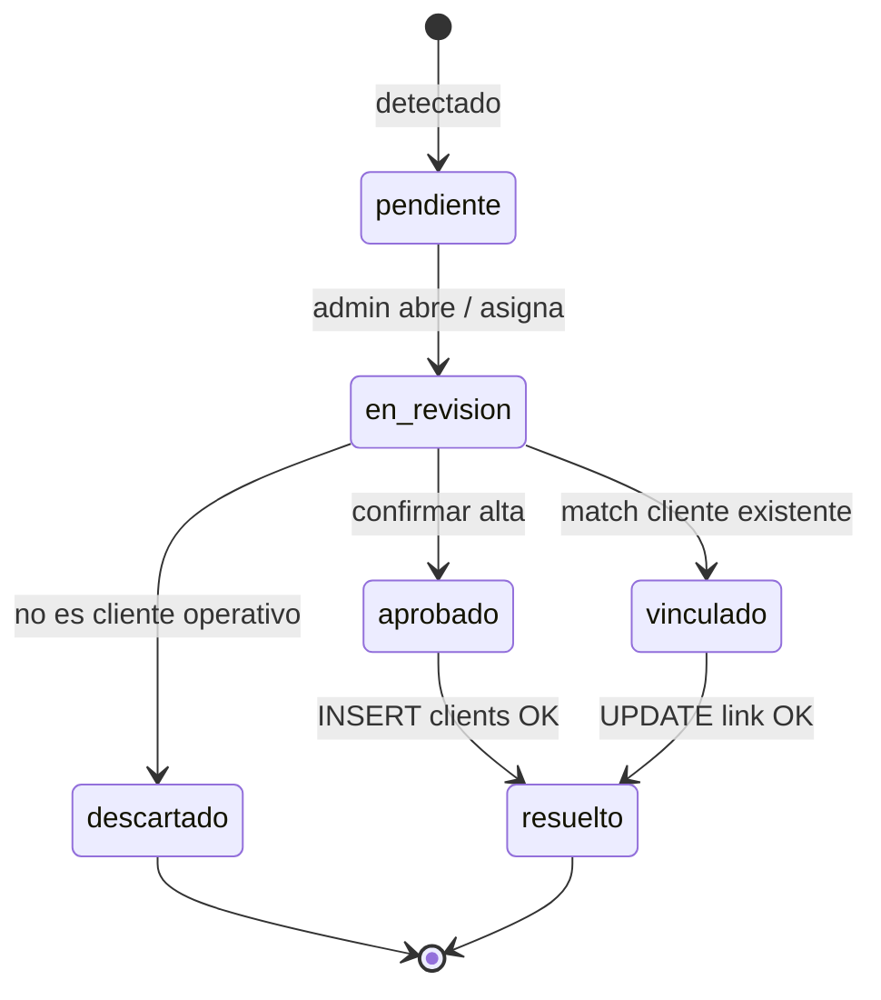
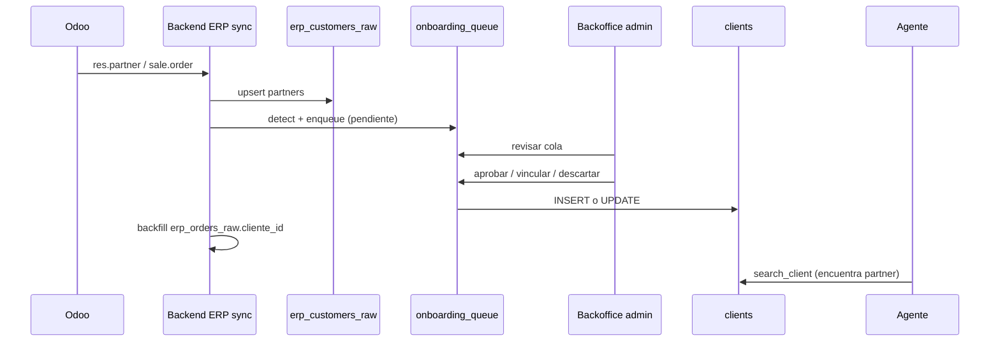

# Odoo — Detección de clientes nuevos y cola de alta en Suplai

**Estado:** Implementado (V1 — backend + backoffice, jun-2026)  
**Fecha:** 2026-06-26  
**Índice cross-repo:** este documento (platform)  
**Casos de referencia:** BenFresh (`benfresh`) — clientes CELIS y ~40 partners activos sin cargar en `clients`  
**Implementación previa:** [implementacion/benfresh/README.md](../../implementacion/benfresh/README.md)

---

## 1) Contexto y problema

### 1.1 Qué pasa hoy

La integración Odoo 19 (BenFresh como primer tenant) cubre bien **productos** (`erp_products_raw`), **pedidos históricos** (`erp_orders_raw`) e **inyección de pedidos confirmados**. Para **clientes**, el flujo actual es **manual y one-shot**:

1. Export CSV desde backoffice: `GET /{schema}/erp/customers/export`
2. Match contra `{schema}.clients` por **últimos 10 dígitos del teléfono**
3. Actualizar `codigo` en clientes ya existentes
4. **No insertar** clientes nuevos ni clientes sin teléfono

Documentado en onboarding BenFresh (jun-2026):

| Resultado export Odoo (501 partners) | Cantidad | Acción tomada |
|---|---:|---|
| `existente` (teléfono matcheó) | 292 | UPDATE `clients.codigo` |
| `nuevo` (teléfono en Odoo, no en Suplai) | 8 | **Ignorados** — no INSERT |
| `sin_telefono` | 201 | **Ignorados** — no INSERT |

### 1.2 Síntoma en producción (BenFresh, jun-2026)

Christian / vendedores buscan clientes que **existen y compran en Odoo** pero el agente responde *"No encontré ese cliente"*.

Ejemplo concreto — familia **CELIS** (4 sucursales en Odoo, pedidos semanales):

| Partner Odoo | odoo_id | Teléfono Odoo | En `clients` | Último pedido ERP |
|---|---|---|---|---|
| CELIS PRODUCE | 546 | vacío | ❌ | 2026-06-25 |
| CELIS WEST PALM BEACH | 547 | vacío | ❌ | 2026-06-25 |
| CELIS WPB - RAILROAD | 548 | vacío | ❌ | 2026-06-25 |
| CELIS DELRAY BEACH | 545 | vacío | ❌ | 2026-06-25 |

En `erp_orders_raw` aparecen con `partner_name` correcto y `cliente_id = null`. El agente **solo busca en `{schema}.clients`**, no en el espejo ERP.

**No es un problema de alias:** el cliente nunca se dio de alta.

### 1.3 Magnitud del gap (BenFresh, datos jun-2026)

| Métrica | Valor |
|---|---:|
| Clientes en `benfresh.clients` | 307 |
| Partners en export Odoo | 501 |
| Partners con pedidos en `erp_orders_raw` | 142 |
| Partners con pedidos **sin** fila en `clients` (match por nombre) | **40** (últimos 30 días) |
| Partners históricos sin vincular (`cliente_id` null en todo el espejo) | 98 |

Otros activos recientes en la misma situación: EL MAGUEY DORADO, MAJESTY FOODS LLC, SMOOTHIE PLUS #2 - MIRAMAR, REY CHAVEZ #2, ANGELES FOOD CORP, etc.

### 1.4 Causa raíz



1. **Sync de pedidos ≠ sync de clientes.** Los partners entran al espejo de pedidos pero no a `clients`.
2. **Match único por teléfono.** Odoo 19 BenFresh: muchos B2B sin `phone`/`mobile` usable (solo email + dirección).
3. **Política de onboarding:** no INSERT automático en fase implementación.
4. **Sin cola ni alertas:** nadie se entera cuando aparece un partner nuevo o un huérfano con pedidos.

---

## 2) Objetivo

Detectar de forma **continua** partners de Odoo que **deberían existir en Suplai** y **agendarlos** en una cola operativa para revisión y alta — sin depender de export CSV manual ni de teléfono obligatorio.

### 2.1 Definición de "agendar"

En este spec, **agendar** = crear o actualizar un ítem en la **cola de onboarding de clientes ERP** (`erp_customer_onboarding_queue`) con:

- Datos del partner Odoo (nombre, dirección, lista de precios, contacto)
- Motivo de detección y prioridad
- Estado inicial `pendiente`
- Asignación opcional a responsable de implementación / admin del tenant

**No** es la tabla `{schema}.agenda` (envíos WhatsApp programados).

### 2.2 Métricas de éxito

| Métrica | Target V1 |
|---|---|
| Partner con pedido ERP últimos 7 días y ausente en `clients` | Aparece en cola ≤ 24 h desde detección |
| Tiempo medio pendiente → `clients` cargado (partners prioritarios) | ≤ 3 días hábiles |
| Búsqueda agente post-alta | Resuelve por nombre Odoo o alias configurado |
| Falsos positivos en cola (duplicados del mismo partner) | 0 (UNIQUE por `partner_odoo_id`) |
| Backfill BenFresh CELIS + top activos | 100 % en cola en primera corrida |

---

## 3) Alcance

### 3.1 In scope (V1)

| Capa | Entrega |
|---|---|
| **Backend** | Staging `erp_customers_raw`, cola `erp_customer_onboarding_queue`, job de detección, endpoints CRUD cola + acción "aprobar alta" |
| **Backoffice** | Vista cola pendientes, detalle partner, botón aprobar / descartar / vincular a cliente existente |
| **Sync existente** | Hook post `sync-orders` y post `customers/export` |
| **BenFresh** | Backfill inicial desde export + espejo pedidos |

### 3.2 Out of scope (V1)

- Alta **100 % automática** sin revisión humana (V2 opcional para `nuevo_con_telefono` + reglas estrictas)
- Sync bidireccional Suplai → Odoo (crear partner en Odoo desde Suplai)
- Geocodificación / red comercial completa (Fase 4 implementación) en el mismo paso
- Alias comerciales (`clientes_aliases`) — se cargan **después** del alta, flujo existente
- Otros ERPs distintos de Odoo 19 (diseño extensible, implementación Odoo primero)

### 3.3 Repos

| Repo | Rol |
|---|---|
| `backend-supabase` | Migraciones, conector Odoo, jobs, API |
| `product-management-app` | UI cola + acciones en sección ERP / Clientes |
| `suplai-platform` | Spec índice, runbook implementación, backfill BenFresh |
| `agente-conversacional-multi_tenant` | Sin cambios V1 (sigue leyendo `clients`) |

---

## 4) Modelo de datos

### 4.1 `{schema}.erp_customers_raw` (staging)

Espejo periódico de `res.partner` comerciales activos, análogo a `erp_products_raw`.

| Columna | Tipo | Notas |
|---|---|---|
| `id` | BIGSERIAL PK | |
| `partner_odoo_id` | BIGINT UNIQUE NOT NULL | ID Odoo |
| `nombre` | TEXT NOT NULL | `name` |
| `email` | TEXT | |
| `telefono_raw` | TEXT | phone / mobile según versión Odoo |
| `telefono_normalizado` | TEXT | últimos 10 dígitos + reglas US/AR |
| `direccion` | TEXT | street + city |
| `zip` | TEXT | |
| `vat` | TEXT | |
| `lista_precios_odoo` | TEXT | pricelist name |
| `lista_precios_id` | INT FK nullable | mapeo a `{schema}.listas_precios` si existe |
| `activo_odoo` | BOOLEAN | `active` |
| `raw_payload` | JSONB | snapshot Odoo |
| `synced_at` | TIMESTAMPTZ | |
| `created_at` | TIMESTAMPTZ | |

Índices: `partner_odoo_id`, `telefono_normalizado`, `upper(nombre)`.

### 4.2 `{schema}.erp_customer_onboarding_queue` (cola / agenda operativa)

| Columna | Tipo | Notas |
|---|---|---|
| `id` | BIGSERIAL PK | |
| `partner_odoo_id` | BIGINT UNIQUE NOT NULL | |
| `partner_name` | TEXT NOT NULL | snapshot al detectar |
| `detection_source` | TEXT NOT NULL | Ver §5.1 |
| `detection_reason` | TEXT NOT NULL | Ej. `sin_match_clients`, `pedido_reciente_sin_cliente` |
| `match_status` | TEXT NOT NULL | `sin_match` \| `posible_duplicado` \| `vinculado_manual` |
| `suggested_client_id` | INT FK nullable | si fuzzy match a cliente existente |
| `priority` | SMALLINT DEFAULT 50 | 1–100; pedidos recientes suben score |
| `status` | TEXT NOT NULL | Ver §4.3 |
| `pedidos_90d` | INT DEFAULT 0 | contador al detectar |
| `ultimo_pedido_erp` | TIMESTAMPTZ | |
| `telefono_normalizado` | TEXT | |
| `email` | TEXT | |
| `direccion` | TEXT | |
| `lista_precios_id` | INT FK nullable | sugerida para alta |
| `review_notes` | TEXT | admin |
| `assigned_to` | UUID nullable | staff implementaciones |
| `scheduled_review_at` | DATE nullable | **fecha agendada** de revisión |
| `resolved_client_id` | INT FK nullable | cliente creado o vinculado |
| `resolved_at` | TIMESTAMPTZ | |
| `resolved_by` | UUID nullable | |
| `created_at` | TIMESTAMPTZ | |
| `updated_at` | TIMESTAMPTZ | |

### 4.3 Estados de la cola



| Estado | Significado |
|---|---|
| `pendiente` | Detectado, esperando revisión (**agendado** en cola) |
| `en_revision` | Alguien está evaluando |
| `aprobado` | Se autorizó crear fila en `clients` |
| `vinculado` | Es el mismo cliente que uno existente (corregir codigo/nombre) |
| `descartado` | Partner Odoo no debe operar en agente (ej. CONSUMER, interno) |
| `resuelto` | Alta o vínculo aplicado |

### 4.4 Vínculo post-alta

Al resolver:

1. INSERT o UPDATE en `{schema}.clients` con `nombre` = nombre Odoo, `codigo` = identificador operativo Suplai (ver §6.3)
2. Guardar mapping `{partner_odoo_id ↔ client_id}` — columna nueva recomendada: `clients.partner_odoo_id BIGINT UNIQUE nullable` **o** tabla `{schema}.erp_client_mappings`
3. Backfill `erp_orders_raw.cliente_id` para ese `partner_odoo_id`
4. Opcional: encolar sugerencia de alias (fuera V1)

---

## 5) Detección — cuándo y cómo

### 5.1 Fuentes de detección (`detection_source`)

| Fuente | Trigger | Qué detecta |
|---|---|---|
| `customers_sync` | Job periódico + botón backoffice "Sync clientes Odoo" | Partner en Odoo activo sin fila en `clients` |
| `orders_sync` | Post `POST /{schema}/erp/sync-orders` | `partner_odoo_id` en pedido nuevo sin mapping |
| `manual_export` | Post `GET /{schema}/erp/customers/export` | Diff vs cola y vs `clients` |
| `backfill` | Script one-shot implementación | Carga inicial tenant (BenFresh) |

### 5.2 Algoritmo de matching (orden de precedencia)

Para cada partner Odoo candidato, buscar en `{schema}.clients`:

| # | Regla | Resultado |
|---|---|---|
| 1 | `clients.partner_odoo_id = partner_odoo_id` | Ya resuelto → skip |
| 2 | `telefono_normalizado` últimos 10 dígitos iguales | `posible_duplicado` si nombre difiere mucho; auto-vincular si score nombre ≥ 0.92 |
| 3 | `upper(trim(nombre))` exacto | `posible_duplicado` → revisión |
| 4 | Email exacto (si ambos no null) | `posible_duplicado` |
| 5 | Sin match | **`sin_match` → encolar `pendiente`** |

Partners excluidos por lista configurable en `distribuidoras.metadata.erp.customer_blocklist_patterns` (ej. `CONSUMER`, `CUSTOMER BORDER`, contactos personales sin pedidos).

### 5.3 Priorización (score 1–100)

```
priority = min(100,
  40 * (tiene_pedido_7d ? 1 : 0)
+ 25 * (tiene_pedido_30d ? 1 : 0)
+ 15 * (pedidos_90d >= 3 ? 1 : 0)
+ 10 * (tiene_telefono ? 1 : 0)
+ 10 * (tiene_email ? 1 : 0)
)
```

Ejemplo BenFresh: CELIS PRODUCE (12 pedidos / 90d) → priority ~90.

### 5.4 Job periódico

- Frecuencia: misma que `sync_frequency` del conector ERP (default **6 h**), más corrida post-sync pedidos.
- Idempotente: `UPSERT` en cola por `partner_odoo_id`; no duplicar ítems `pendiente`/`en_revision`.
- Reabrir: si partner `descartado` vuelve a tener pedido confirmado → nuevo ítem o reactivar con nota.

---

## 6) Flujo operativo

### 6.1 Diagrama end-to-end



### 6.2 Pantalla backoffice (V1)

Ubicación sugerida: **ERP → Clientes pendientes** (badge con count `pendiente` + `en_revision`).

| Columna UI | Fuente |
|---|---|
| Partner Odoo | `partner_name` |
| Prioridad | `priority` + icono pedido reciente |
| Pedidos 90d | `pedidos_90d` |
| Último pedido | `ultimo_pedido_erp` |
| Teléfono / email | staging |
| Match sugerido | `suggested_client_id` si fuzzy |
| Agendado | `scheduled_review_at` |
| Estado | badge |

Acciones:

- **Aprobar alta** → form mínimo: teléfono (obligatorio para agente WhatsApp si aplica), lista precios, vendedor opcional
- **Vincular a existente** → picker cliente + confirmación
- **Descartar** → motivo obligatorio
- **Agendar revisión** → set `scheduled_review_at` + opcional `assigned_to`

### 6.3 Reglas de alta en `clients`

| Campo | Regla V1 |
|---|---|
| `nombre` / `razon_social` | Nombre exacto Odoo |
| `codigo` | Si hay teléfono: normalizado con prefijo país (`1` US). Si no: **`partner_odoo_id` como string** temporal + flag metadata `codigo_es_odoo_id=true` hasta que operaciones cargue teléfono |
| `phone_number` | Teléfono normalizado si existe; si no: **placeholder prohibido en V1** — UI exige teléfono **o** marca explícita "cliente solo vendedor sin WA" (`activo_ai=false` + nota) |
| `lista_precios_id` | Mapeo desde pricelist Odoo |
| `partner_odoo_id` | FK lógica al partner |
| `activo_ai` | Default `true` si teléfono válido; else `false` hasta validación |
| `is_mock` | `false` en prod |

**Decisión cerrada V1:** clientes sin teléfono **sí** entran a `clients` (caso CELIS) con `activo_ai=false` para canal vendedor; el agente seller **debe** poder cargar pedidos por nombre. Canal cliente WhatsApp queda deshabilitado hasta teléfono.

### 6.4 Caso BenFresh — backfill inmediato

Primera corrida `backfill` debe encolar al menos:

- Los 4 CELIS (odoo 545–548)
- Partners con pedidos últimos 30 días y sin `clients` (~40)
- Los 8 `nuevo` del CSV con teléfono nunca insertados

Script sugerido: `scripts/benfresh/backfill_erp_customer_queue.sql` (platform) invocando lógica backend o SQL idempotente.

---

## 7) API (backend)

Prefijo: `/{schema}/erp/customer-onboarding/*`

| Método | Ruta | Descripción |
|---|---|---|
| GET | `/queue` | Lista paginada; filtros `status`, `priority_min`, `assigned_to` |
| GET | `/queue/{id}` | Detalle + raw_payload + pedidos recientes del partner |
| POST | `/queue/sync` | Fuerza detección (admin) |
| PATCH | `/queue/{id}` | `scheduled_review_at`, `assigned_to`, `review_notes`, `status=en_revision` |
| POST | `/queue/{id}/approve` | Alta en `clients` (body: teléfono opcional, lista_precios_id, vendedor_id) |
| POST | `/queue/{id}/link` | Body `{ client_id }` — vincula y backfill |
| POST | `/queue/{id}/dismiss` | Body `{ reason }` |
| GET | `/customers-raw/export` | CSV staging (reemplaza/enriquece export actual) |

Permisos: rol admin tenant + área implementaciones Suplai.

---

## 8) Cambios en sync existente

### 8.1 `POST /{schema}/erp/sync-orders`

Después de upsert en `erp_orders_raw`:

```python
orphan_partner_ids = distinct partner_odoo_id where cliente_id is null
enqueue_customers_from_partners(orphan_partner_ids, source="orders_sync")
```

### 8.2 Nuevo `POST /{schema}/erp/sync-customers`

- Pull `res.partner` (filtro: customer rank / sale order history — configurable)
- Upsert `erp_customers_raw`
- Run detection → cola

### 8.3 Export CSV legacy

`GET /{schema}/erp/customers/export` sigue existiendo; agrega columnas:

- `queue_status`
- `client_id`
- `match_status`
- `priority`

---

## 9) Impacto en agente y pedidos

| Componente | Cambio V1 |
|---|---|
| Agente seller `search_client` | Sin cambio de código si partner está en `clients` |
| Agente seller sin teléfono | Funciona con nombre Odoo + aliases post-alta manual |
| Inyección ERP al confirmar | Usa `partner_odoo_id` mapping; menos pedidos huérfanos |
| `erp_orders_raw.cliente_id` | Backfill retroactivo al resolver cola |

---

## 10) Plan de implementación

### Fase A — Backend + migración (sem. 1)

- [ ] Migración tablas §4.1 y §4.2 + `clients.partner_odoo_id` o `erp_client_mappings`
- [ ] Servicio detección + priorización
- [ ] Hook post sync-orders
- [ ] Endpoints §7
- [ ] Tests: CELIS encolados; no duplicar; link backfill

### Fase B — Backoffice (sem. 2)

- [ ] Vista cola + acciones approve/link/dismiss
- [ ] Badge contador en nav ERP
- [ ] Botón "Sync clientes Odoo"

### Fase C — BenFresh prod (sem. 2–3)

- [ ] Backfill cola
- [ ] Operaciones aprueba CELIS + top 15 activos
- [ ] Carga alias comerciales (`celis`, `celis produce`, etc.)
- [ ] Re-test casos Christian (Powerfuel, Sedanos 33, Dixie, Sergio's, Celis)

### Fase D — V2 (futuro)

- Auto-alta para `nuevo` + teléfono + sin ambigüedad fuzzy
- Notificación Slack/email al encolar priority ≥ 80
- Integración checklist implementaciones (SPEC-011) como User Story automática

---

## 11) Riesgos y mitigaciones

| Riesgo | Mitigación |
|---|---|
| Duplicar clientes (nombre similar) | Fuzzy match → `posible_duplicado`; approve manual |
| Partners basura en Odoo | Blocklist patterns + dismiss con auditoría |
| Clientes sin teléfono no usable en WA | `activo_ai=false`; pedidos vía vendedor OK |
| `codigo` colisiona phone vs odoo_id | Metadata flag + migración cuando llegue teléfono |
| Volumen cola inicial BenFresh (~200+) | Backfill filtrado: solo con pedidos 90d o priority ≥ 40 |

---

## 12) Specs hijas (a crear en cada repo)

| Repo | Archivo propuesto | Contenido |
|---|---|---|
| `backend-supabase` | `docs/specs/057-erp-customer-onboarding-queue.md` | Migraciones, servicios, endpoints, jobs |
| `product-management-app` | `doc/specs/050-erp-customer-onboarding-ui.md` | UI cola, formularios approve/link |
| `suplai-platform` | `implementacion/benfresh/runbook-cola-clientes-odoo.md` | Backfill + checklist operaciones |

---

## 13) Criterios de aceptación (BenFresh)

1. Buscar `celis produce` → encuentra **CELIS PRODUCE** (odoo 546) tras approve en cola.
2. Buscar `celis west palm beach` → **CELIS WEST PALM BEACH** (547), no Foodtown.
3. Partner con pedido nuevo en Odoo aparece en cola ≤ 24 h sin intervención manual de export CSV.
4. Aprobar alta encola backfill de pedidos históricos con `cliente_id` correcto.
5. Dixie / Sergio's / Powerfuel / Sedanos 33 siguen funcionando (sin regresión).

---

## 14) Referencias

- [implementacion/benfresh/README.md](../../implementacion/benfresh/README.md) — estado conector Odoo 19
- [implementacion/benfresh/erp_clientes_benfresh.csv](../../implementacion/benfresh/erp_clientes_benfresh.csv) — export match jun-2026
- [002-suplai-field-app-diseno.md](./002-suplai-field-app-diseno.md) §14.4 — sync ERP pedidos
- [011-admin-implementaciones-checklist-user-stories.md](./011-admin-implementaciones-checklist-user-stories.md) — integración futura con checklist PM
