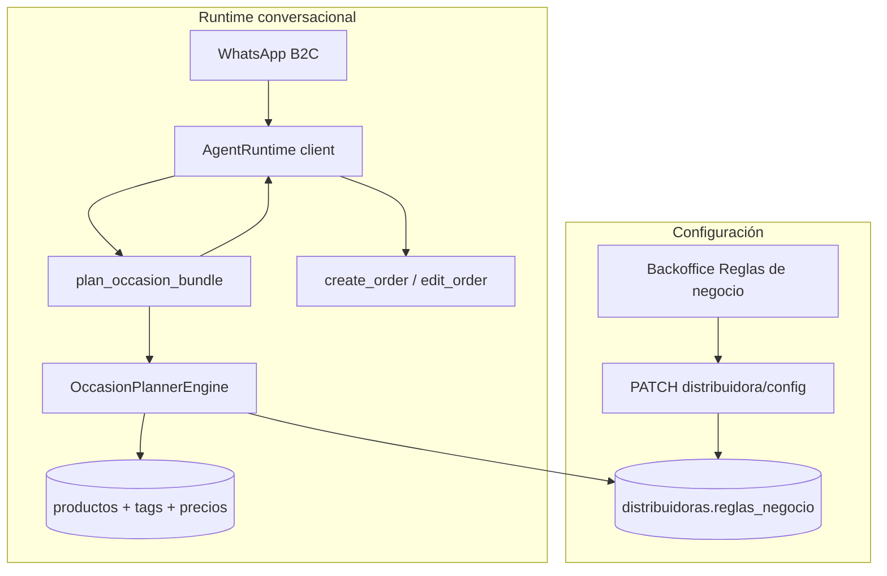

# Occasion Planner B2C — Índice cross-repo

**Estado:** Aprobado (diseño)
**Fecha:** 2026-06-29
**Tenant piloto:** `al_fuego` (carnicería boutique, atención B2C + B2B híbrida)
**Primer escenario:** `asado` — planificar carne para N personas

---

## 1) Contexto

Suplai Sales nació para **distribuidoras B2B** (agente atiende comercios / PDV). **Al Fuego** es el primer tenant con foco **B2C**: el consumidor final escribe por WhatsApp para armar un asado, un menú o una compra por ocasión.

El dueño planteó este flujo:

1. El cliente escribe: *"Quiero hacer un asado para 8 personas"*.
2. El agente calcula cantidades (ej. 500 g por adulto), propone un combo con cortes sugeridos (SKUs con precio por kilo).
3. El cliente acepta o negocia cortes y cantidades hasta confirmar pedido.

**Problema de diseño:** una tool `armar_asado` es demasiado específica y no escala a restaurantes, pizzerías u otros verticales B2C.

**Decisión:** abstracción genérica **Occasion Planner** — motor determinístico + configuración por tenant + una tool opt-in `plan_occasion_bundle`.

---

## 2) Objetivo

| Objetivo | Métrica |
|----------|---------|
| Propuestas de bundle consistentes y testeables | 100 % de cantidades calculadas por el motor, no inventadas por el LLM |
| Reutilizable cross-tenant | Nuevo vertical = JSON de escenario + tags en catálogo, sin código nuevo |
| Operable desde backoffice | Operador configura escenarios sin editar SQL ni JSON crudo (V1 con validación; plantillas) |
| Integración con pedido existente | Propuesta → ajustes → `create_order` / `edit_order` |

---

## 3) Decisiones de producto (cerradas)

| # | Tema | Decisión |
|---|------|----------|
| 1 | Nombre de la tool | `plan_occasion_bundle` (opt-in vía `tools_habilitadas`) |
| 2 | Persistencia de config | `public.distribuidoras.reglas_negocio.occasion_planners` (JSONB existente; sin migración V1) |
| 3 | Modo de negocio | `metadata.business_mode`: `b2b` \| `b2c` \| `hybrid` (Al Fuego = `hybrid`) |
| 4 | Cálculo de cantidades | Motor determinístico (pipeline de pasos); el LLM **no** hace aritmética de porciones |
| 5 | Selección de SKUs | Por **tags** de producto + ratios configurables; no SKUs hardcodeados en código |
| 6 | Precios variables (vacío) | Flag `variable_weight` por línea + disclaimer del tenant en propuesta |
| 7 | Relación con `suggest_order_boost` | Complementarias: boost = cross/up sobre pedido abierto B2B; occasion = plan desde cero B2C |
| 8 | UI backoffice | Panel en pestaña **Reglas de negocio** de Configuración de Distribuidora |
| 9 | Validación config | Backend valida schema al guardar; preview opcional en UI |

---

## 4) Specs hijas

| Repo | Archivo | Contenido |
|------|---------|-----------|
| `agent/` | [035-occasion-planner-tool.md](../../../agent/docs/specs/035-occasion-planner-tool.md) | Tool `plan_occasion_bundle`, motor `OccasionPlannerEngine`, pipeline de pasos, tests |
| `backend/` | [058-occasion-planners-config.md](../../../backend/docs/specs/058-occasion-planners-config.md) | Validación Pydantic, endpoints config, contrato JSON |
| `backoffice/` | [051-occasion-planner-config-ui.md](../../../backoffice/doc/specs/051-occasion-planner-config-ui.md) | UI en Configuración → Reglas de negocio, preview, plantilla `asado` |

**Datos de catálogo (implementación tenant):** tags en productos Al Fuego — skill `suplai-implementation` fase 1.1; ver anexo A.

---

## 5) Arquitectura end-to-end



---

## 6) Modelo de datos (config)

Raíz: `reglas_negocio.occasion_planners`

```json
{
  "enabled": true,
  "default_scenario_id": "asado",
  "scenarios": {
    "asado": {
      "label": "Asado para N personas",
      "active": true,
      "parameters_schema": { "...": "..." },
      "demand_rules": [ "..." ],
      "slots": [ "..." ],
      "pipeline": [
        "calculate_demand",
        "select_products_by_tags",
        "distribute_by_ratio",
        "filter_stock",
        "estimate_prices",
        "apply_disclaimers"
      ],
      "disclaimers": {
        "variable_weight": true,
        "template": "Precios aproximados; el peso real del vacío puede variar."
      }
    }
  }
}
```

Schema completo y ejemplo Al Fuego: [035 del agente §6–7](../../../agent/docs/specs/035-occasion-planner-tool.md).

---

## 7) Flujo conversacional (Al Fuego)

| Paso | Actor | Acción |
|------|-------|--------|
| 1 | Cliente | *"Quiero un asado para 8, somos 6 adultos y 2 chicos"* |
| 2 | LLM | Extrae parámetros → `plan_occasion_bundle(scenario_id="asado", parameters={adults:6, children:2})` |
| 3 | Motor | 6×500g + 2×250g = 3,25 kg carne principal; distribuye entre cortes por ratio |
| 4 | LLM | Presenta propuesta con disclaimer de peso variable (prompt tenant) |
| 5 | Cliente | *"Sacá entraña, más vacío"* |
| 6 | LLM | `plan_occasion_bundle(..., adjustments=[...])` o edita vía `create_order` |
| 7 | Cliente | Confirma → `create_order` + `confirm_order` |

---

## 8) Plan de implementación incremental

| Fase | Entregable | Repo |
|------|-----------|------|
| **0** | Specs (este índice + hijas) | platform, agent, backend, backoffice |
| **1** | Validación config + GET/PATCH sin UI avanzada | backend |
| **2** | Motor + tool + tests unitarios | agent |
| **3** | UI panel Occasion Planner + plantilla asado | backoffice |
| **4** | Tags catálogo Al Fuego + config tenant + E2E | implementacion/al_fuego |
| **5** | Evals conversacionales B2C | agent (skill agent-e2e-testing) |

---

## 9) Fuera de alcance V1

- Motor ML / sales-engine para B2C sin historial
- Tienda web con wizard de asado embebido
- Multi-moneda o multi-lista dinámica por ocasión
- Columna dedicada `occasion_planners_config` (evaluar post-V1 si el JSON crece)

---

## 10) Riesgos y mitigaciones

| Riesgo | Mitigación |
|--------|------------|
| Catálogo sin tags → propuesta vacía | Validación en backoffice: "N productos matchean slot X" |
| LLM calcula kg en prosa | Tool devuelve totales; prompt base prohíbe recalcular |
| Precio por unidad vs por kg | Normalizar en paso `estimate_prices` según `umv_tipo` / metadata producto |
| Config JSON inválida | Validación backend al guardar; UI no persiste si falla |

---

## Anexo A — Tags sugeridos Al Fuego (Fase 1.1)

| Tag | Uso en escenario `asado` |
|-----|--------------------------|
| `parrilla` | Filtro general carnes |
| `corte-principal` | Slot carne principal |
| `asado`, `vacio`, `entrania`, `picanha` | Ratios de distribución |
| `achura` | Slot achuras |
| `complemento-asado` | Carbón, leña, vajilla (slot opcional V2) |

---

## Anexo B — Referencias

- Arquitectura agente: `agent/docs/architecture/agent-design-state-for-ai.md`
- Cross/up B2B existente: `agent/app/agent/tools/recommendations.py`
- Config distribuidora UI: `backoffice/components/agent-config-form.tsx`
- Prompt Al Fuego: `implementacion/al_fuego/outputs/phase-01-3-prompt-config.json`
