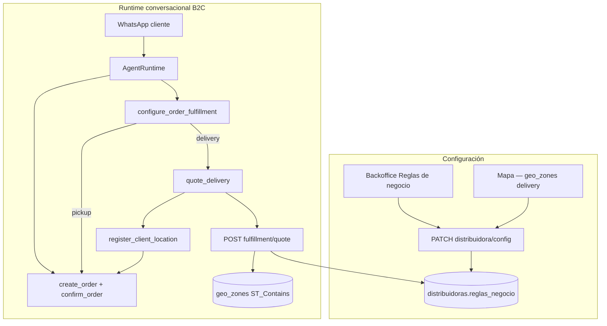

# B2C Fulfillment — retiro en sucursal y envío a domicilio (índice cross-repo)

**Estado:** Aprobado (diseño)
**Fecha:** 2026-06-29
**Tenant piloto:** `al_fuego` (carnicería boutique, atención B2C + B2B híbrida)
**Caso de negocio:** el dueño de Al Fuego necesita que el agente pregunte cómo recibir el pedido antes de confirmarlo.

---

## 1) Contexto

Tras armar el carrito (p. ej. con **Occasion Planner** o búsqueda de productos), el consumidor final debe elegir **cómo recibe la compra**:

1. **Retiro en sucursal** — el agente pregunta día y hora aproximada; se registra como nota operativa en el pedido.
2. **Envío a domicilio** — el agente pide dirección (texto o pin de Google Maps / WhatsApp), cotiza el envío según distancia y zona, confirma el costo con el cliente y persiste la ubicación en el perfil.

El stack B2B ya modela rutas semanales (`clients.dia_de_visita`, spec agente **022**). Eso **no aplica** al B2C de Al Fuego, donde la entrega es **on-demand** con tarifa por distancia y polígono de cobertura.

**Infra reutilizable (ya desplegada):**

| Pieza | Spec / módulo | Uso en este feature |
|-------|---------------|---------------------|
| `client_locations` + tool `register_client_location` | Agente **014**, backend **030** | Guardar dirección primaria del consumidor |
| `geo_zones` con `zone_type: delivery` | Backend **031** | Zona de cobertura válida (polígono en mapa) |
| `pedidos.notas` | Pedidos existentes | Retiro programado + metadata de fulfillment |
| `reglas_negocio` (JSONB) | Config distribuidora | Tarifas, modos habilitados, punto central |
| Mapa comercial backoffice | BO **022–023** | Dibujar zona `delivery` |

---

## 2) Objetivo

| Objetivo | Métrica |
|----------|---------|
| Flujo conversacional claro retiro vs delivery | 100 % de pedidos B2C confirmados con método registrado |
| Cotización determinística de envío | Precio calculado en backend, no inventado por el LLM |
| Cobertura geográfica configurable | Pedidos fuera de zona rechazados con mensaje accionable |
| Operable sin SQL | Operador configura tarifas y sucursal desde Reglas de negocio |

---

## 3) Decisiones de producto (cerradas)

| # | Tema | Decisión |
|---|------|----------|
| 1 | Persistencia de config | `public.distribuidoras.reglas_negocio.b2c_fulfillment` (JSONB; sin migración V1) |
| 2 | Modos habilitados | `pickup`, `delivery` o ambos; default Al Fuego: ambos |
| 3 | Cotización | Backend `POST /{schema}/fulfillment/quote` — distancia desde **punto central** del tenant |
| 4 | Fórmula tarifa V1 | `max(min_fee, base_fee + round(distance_km) * price_per_km)`; redondeo configurable |
| 5 | Zona válida | Polígono `geo_zones` referenciado por `delivery_zone_id` **o** `zone_type=delivery` único activo |
| 6 | Fuera de zona | HTTP 422 `OUT_OF_DELIVERY_ZONE`; agente ofrece retiro si está habilitado |
| 7 | Retiro | Texto estructurado en `pedidos.notas` + snapshot JSON en `reglas_negocio` no aplica; solo nota |
| 8 | Costo envío en pedido | Línea de ítem con SKU configurable `shipping_product_code` **o** incremento en notas + total manual V1 → **línea SKU** preferido |
| 9 | Tools opt-in | `configure_order_fulfillment`, `quote_delivery`, reutilizar `register_client_location` |
| 10 | Perfil | `metadata.business_mode` ∈ `b2c` \| `hybrid` para activar flujo conversacional base |
| 11 | Geocoding V1 | Sin Google Geocoding API pago; coordenadas desde WhatsApp pin / Maps URL parseable; texto → `geocode_status=pending` + quote solo si hay coords |
| 12 | Distancia | PostGIS `ST_DistanceSphere` (o Haversine equivalente) desde `origin` configurado |

---

## 4) Specs hijas

| Repo | Archivo | Contenido |
|------|---------|-----------|
| `backend/` | [059-b2c-fulfillment-config-y-quote.md](../../../backend-supabase/docs/specs/059-b2c-fulfillment-config-y-quote.md) | Validación config, quote, zona, tests |
| `agent/` | [036-b2c-fulfillment-tools.md](../../../agente-conversacional-multi_tenant/docs/specs/036-b2c-fulfillment-tools.md) | Tools conversacionales, flujo retiro/delivery |
| `backoffice/` | [052-b2c-fulfillment-config-ui.md](../../../product-management-app/doc/specs/052-b2c-fulfillment-config-ui.md) | Panel Reglas de negocio + enlace zona mapa |

**Relacionado:** [016 Occasion Planner B2C](./016-occasion-planner-b2c.md) — precede fulfillment en el journey Al Fuego.

---

## 5) Arquitectura end-to-end



---

## 6) Modelo de datos (config)

Raíz: `reglas_negocio.b2c_fulfillment`

```json
{
  "enabled": true,
  "modes": ["pickup", "delivery"],
  "prompt": {
    "ask_method": "¡Excelente! ¿Cómo preferís recibir tu pedido? ¿Pasás a retirarlo por la sucursal o te lo enviamos a domicilio?"
  },
  "pickup": {
    "enabled": true,
    "branch_label": "Sucursal Al Fuego — Av. Colón 1234",
    "ask_schedule": true,
    "note_template": "RETIRO PROGRAMADO: {scheduled_text}"
  },
  "delivery": {
    "enabled": true,
    "origin": {
      "label": "Planta Al Fuego",
      "latitude": -31.4201,
      "longitude": -64.1888
    },
    "delivery_zone_id": 42,
    "pricing": {
      "base_fee": 1500,
      "price_per_km": 350,
      "min_fee": 1500,
      "max_fee": null,
      "currency": "ARS",
      "distance_rounding": "ceil"
    },
    "shipping_product_code": "ENVIO-DOM",
    "out_of_zone_message": "Por ahora no llegamos a esa zona. ¿Querés retirar por la sucursal?"
  }
}
```

Schema completo: spec backend **059** §5.

---

## 7) Flujo conversacional (Al Fuego)

| Paso | Actor | Acción |
|------|-------|--------|
| 1 | Cliente | Confirma ítems del pedido (Occasion Planner o catálogo) |
| 2 | LLM | Pregunta método de entrega (copy tenant o default) |
| 3a | Cliente | *"Retiro"* → LLM pregunta día y hora aproximada |
| 3b | Cliente | *"Delivery"* → LLM pide dirección o pin de Maps |
| 4a | LLM | `configure_order_fulfillment(method=pickup, scheduled_text=...)` → nota en pedido abierto |
| 4b | LLM | `register_client_location(...)` si hay coords → `quote_delivery(...)` |
| 5b | LLM | Presenta costo confirmado; cliente acepta |
| 6b | LLM | `configure_order_fulfillment(method=delivery, quote_id=...)` → agrega línea envío |
| 7 | Cliente | Confirma → `confirm_order` |

**Copy de referencia (dueño Al Fuego):**

> ¡Excelente! ¿Cómo preferís recibir tu pedido? ¿Pasás a retirarlo por la sucursal o te lo enviamos a domicilio?

---

## 8) Plan de implementación incremental

| Fase | Entregable | Repo |
|------|-----------|------|
| **0** | Specs (este índice + hijas) | platform, backend, agent, backoffice |
| **1** | Validación config + `POST .../fulfillment/quote` | backend |
| **2** | Tools + prompt hints + tests | agent |
| **3** | Panel Reglas de negocio + link zona mapa | backoffice |
| **4** | Config tenant `al_fuego` + zona delivery + SKU envío | implementacion/al_fuego |
| **5** | E2E B2C retiro + delivery | agent (skill agent-e2e-testing) |

**Orden de merge sugerido:** backend → agente → backoffice (mismo criterio que Occasion Planner).

---

## 9) Fuera de alcance V1

- Optimización de rutas multi-stop (field / B2B)
- Ventanas horarias de delivery dinámicas por día
- Integración ERP con costo de envío como concepto separado
- Geocoding batch de direcciones textuales pendientes
- Tienda web con selector de fulfillment embebido
- Múltiples sucursales de retiro con stock distinto

---

## 10) Riesgos y mitigaciones

| Riesgo | Mitigación |
|--------|------------|
| LLM inventa precio de envío | Tool `quote_delivery` solo devuelve monto backend; prompt prohíbe estimar |
| Cliente sin coordenadas | Pedir pin WhatsApp o link Maps; no cotizar hasta tener lat/lng |
| Sin zona `delivery` dibujada | Backoffice muestra warning en panel; quote falla con mensaje claro |
| SKU envío inexistente | Validación preview backend + diagnóstico UI |
| Conflicto con rutas B2B | Flujo solo si `business_mode` ≠ `b2b` puro o `b2c_fulfillment.enabled` |

---

## Anexo A — Config sugerida Al Fuego (implementación)

| Campo | Valor inicial |
|-------|---------------|
| `enabled` | `true` |
| `modes` | `["pickup", "delivery"]` |
| `pickup.branch_label` | Dirección real sucursal |
| `delivery.origin` | Coordenadas planta/sucursal despacho |
| `delivery.delivery_zone_id` | ID polígono creado en mapa (Córdoba radio ~8 km) |
| `delivery.pricing` | A definir con dueño (ej. base $1500 + $350/km) |
| `delivery.shipping_product_code` | Producto servicio "Envío a domicilio" en catálogo |
| Tools | `configure_order_fulfillment`, `quote_delivery`, `register_client_location` |

---

## Anexo B — Referencias

- Ubicaciones cliente: agente spec **014**, backend **030**, **046**
- Zonas mapa: backend **031**, backoffice **022**
- Occasion Planner: [016](./016-occasion-planner-b2c.md)
- Prompt Al Fuego: `implementacion/al_fuego/outputs/phase-01-3-prompt-config.json`
