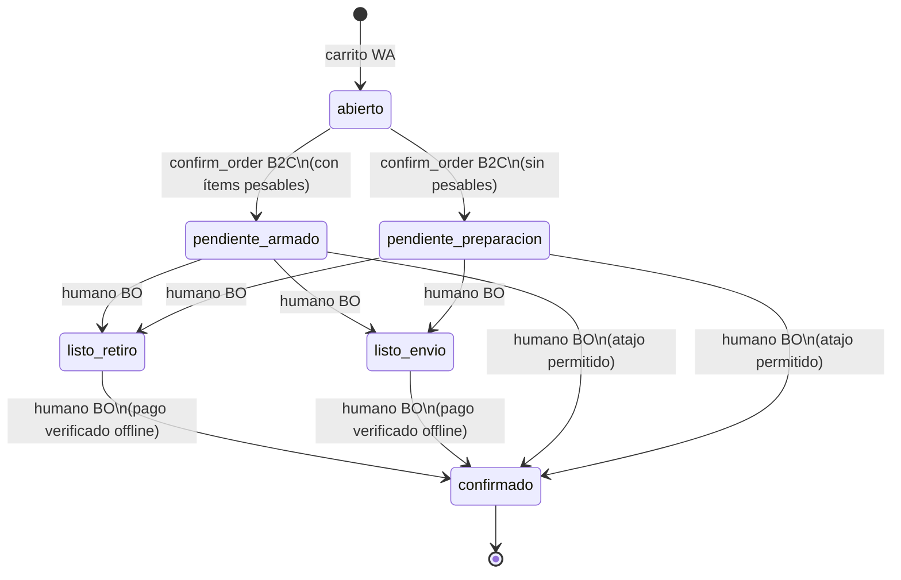

# B2C Post-confirm — armado, pesaje y cierre operativo (índice cross-repo)

**Estado:** Aprobado (diseño)
**Fecha:** 2026-06-30
**Tenant piloto:** `al_fuego` (carnicería boutique, B2C + B2B híbrida)
**Precede en el journey:** [016 Occasion Planner](./016-occasion-planner-b2c.md) → [017 Fulfillment retiro/delivery](./017-b2c-fulfillment-delivery-pickup.md)

---

## 1) Contexto

Tras confirmar el carrito por WhatsApp (con o sin Occasion Planner y con método retiro/envío ya registrado), el pedido B2C **no debe** cerrarse como en B2B:

- Carnes envasadas al vacío: precio por **kg**, venta por **unidad/paquete**; el peso real difiere del estándar (`peso_referencia_kg`).
- El local **arma físicamente** el pedido antes de cobrar al cliente.
- El **pago no se integra** en V1: transferencia, efectivo en local o cuenta corriente quedan fuera del sistema; el operador humano decide cuándo cerrar.

**Decisión de producto:** workflow de estados reutilizable (carnicería hoy, restaurante mañana) sin bloquear por verificación de pago.

---

## 2) Objetivo

| Objetivo | Métrica |
|----------|---------|
| Pedidos B2C no van directo a `confirmado` + ERP | 100 % B2C post-WA pasan por estados operativos configurados |
| Pesaje simple en backoffice | Operador actualiza `cantidad_solicitada` (kg real) y total recalculado |
| Ticket al cliente al cierre humano | Al pasar a `confirmado`: plantilla Meta + link descarga PDF |
| Métricas Copilot intactas | Venta cuenta solo en `confirmado` (humano) |
| Sin ERP B2C V1 | Cero inyección ERP en tenants `business_mode` b2c/hybrid para este flujo |

---

## 3) Decisiones de producto (cerradas)

| # | Tema | Decisión |
|---|------|----------|
| 1 | ¿Cuándo entra armado/pesaje? | Si el pedido tiene **≥1 ítem** cuyo producto tiene `es_pesable=true` → tras confirmación cliente entra en `pendiente_armado` |
| 2 | Sin ítems pesables | Tras confirmación cliente el humano pasa manualmente a `listo_retiro` / `listo_envio` y luego a `confirmado` (sin UI de pesaje) |
| 3 | Ítems no pesables | Precio de BD; edición de línea **opcional** en UI pero no requerida |
| 4 | Envío (`ENVIO-DOM`) | Línea normal del pedido; suma al total |
| 5 | Modelo de peso | **Sobrescribir** `items_pedido.cantidad_solicitada` con kg real (sin columnas extra V1) |
| 6 | Estado intermedio | `pendiente_armado` (reutilizable cross-vertical) |
| 7 | Estados operativos | `listo_retiro`, `listo_envio` según fulfillment spec 017 |
| 8 | Estado final / venta | `confirmado` — dispara métricas existentes + notificación cliente |
| 9 | Pago | **Fuera de alcance** V1: no link de pago, no “ya pagué”, no verificación en sistema |
| 10 | ERP B2C | **No** inyectar en V1 para este flujo |
| 11 | Alerta staff WA | **No** V1; operador refresca panel Pedidos |
| 12 | Alerta staff backoffice | Ticket en panel **Notificaciones** (`ia_tickets`) al entrar en `pendiente_armado` |
| 13 | Notificación cliente | Solo al pasar a `confirmado`: plantilla Meta aprobada + **link descarga PDF** (no adjunto WA V1) |
| 14 | PDF layout | Spec aparte [019](./019-b2c-order-pdf-builder.md) — builder configurable en backoffice |
| 15 | Datos extra PDF | Alias / CBU configurable en layout (no link de pago) |
| 16 | Activación | `metadata.business_mode` ∈ `b2c`, `hybrid` + `reglas_negocio.b2c_post_confirm.enabled` |

---

## 4) Máquina de estados



**Notas:**

- `pendiente_preparacion` es el estado inicial B2C **sin** ítems pesables (mismo rol operativo que `pendiente_armado` pero sin editor de kg).
- El humano **puede** saltar `listo_*` y pasar directo a `confirmado` si la operación lo permite.
- `confirmado` **no** dispara ERP en B2C V1; sí dispara plantilla Meta + PDF link + evento métricas (`order_confirmed` adaptado).
- Pedidos B2B puro siguen: `abierto` → `confirmado` + ERP (sin cambios).

---

## 5) Flujo operativo (Al Fuego)

| Paso | Actor | Acción |
|------|-------|--------|
| 1 | Cliente WA | Confirma pedido (`confirm_order`) tras Occasion Planner + fulfillment |
| 2 | Sistema | Si hay pesables → `pendiente_armado` + `ia_ticket` en panel Notificaciones |
| 2b | Sistema | Sin pesables → `pendiente_preparacion` (sin ticket obligatorio V1) |
| 3 | Operador BO | Abre Pedidos; edita kg reales en líneas pesables; total recalculado |
| 4 | Operador BO | Marca `listo_retiro` o `listo_envio` (según notas fulfillment) |
| 5 | Operador BO | Verifica pago **fuera** del sistema (transferencia, efectivo, cuenta corriente) |
| 6 | Operador BO | Marca `confirmado` → Meta al cliente + link PDF |
| 7 | Cliente | Descarga PDF; retira o recibe envío (operación física) |

---

## 6) Specs hijas

| Repo | Archivo | Contenido |
|------|---------|-----------|
| `backend/` | [060-b2c-post-confirm-states-api.md](../../../backend-supabase/docs/specs/060-b2c-post-confirm-states-api.md) | Estados, PATCH pesos, transiciones, tickets, envío cliente |
| `backoffice/` | [054-b2c-pedidos-armado-ui.md](../../../product-management-app/doc/specs/054-b2c-pedidos-armado-ui.md) | UI pesaje, transiciones estado, modal plantilla Meta |
| `backoffice/` + `backend/` | [019-b2c-order-pdf-builder.md](./019-b2c-order-pdf-builder.md) | Builder PDF pedido cerrado (layout, colores, campos) |
| `agent/` | [037-b2c-post-confirm-confirm-order.md](../../../agente-conversacional-multi_tenant/docs/specs/037-b2c-post-confirm-confirm-order.md) | `confirm_order` bifurcado B2C, sin ERP intermedio |

**Relacionado:** PDF confirmación email Brevo existente (backend **021**) — reutilizar generador base; B2C usa template configurable spec **019**.

---

## 7) Config (`reglas_negocio.b2c_post_confirm`)

```json
{
  "enabled": true,
  "create_ticket_on_pendiente_armado": true,
  "meta_plantilla_confirmado_id": "uuid-meta-plantilla",
  "pdf_template_id": "default",
  "payment_hints": {
    "alias": "ALFUEGO.CORDOBA",
    "cbu": null,
    "instrucciones": "Transferí el total indicado en el PDF."
  }
}
```

Schema completo: backend spec **060** §5. Layout PDF: spec **019**.

---

## 8) Plan de implementación incremental

| Fase | Entregable | Repo |
|------|-----------|------|
| **0** | Specs (este índice + hijas + 019) | platform, backend, backoffice, agent |
| **1** | Estados + API transiciones + recálculo peso | backend |
| **2** | UI Pedidos modo B2C + transiciones + ia_ticket | backoffice |
| **3** | `confirm_order` bifurcado + tests | agent |
| **4** | PDF builder + link firmado + Meta al confirmar | backend + backoffice |
| **5** | Config tenant `al_fuego` + E2E journey | implementacion/al_fuego |

**Orden de merge:** backend → backoffice → agent → config tenant.

---

## 9) Fuera de alcance V1

- Link de pago (Mercado Pago, etc.)
- Cliente avisa “ya pagué” / verificación de pago en sistema
- WhatsApp a staff suscriptores por nuevo pedido
- Inyección ERP pedidos B2C
- Adjunto PDF en WhatsApp (solo link)
- Trazabilidad peso estimado vs real (columnas dedicadas)
- Notificación automática al pasar a `listo_retiro` / `listo_envio` (solo cambio de estado en BO)

---

## 10) Riesgos y mitigaciones

| Riesgo | Mitigación |
|--------|------------|
| `confirm_order` actual siempre → `confirmado` | Flag policy B2C en agente + backend guard en PATCH estado |
| Copilot cuenta venta antes de cobro real | Venta solo en `confirmado` humano; estados previos excluidos de métricas |
| Sobrescribir kg pierde estimado | Disclaimer en PDF + notas ítem opcional al confirmar cliente |
| Plantilla Meta fuera ventana 24h | Documentar requisito plantilla UTILITY/MARKETING aprobada |
| Conflicto B2B same tenant hybrid | Rama solo si `business_mode` hybrid **y** actor cliente B2C |

---

## Anexo A — Config sugerida Al Fuego

| Campo | Valor inicial |
|-------|---------------|
| `enabled` | `true` |
| `create_ticket_on_pendiente_armado` | `true` |
| Productos carne | `es_pesable=true`, `peso_referencia_kg=1.0` (ajustar por SKU) |
| `meta_plantilla_confirmado_id` | Crear en Meta Business + registrar en BO |
| `payment_hints.alias` | Alias real sucursal |

---

## Anexo B — Referencias

- Occasion Planner: [016](./016-occasion-planner-b2c.md)
- Fulfillment: [017](./017-b2c-fulfillment-delivery-pickup.md)
- PDF email B2B: backend spec **021**
- Productos pesables: `es_pesable`, `peso_referencia_kg` (backend spec **024**)
- Panel notificaciones: `{schema}.ia_tickets` + `tickets-table.tsx`
