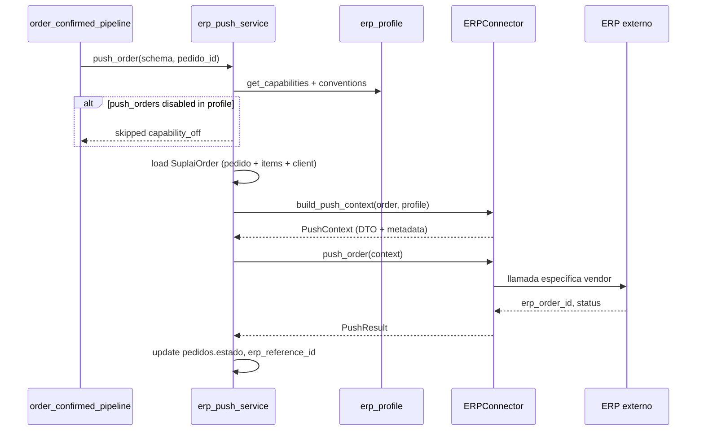

# ERP — Aislamiento de conectores y decontaminación Odoo/GEV

**Estado:** Borrador  
**Fecha:** 2026-07-03  
**Índice cross-repo:** este documento (platform)  
**Prerequisito para:** [../producto/erp-integraciones-funcionamiento-esperado.md](../producto/erp-integraciones-funcionamiento-esperado.md)  
**Complementa:** [015-odoo-clientes-nuevos-deteccion-cola-alta.md](./015-odoo-clientes-nuevos-deteccion-cola-alta.md), backend `docs/specs/005-erp-integration-engine.md`, `012-inyeccion-pedidos-erp.md`  
**Repos afectados:** `backend/` (migraciones + `erp/`), `backoffice/` (modal approve cliente, config ERP)

---

## 1) Contexto y problema

### 1.1 Qué funciona hoy

El engine ERP (`backend/erp/`) tiene una interfaz común `ERPConnector` y un servicio compartido `erp_sync_service.py` que orquesta staging, sync de precios/stock, push de pedidos y espejo de pedidos. Los conectores implementados son **Odoo**, **GEV**, **custom_rest** y **SAP** (stub).

La arquitectura es correcta en espíritu (interfaz + factory + servicio), pero la **implementación del servicio compartido y del modelo de datos** asumió Odoo como único ERP “completo” y filtró lógica específica al camino común. Eso contamina integraciones como GEV y dificulta sumar ERPs nuevos.

### 1.2 Las tres fugas actuales

| # | Fuga | Dónde vive hoy | Impacto |
|---|------|----------------|---------|
| **1** | Nombres de columnas, claves externas y convenciones **Odoo-centric** en tablas y servicios compartidos | `partner_odoo_id`, `odoo_id` en `clients.datos_personales`, listas `ERP_{nombre}`, campos del espejo de pedidos | GEV/SAP/custom no pueden reutilizar el espejo sin arrastrar semántica Odoo |
| **2** | **Push de pedidos** con lógica GEV embebida en el servicio compartido | `inject_order_to_erp` extrae `price_list_id` con `regexp_replace(lp.nombre, '[^0-9]', …)` — válido para GEV, incorrecto para Odoo | Riesgo de payloads incorrectos; un solo toggle global `push_orders_enabled` |
| **3** | **Teléfono sintético** hardcodeado en el servicio compartido | `resolve_erp_customer_phone` → `999{partner_odoo_id}` en `erp_sync_service.py`, aplicado en staging/cola sin opt-in del operador | Comportamiento Odoo impuesto a todos; no es decisión humana en el modal de alta |

### 1.3 Objetivo de este spec

**Desacoplar** la lógica específica de cada ERP del núcleo compartido, introduciendo:

1. **Perfiles de convención y mapeo** por tipo de conector (persistidos en DB).
2. **Adaptadores de push de pedidos** por conector, con flags de capacidad independientes.
3. **Resolución de teléfono** delegada al conector + propuesta explícita en UI (no auto-inventar en sync).

Este spec **no** implementa las features de producto faltantes (wizards de alta desde staging, espejo de listas de precios, etc.). Es prerequisito técnico para hacerlo sin más deuda.

---

## 2) Objetivo

| Objetivo | Métrica de éxito |
|----------|------------------|
| Núcleo ERP agnóstico del vendor | `erp_sync_service.py` no contiene regex, prefijos de teléfono ni nombres `odoo_*` en lógica de negocio |
| Mapeo externo ↔ Suplai configurable | Cada tenant con conector activo tiene perfil de convención cargado (seed por tipo + override opcional) |
| Push aislado por ERP | Cada conector implementa `build_order_payload` + `push_order`; activación por capacidad, no un solo boolean global |
| Teléfono inventado bajo control humano | Sync/cola **nunca** crea teléfono sintético; el modal de alta **puede** proponerlo si el perfil del conector lo permite |

---

## 3) Alcance

### 3.1 In scope

| Capa | Entrega |
|------|---------|
| **Backend — modelo** | Tablas de perfil de convención + migración de columnas genéricas en staging |
| **Backend — conectores** | Hooks por entidad (producto, cliente, lista, pedido, push); eliminar lógica vendor del servicio |
| **Backend — push** | Pipeline `SuplaiOrder → connector.build_push_context → connector.push_order`; flags por capacidad |
| **Backoffice** | Modal approve/link cliente: propuesta de teléfono cuando ERP no lo trae (según perfil) |
| **Migración** | Backfill de datos Odoo existentes a columnas genéricas |

### 3.2 Out of scope (spec de producto posterior)

- UI de espejo de listas de precios y wizard de alta de lista.
- Wizard de alta de producto desde `erp_products_raw`.
- Deprecar botón “Cargar clientes” auto-create.
- Conector SAP completo o reactivar push GEV real (solo dejar el aislamiento listo).
- Sync bidireccional Suplai → ERP fuera de pedidos.

---

## 4) Diseño — Perfiles de convención y mapeo (Fuga 1)

### 4.1 Concepto

Cada **tipo de conector** (`odoo`, `gev`, `custom_rest`, …) tiene una **plantilla de convención** que define:

- Qué campo del ERP es la **clave externa** por entidad.
- Cómo se **nombran** las listas de precios importadas.
- Qué campos del payload crudo mapean a columnas Suplai.
- Qué capacidades soporta (pull clientes, pull pedidos, push pedidos, teléfono sintético, etc.).

La plantilla vive en DB; al conectar un tenant se **instancia** (copia del seed + overrides mínimos del tenant).

### 4.2 Tablas propuestas

#### `core.erp_connector_profiles` (plantilla por tipo de conector)

| Columna | Tipo | Descripción |
|---------|------|-------------|
| `connector` | text PK | `odoo`, `gev`, … |
| `display_name` | text | Etiqueta humana |
| `version` | int | Para migrar perfiles sin romper tenants |
| `conventions` | jsonb | Ver §4.3 |
| `field_mappings` | jsonb | Ver §4.4 |
| `capabilities` | jsonb | Ver §4.5 |
| `created_at` / `updated_at` | timestamptz | |

#### `core.erp_tenant_profiles` (instancia por tenant — opcional override)

| Columna | Tipo | Descripción |
|---------|------|-------------|
| `tenant_id` | uuid PK FK | `distribuidoras.id` |
| `connector` | text | Redundante para query |
| `conventions_override` | jsonb | Solo deltas sobre plantilla |
| `field_mappings_override` | jsonb | Solo deltas |
| `updated_at` | timestamptz | |

Si no hay fila en `erp_tenant_profiles`, se usa el seed de `erp_connector_profiles`.

### 4.3 Bloque `conventions` (JSON)

Convenciones de **nombres y claves**, no de transformación de valores:

```json
{
  "product": {
    "external_id_field": "sku",
    "external_key_source": "default_code",
    "staging_table": "erp_products_raw",
    "staging_key_column": "sku"
  },
  "customer": {
    "external_id_field": "erp_partner_id",
    "external_key_source": "res.partner.id",
    "staging_table": "erp_customers_raw",
    "staging_key_column": "erp_partner_id",
    "phone_match_strategy": "last_10_digits"
  },
  "price_list": {
    "import_name_template": "ERP_{external_list_id}",
    "external_id_field": "erp_list_id",
    "external_key_source": "product.pricelist.id | ID_LISTA_PRECIO"
  },
  "order": {
    "external_id_field": "erp_order_id",
    "external_ref_field": "client_order_ref",
    "suplai_ref_template": "SUPPLAI-{suplai_pedido_id}",
    "staging_table": "erp_orders_raw",
    "staging_key_column": "erp_order_id"
  }
}
```

**Regla:** el servicio compartido lee `conventions.*` del perfil activo; **nunca** hardcodea `ERP_`, `SUPPLAI-`, `partner_odoo_id`, etc.

### 4.4 Bloque `field_mappings` (JSON)

Mapeo **ERP → DTO normalizado → columna Suplai** por entidad:

```json
{
  "customer": {
    "external_id": { "from": "datos_extra.odoo_id", "to": "clients.partner_erp_id" },
    "display_name": { "from": "nombre", "to": "clients.razon_social" },
    "phone": { "from": "telefono", "to": "clients.phone_number" },
    "price_list_external": { "from": "datos_extra.lista_precios_odoo", "to": "erp_customers_raw.lista_precios_erp" }
  },
  "order_push": {
    "customer_ref": { "from": "clients.partner_erp_id", "strategy": "connector.resolve_customer_for_push" },
    "line_sku": { "from": "items_pedido.product_code" },
    "line_price_list": { "from": "items_pedido.lista_precios", "strategy": "connector.resolve_price_list_for_push" }
  }
}
```

El conector implementa estrategias referenciadas (`resolve_*`) cuando el mapeo no es 1:1.

### 4.5 Bloque `capabilities` (JSON)

```json
{
  "pull_products": true,
  "pull_prices": true,
  "pull_customers": true,
  "pull_orders": true,
  "push_orders": true,
  "customer_onboarding_queue": true,
  "synthetic_phone_allowed": true,
  "auto_create_price_lists_on_sync": false
}
```

**Importante:** `auto_create_price_lists_on_sync: false` pasa a ser el default global; el sync de precios solo actualiza listas **ya vinculadas** (ver spec de producto). Durante la transición, Odoo legacy puede tener override `true` en tenant hasta migrar.

### 4.6 Migración de columnas Odoo-centric → genéricas

| Tabla / columna actual | Columna nueva | Backfill |
|------------------------|---------------|----------|
| `erp_customers_raw.partner_odoo_id` | `erp_partner_id` (bigint/text según perfil) | Copiar valor |
| `erp_orders_raw.partner_odoo_id` | `erp_partner_id` | Copiar valor |
| `erp_customer_onboarding_queue.partner_odoo_id` | `erp_partner_id` | Copiar valor |
| `clients.partner_odoo_id` | `partner_erp_id` | Copiar valor |
| `clients.datos_personales.odoo_id` | Mantener lectura legacy; escribir también `partner_erp_id` y `erp_connector` | Script one-shot |
| `listas_precios` (sin ERP id) | `erp_list_id` text nullable + `erp_connector` text nullable | Poblar desde nombre `ERP_*` donde aplique |

**Compatibilidad V1:** vistas o aliases en queries durante 1 release; deprecar columnas `*_odoo_*` en release siguiente.

### 4.7 Seeds iniciales

| Conector | `external_id` cliente | Lista import | Push pedidos | Tel. sintético |
|----------|----------------------|--------------|--------------|----------------|
| **odoo** | `res.partner.id` → `erp_partner_id` | `ERP_{pricelist.name}` | sale.order + `client_order_ref` | Permitido en UI, **no** en sync |
| **gev** | N/A (sin pull clientes) | `ERP_{ID_LISTA_PRECIO}` | Container JSON (cuando se reactive) | No |
| **custom_rest** | Según API | Configurable en override | Según API | Configurable |

---

## 5) Diseño — Push de pedidos aislado (Fuga 2)

### 5.1 Problema actual

```text
inject_order_to_erp(schema, pedido_id)
  → SQL genérico con regexp_replace en listas_precios.nombre  ← lógica GEV
  → connector.push_order(dto)  ← lógica Odoo/GEV mezclada en DTO armado afuera
```

Un solo flag `push_orders_enabled` en `core.erp_connector_configs` activa push para todo el tenant.

### 5.2 Pipeline objetivo



### 5.3 Interfaz de conector (cambios)

Extender `ERPConnector` en `base.py`:

```python
class PushContext(TypedDict):
    order: OrderDTO
    profile: dict  # convenciones + mappings del tenant
    metadata: dict

# Métodos nuevos / movidos al conector:
async def build_push_context(self, *, order_row: dict, items: list, client_row: dict, profile: dict) -> PushContext
async def push_order(self, context: PushContext) -> dict  # reemplaza firma actual basada solo en OrderDTO
```

**Reglas:**

- `OdooConnector.build_push_context`: resuelve `partner_id` vía `partner_erp_id` o teléfono; **no** usa regex en nombres de lista; precio unitario desde ítem Suplai.
- `GEVConnector.build_push_context`: mapea `ID_LISTA_PRECIO` numérico desde `listas_precios.erp_list_id`; arma payload container.
- El **servicio compartido no conoce** el formato de lista GEV ni el `client_order_ref` de Odoo.

### 5.4 Activación por capacidad (no un boolean global)

Reemplazar / complementar `push_orders_enabled`:

| Campo | Ubicación | Descripción |
|-------|-----------|-------------|
| `capabilities.push_orders` | Perfil del conector | El vendor **soporta** push |
| `push_orders_enabled` | `erp_connector_configs` | El tenant **quiere** push activo |

Push ejecuta solo si **ambos** son true. UI backoffice: toggle existente + tooltip “No disponible para este conector” si capability false (ej. GEV pausado).

**Futuro:** granularidad por canal (`push_orders_tienda`, `push_orders_field`) — out of scope; dejar hook en perfil.

### 5.5 Cola de fallback

`process_fallback_queue` permanece en servicio compartido pero delega en el mismo pipeline §5.2. Sin SQL vendor-specific en el loop.

---

## 6) Diseño — Teléfono inventado (Fuga 3)

### 6.1 Principio

| Acción | ¿Teléfono sintético? |
|--------|---------------------|
| Sync automático / job 6h | **Nunca** |
| `sync_customers_to_raw` | Guardar teléfono vacío; flag `phone_missing: true` en raw_payload |
| Cola onboarding detect | Encolar con `telefono_normalizado = null` |
| Operador abre modal Approve | Conector **propone** teléfono si `capabilities.synthetic_phone_allowed` |
| Operador confirma o edita | Se persiste el teléfono elegido |

### 6.2 Hook en conector

```python
async def propose_customer_phone(
    self,
    *,
    external_id: str,
    raw_customer: Customer,
    profile: dict,
) -> PhoneProposal:
    """
    Retorna:
      - phones: list[{ value, label, synthetic: bool }]
      - recommended: index | null
    """
```

**Odoo:** si no hay phone en partner ni hijos → propuesta `[{ value: "999{external_id}", label: "Placeholder ERP (sin teléfono)", synthetic: true }]`.

**GEV:** lista vacía (sin pull clientes).

### 6.3 UI — Modal approve cliente (backoffice)

En `ErpCustomerOnboardingQueueSection` / approve dialog:

1. Si el partner no tiene teléfono usable, llamar `GET /{schema}/erp/customer-onboarding/queue/{id}/phone-proposals`.
2. Mostrar radio: “Usar teléfono propuesto (ERP)” / “Ingresar manualmente” / “Descartar — completar después”.
3. Backend `approve` rechaza si no hay teléfono y el operador no eligió propuesta ni manual.

### 6.4 Eliminar del servicio compartido

- Borrar `resolve_erp_customer_phone`, `_synthetic_phone`, `_is_synthetic_phone` de `erp_sync_service.py`.
- Mover implementación Odoo a `OdooConnector.propose_customer_phone`.
- `export_customers_with_match` marca `telefono_sintetico: false` siempre en export; propuesta solo vía endpoint dedicado.

---

## 7) Requisitos funcionales

| ID | Requisito |
|----|-----------|
| RF-01 | Existe `core.erp_connector_profiles` con seed por conector activo en producción (`odoo`, `gev`). |
| RF-02 | Al `POST /{schema}/erp/connect`, se valida que exista perfil para el `connector` elegido. |
| RF-03 | Servicios de sync/staging leen convenciones del perfil; no hardcodean prefijos `ERP_`, `SUPPLAI-`, ni nombres `odoo_*`. |
| RF-04 | Migración renombra columnas staging a `erp_partner_id` / `erp_order_id` genéricos con backfill. |
| RF-05 | `inject_order_to_erp` delega armado de payload en `connector.build_push_context`. |
| RF-06 | Push requiere `capabilities.push_orders` **y** `push_orders_enabled`. |
| RF-07 | GEV push pausado se expresa como `capabilities.push_orders: false`; toggle UI deshabilitado con mensaje. |
| RF-08 | Sync/cola **no** asigna teléfono sintético. |
| RF-09 | Endpoint `phone-proposals` devuelve propuestas del conector para ítem de cola. |
| RF-10 | Approve exige teléfono explícito (real o sintético confirmado por operador). |
| RF-11 | `auto_create_price_lists_on_sync` default `false`; sync solo actualiza precios de listas con `erp_list_id` vinculado. |

---

## 8) Requisitos no funcionales

| ID | Requisito |
|----|-----------|
| RNF-01 | Perfil en memoria cacheado por request (no N+1 queries por ítem de pedido). |
| RNF-02 | Cambios de perfil versionados; tenant puede quedar en versión anterior hasta migrate explícito. |
| RNF-03 | Logs incluyen `connector`, `capability`, `profile_version` — nunca credenciales. |
| RNF-04 | Tests unitarios por conector para `build_push_context` y `propose_customer_phone`. |

---

## 9) Criterios de aceptación

### AC-1 — Perfil Odoo seed

- **Given** conector `odoo` en `erp_connector_profiles`
- **When** tenant BenFresh conecta Odoo
- **Then** convenciones indican `erp_partner_id` y template `ERP_{external_list_id}`; capabilities incluyen `customer_onboarding_queue: true`

### AC-2 — Push Odoo sin regex GEV

- **Given** pedido con ítems cuya lista se llama `ERP_Mayorista USD`
- **When** `inject_order_to_erp` ejecuta con conector Odoo
- **Then** el payload Odoo lleva `price_unit` correcto **sin** depender de dígitos en el nombre de lista

### AC-3 — Push GEV capability off

- **Given** tenant GEV con perfil `push_orders: false`
- **When** operador intenta activar toggle push en UI
- **Then** toggle deshabilitado; API PATCH push-orders retorna 409 `CAPABILITY_NOT_SUPPORTED`

### AC-4 — Teléfono sintético solo en approve

- **Given** partner Odoo sin teléfono en cola onboarding
- **When** corre sync automático de clientes raw
- **Then** `telefono_normalizado` es null; **no** se crea cliente en `clients`
- **When** operador aprueba eligiendo propuesta sintética
- **Then** cliente creado con teléfono confirmado y flag `datos_personales.phone_synthetic: true`

### AC-5 — Columnas genéricas

- **Given** filas existentes en `erp_orders_raw` con `partner_odoo_id`
- **When** corre migración
- **Then** `erp_partner_id` poblado; queries legacy siguen funcionando vía vista deprecada un release

---

## 10) Plan de implementación (orden sugerido)

| Fase | Entrega | Repo |
|------|---------|------|
| **A** | Tablas perfil + seeds Odoo/GEV + lectura en factory | backend |
| **B** | Migración columnas genéricas + backfill | backend |
| **C** | Refactor `build_push_context` Odoo + GEV; sacar regex de servicio | backend |
| **D** | Capabilities + gate push; UI toggle condicionado | backend + backoffice |
| **E** | `propose_customer_phone` + endpoint + modal approve | backend + backoffice |
| **F** | Eliminar teléfono sintético de sync/export; tests | backend |
| **G** | `auto_create_price_lists_on_sync: false` + match por `erp_list_id` | backend |

**Dependencia:** Fase G alinea el sync con el spec de producto; puede ir en el mismo PR que A–F o inmediatamente después.

---

## 11) Riesgos y mitigaciones

| Riesgo | Mitigación |
|--------|------------|
| Romper BenFresh en producción | Feature flag `erp_profile_v2`; shadow read de perfil sin escribir |
| Migración columnas en caliente | Vistas compat + deploy backend antes de backoffice |
| Perfil JSON demasiado libre | JSON Schema validado al guardar seed; overrides acotados |
| Operadores aprueban teléfonos sintéticos masivamente | Badge “Tel. ERP” en contacts-table; doc operativa |

---

## 12) Referencias de código (estado actual)

| Archivo | Problema |
|---------|----------|
| `erp/services/erp_sync_service.py` | Regex listas, teléfono sintético, auto-create listas |
| `erp/connectors/odoo.py` | OK como vendor; falta `build_push_context` / `propose_customer_phone` |
| `erp/connectors/gev.py` | Push pausado; lógica payload hoy mezclada en servicio |
| `erp/connectors/base.py` | DTOs con `partner_odoo_id` en `OrderDTO` |
| `components/erp-integrations-section.tsx` | Toggle push global |
| `components/erp-customer-onboarding-queue-section.tsx` | Approve sin propuesta teléfono |

---

## 13) Fuera de alcance explícito (remite a doc de producto)

Ver [../producto/erp-integraciones-funcionamiento-esperado.md](../producto/erp-integraciones-funcionamiento-esperado.md): wizards de alta, badges en listas de precios, espejo completo de listas, refresco staging en job 6h, unificación badge pedidos backoffice.
