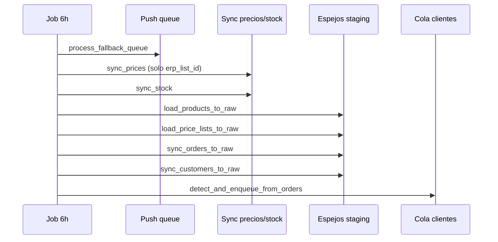

# ERP — Cierre del loop de integraciones (post decontaminación)

**Estado:** Borrador  
**Fecha:** 2026-07-03  
**Índice cross-repo:** este documento (platform)  
**Prerequisito:** [021-erp-aislamiento-conectores-decontaminacion.md](./021-erp-aislamiento-conectores-decontaminacion.md) **mergeado** (backend #127, backoffice #167)  
**Documento de producto:** [../producto/erp-integraciones-funcionamiento-esperado.md](../producto/erp-integraciones-funcionamiento-esperado.md)  
**Complementa:** [015-odoo-clientes-nuevos-deteccion-cola-alta.md](./015-odoo-clientes-nuevos-deteccion-cola-alta.md), [020-erp-odoo-ui-colapsable-asignacion-vendedores.md](./020-erp-odoo-ui-colapsable-asignacion-vendedores.md), backend `005-erp-integration-engine.md`, `012-inyeccion-pedidos-erp.md`

---

## 1) Contexto

### 1.1 Qué quedó resuelto con el spec 021

| Entrega 021 | Estado |
|-------------|--------|
| Perfiles `core.erp_connector_profiles` + capabilities por conector | ✅ |
| Columnas genéricas (`partner_erp_id`, `erp_list_id`, `erp_partner_id`) | ✅ |
| Push aislado: `build_push_context` + `push_order(PushContext)` | ✅ |
| Toggle push condicionado por `capabilities.push_orders` | ✅ |
| Teléfono sintético solo en approve + `phone-proposals` | ✅ |
| Sync/cola **no** inventan teléfono en jobs automáticos | ✅ |
| `load_profile` + gate en connect | ✅ |

### 1.2 Qué sigue faltando (gap producto)

El engine ERP ya es **agnóstico del vendor**, pero el **loop operativo** para un supervisor sigue incompleto:

- No hay espejo ni wizard de **listas de precios** ERP.
- El espejo de **productos** no muestra diff ni wizard de alta.
- **“Cargar clientes”** sigue siendo un camino peligroso (auto-create masivo).
- El **job 6h** no refresca todos los espejos y aún puede crear listas en tenants Odoo (`auto_create_price_lists_on_sync: true` transitorio).
- Badges y UX de **pedidos** / **listas** / **teléfono ERP** están dispersos o ausentes.
- **GEV** push sigue pausado (capability off) — reactivación es fase aparte.

### 1.3 Regla rectora (heredada del doc de producto)

> **Ningún job automático crea productos, clientes ni listas de precios en Suplai.**  
> La promoción ERP → Suplai es siempre **humana** (wizard o cola approve).  
> Los jobs automáticos solo **actualizan** entidades ya vinculadas y **refrescan espejos** staging.

Excepciones a eliminar en este spec:

| Comportamiento legacy | Acción en 022 |
|----------------------|---------------|
| Sync precios auto-crea listas `ERP_*` | Desactivar en perfil Odoo + match por `erp_list_id` |
| `POST /load-customers` inserta en `clients` | Deprecar UI; mantener solo espejo + cola |
| Refresh espejo solo manual | Job 6h refresca staging sin promover |

---

## 2) Objetivo

Completar el **circuito ERP → espejo → alta humana → operación Suplai → push/espejo pedidos** para tenants Odoo (BenFresh/demo como referencia), de forma extensible a GEV/custom_rest vía perfiles.

| Objetivo | Métrica de éxito |
|----------|------------------|
| Listas ERP vinculadas por ID, no por nombre | 100% precios job 6h vía `listas_precios.erp_list_id` |
| Productos: diff + wizard desde espejo | Operador alta SKU desde fila cruda sin CSV |
| Clientes: un solo camino operativo | Cola approve; load-customers oculto/410 |
| Job 6h alineado a regla rectora | Logs confirman 0 INSERT en productos/clientes/listas por job |
| UX integraciones legible | Capabilities visibles; badges consistentes |
| Checklist tenant maduro ejecutable | §7 checklist completable en BenFresh |

---

## 3) Alcance

### 3.1 In scope — seis épicas (R1–R6)

| Epic | Nombre | Prioridad |
|------|--------|-----------|
| **R1** | Listas de precios ERP (espejo + vínculo + sync) | P0 |
| **R2** | Productos — diff espejo + wizard alta | P0 |
| **R3** | Clientes — higiene y badges | P1 |
| **R4** | Pedidos — badge unificado backoffice | P2 |
| **R5** | Job 6h completo | P1 |
| **R6** | GEV fase 3 (push real) | P3 — opcional tenant |

### 3.2 Out of scope

- Conector SAP productivo.
- Sync bidireccional Suplai → ERP fuera de pedidos confirmados.
- Reemplazo total del export CSV legacy de pedidos (`exportado` manual).
- Multi-ERP simultáneo por tenant (un conector activo por tenant, como hoy).

---

## 4) Diseño por épica

### 4.1 R1 — Listas de precios ERP

#### 4.1.1 Modelo

Nueva tabla por tenant `{schema}.erp_price_lists_raw`:

| Columna | Tipo | Descripción |
|---------|------|-------------|
| `id` | serial PK | |
| `erp_list_id` | text NOT NULL | ID nativo ERP (Odoo pricelist id, GEV id numérico) |
| `nombre` | text | Nombre en ERP |
| `activa` | boolean | |
| `moneda` | text | Opcional |
| `raw_payload` | jsonb | |
| `synced_at` | timestamptz | |

Índice único: `(erp_list_id)`.

En `{schema}.listas_precios` (ya existe post-021):

- `erp_list_id` — obligatorio para sync automático de precios.
- `erp_connector` — redundante útil para UI (`odoo`, `gev`).

#### 4.1.2 Backend

| Endpoint / job | Comportamiento |
|----------------|----------------|
| `POST /{schema}/erp/load-price-lists` | Pull cabeceras → `erp_price_lists_raw` |
| `GET /{schema}/erp/price-lists-raw` | Lista paginada + diff vs `listas_precios` |
| `POST /{schema}/erp/price-lists-raw/{id}/link` | Vincula fila espejo a lista Suplai existente o crea nueva con wizard payload |
| `sync_prices_for_schema` | **Solo** upsert en listas con `erp_list_id`; **nunca** `INSERT listas_precios` |

Cambio de perfil Odoo (seed + migración de datos):

```json
"auto_create_price_lists_on_sync": false
```

Backfill BenFresh: poblar `erp_list_id` en listas cuyo nombre matchea `ERP_{id}` existente (script one-shot en implementación).

#### 4.1.3 Backoffice

- Sección **Listas crudas ERP** en Integraciones (colapsable, como productos/pedidos).
- Columnas: ID ERP, nombre, en Suplai (sí/no), lista Suplai vinculada.
- Acciones: **Vincular** (picker lista existente) / **Crear lista desde ERP** (wizard mínimo: nombre + erp_list_id readonly).
- Badge **ERP** en **Administrar listas de precios** cuando `erp_list_id IS NOT NULL`.

#### 4.1.4 Conectores

- **Odoo:** `fetch_price_list_headers()` — `product.pricelist` fields `id`, `name`, `active`, `currency_id`.
- **GEV:** usar endpoint/listado existente de listas si aplica; si no hay cabeceras separadas, derivar distinct de `fetch_prices()` agrupando por `lista_id`.
- Hook en `ERPConnector` base (default `NotImplementedError` → capability `pull_price_list_headers: false`).

---

### 4.2 R2 — Productos: diff + wizard

#### 4.2.1 Backend

Extender `GET /{schema}/erp/products-raw` (o query param `diff=true`):

| Campo derivado | Regla |
|----------------|-------|
| `match_status` | `en_suplai` \| `solo_erp` \| `solo_suplai` |
| `producto_id` | FK si `product_code == sku` |

`POST /{schema}/erp/products-raw/{id}/promote` — **no** inserta directo: devuelve DTO prefill para wizard productos existente, o crea vía endpoint productos bulk con validación.

Alternativa más simple V1: wizard front abre modal con campos prellenados y llama `POST /{schema}/productos` estándar.

#### 4.2.2 Backoffice

- Tabla productos crudos: filtros **Solo ERP** / **En ambos**.
- Botón **Dar de alta en Suplai** por fila → modal prefill (SKU readonly, nombre, stock opcional, unidad).
- Tras alta exitosa, badge **ERP** en catálogo (lógica existente por presencia en espejo).

#### 4.2.3 Job 6h

- Paso refresh: `load_products_to_raw` (sin tocar `productos`).
- Paso stock: sin cambios (solo SKUs existentes).

---

### 4.3 R3 — Clientes: higiene

#### 4.3.1 Deprecar load-customers

| Capa | Cambio |
|------|--------|
| API `POST /load-customers` | Retorna **410 Gone** con `code: DEPRECATED_USE_ONBOARDING_QUEUE` salvo header `X-ERP-Legacy-Load: 1` (ops break-glass, log warning) |
| UI Integraciones | Ocultar botón **Cargar clientes**; reemplazar copy: “Usá Sync + detectar en cola clientes” |
| Export CSV | Se mantiene (análisis offline) |

#### 4.3.2 UI espejo clientes (V1 ligera)

`GET /{schema}/erp/customers-raw` paginado (tabla ya existe):

- Filtro: sin teléfono / en cola / vinculado.
- Link a ítem de cola si `partner_erp_id` está encolado.

#### 4.3.3 Badges

| Condición | Badge |
|-----------|-------|
| `partner_erp_id` o `erp_sync_status = linked` | **ERP** |
| `erp_sync_status = not_in_erp` | **Sin ERP** |
| `datos_personales.phone_synthetic = true` | **Tel. ERP** (sub-badge en contacts-table) |

#### 4.3.4 Capabilities en UI conexión

Panel read-only debajo del conector activo:

```
Pull productos ✓ | Pull precios ✓ | Push pedidos ✓ | Cola clientes ✓ | …
```

Fuente: `GET /erp/config` → `capabilities` (ya expuesto post-021).

---

### 4.4 R4 — Pedidos: badge backoffice

Unificar visualización con field-app:

| `pedidos.estado` | Badge backoffice |
|------------------|------------------|
| `enviado_erp` + `erp_reference_id` | **Enviado ERP** (+ tooltip ref) |
| `error_sync` | **Error ERP** |
| `pendiente_sync` | **Pendiente ERP** |
| `exportado` (legacy CSV) | **Exportado** (ámbar, tooltip deprecación) |

Sin cambiar estados en BD en V1; solo UI + doc operativa.

---

### 4.5 R5 — Job 6h completo

Pipeline objetivo (`run_erp_sync_job`):



Métricas en log estructurado por tenant:

```json
{
  "event_code": "ERP_SYNC_JOB_COMPLETED",
  "prices_updated": 120,
  "lists_auto_created": 0,
  "products_raw_refreshed": 200,
  "price_lists_raw_refreshed": 5,
  "orders_synced": 470,
  "customers_raw_refreshed": 501,
  "queue_enqueued": 3
}
```

**Guardrail:** si `lists_auto_created > 0` → log level **ERROR** (regresión).

Capacidades: omitir pasos no soportados por perfil (`pull_customers: false` → skip paso 7–8).

---

### 4.6 R6 — GEV push (opcional)

Prerequisitos:

- R1 completo (listas por `erp_list_id` numérico).
- Tests container GEV en staging.

Entregas:

1. Implementar `GEVConnector.push_order` real (reemplazar mock).
2. Perfil GEV: `push_orders: true` tras QA.
3. Toggle UI habilitado; prueba E2E pedido confirmado → GEV.

Out of scope si API GEV no expone alta pedidos en el tenant piloto.

---

## 5) Requisitos funcionales

| ID | Requisito |
|----|-----------|
| RF-01 | Existe `erp_price_lists_raw` con pull manual y refresh job |
| RF-02 | Sync precios nunca crea filas en `listas_precios` cuando `auto_create_price_lists_on_sync=false` |
| RF-03 | Operador vincula lista Suplai ↔ ERP por `erp_list_id` desde UI |
| RF-04 | Productos crudos muestran `match_status` y permiten wizard de alta |
| RF-05 | `POST /load-customers` deprecado en UI; camino principal = cola onboarding |
| RF-06 | Badge **Tel. ERP** visible en clientes con teléfono sintético confirmado |
| RF-07 | Panel capabilities visible en Integraciones ERP |
| RF-08 | Job 6h ejecuta refresh espejos productos/listas/clientes según capabilities |
| RF-09 | Job 6h loguea `lists_auto_created=0` como invariante |
| RF-10 | Pedidos backoffice muestran badge alineado a field-app para estados ERP |
| RF-11 | (R6) GEV push reactivable sin cambios en servicio compartido |

---

## 6) Requisitos no funcionales

| ID | Requisito |
|----|-----------|
| RNF-01 | Wizards y tablas espejo paginadas (≤200 filas por request) |
| RNF-02 | Pull listas/productos/clientes en job: timeout por tenant ≤15 min; errores parciales no abortan otros pasos |
| RNF-03 | Proxies backoffice sync largos: `maxDuration` ≥600s en Vercel |
| RNF-04 | Migraciones en `backend/sql/` numeradas; backfill documentado por tenant |

---

## 7) Criterios de aceptación (por épica)

### AC-R1 — Listas

- **Given** lista Odoo id `5` en espejo sin vínculo  
- **When** operador crea lista Suplai desde wizard  
- **Then** `listas_precios.erp_list_id = '5'` y job 6h actualiza precios de esa lista  

- **Given** sync precios job con perfil Odoo actualizado  
- **When** corre job  
- **Then** `lists_auto_created = 0` en logs  

### AC-R2 — Productos

- **Given** SKU en espejo, no en `productos`  
- **When** operador usa wizard desde fila cruda  
- **Then** producto creado con mismo `product_code`; badge ERP visible  

### AC-R3 — Clientes

- **Given** backoffice Integraciones  
- **When** operador busca “Cargar clientes”  
- **Then** botón no visible; cola onboarding accesible  

- **Given** cliente con `phone_synthetic`  
- **When** se lista en Clientes  
- **Then** badge **Tel. ERP** visible  

### AC-R5 — Job

- **Given** tenant BenFresh Odoo, job 6h  
- **When** completa  
- **Then** métricas incluyen refresh de productos + listas + clientes raw; cola detect actualizada  

---

## 8) Plan de implementación

Orden recomendado (PRs incrementales):

| Fase | Epic | Repo(s) | Dependencia |
|------|------|---------|-------------|
| **1** | R1 migración + pull listas + sync sin auto-create | backend | 021 mergeado |
| **2** | R1 UI espejo listas + badge administrar listas | backoffice | Fase 1 |
| **3** | R1 backfill BenFresh `erp_list_id` + flip perfil Odoo | platform implementación + SQL seed update | Fase 1 |
| **4** | R2 diff productos + wizard | backend + backoffice | — |
| **5** | R3 deprecar load-customers + badges + capabilities panel | backend + backoffice | — |
| **6** | R5 job 6h pasos espejo | backend | R1 pull listas |
| **7** | R4 badge pedidos backoffice | backoffice | — |
| **8** | R6 GEV push | backend + test-api-gev | R1, QA GEV |

Estimación orientativa: R1–R3 = MVP integración madura Odoo; R4–R5 = pulido operativo; R6 = tenant-specific.

---

## 9) Riesgos

| Riesgo | Mitigación |
|--------|------------|
| BenFresh pierde precios tras apagar auto-create | Backfill `erp_list_id` antes de flip perfil; dry-run diff precios |
| Operadores dependían de load-customers | Comunicación + cola; break-glass header temporal |
| Job 6h más lento | Pasos opcionales por capability; métricas por paso |
| GEV API inestable | R6 solo tras contrato API congelado |

---

## 10) Checklist tenant maduro (operaciones)

Usar al cerrar implementación BenFresh/demo:

- [ ] Capabilities visibles en UI
- [ ] Productos operativos vinculados por SKU
- [ ] Listas con `erp_list_id` poblado
- [ ] Cola clientes vacía o justificada
- [ ] Push pedidos probado; toggle ON
- [ ] Job 6h: `lists_auto_created=0`
- [ ] Operadores capacitados en wizards (no CSV como camino principal)

---

## 11) Referencias

| Recurso | Ubicación |
|---------|-----------|
| Funcionamiento esperado + roadmap R1–R6 | `platform/docs/producto/erp-integraciones-funcionamiento-esperado.md` |
| Decontaminación (021) | `platform/docs/specs/021-erp-aislamiento-conectores-decontaminacion.md` |
| Engine ERP | `backend/docs/specs/005-erp-integration-engine.md` |
| Tablas intermedias | `backend/docs/erp-requisitos-tablas-intermedias.md` |
| Código Integraciones UI | `backoffice/components/erp-integrations-section.tsx` |
| Sync service | `backend/erp/services/erp_sync_service.py` |
| Perfiles | `backend/erp/profile.py`, `backend/sql/71_*.sql` |
