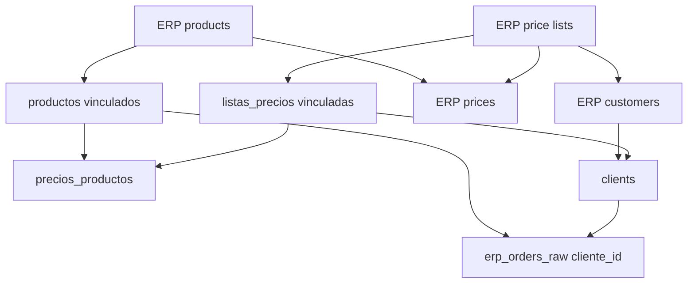

# ERP — Operación guiada, módulo de precios y dependencias cruzadas

**Estado:** Borrador  
**Fecha:** 2026-07-06  
**Índice cross-repo:** este documento (platform)  
**Prerequisito:** [022-erp-integraciones-cierre-loop-producto.md](./022-erp-integraciones-cierre-loop-producto.md) en curso o mergeado  
**Complementa:** [021-erp-aislamiento-conectores-decontaminacion.md](./021-erp-aislamiento-conectores-decontaminacion.md), [015-odoo-clientes-nuevos-deteccion-cola-alta.md](./015-odoo-clientes-nuevos-deteccion-cola-alta.md), [../producto/erp-integraciones-funcionamiento-esperado.md](../producto/erp-integraciones-funcionamiento-esperado.md)  
**Repos afectados:** `backend/`, `backoffice/`, `platform/`

---

## 1) Contexto y problema

### 1.1 Lo que ya resolvemos

El stack ERP ya tiene o está incorporando espejos por entidad:

| Entidad | Espejo / tabla operativa | Estado esperado post-022 |
|---------|--------------------------|---------------------------|
| Listas de precios | `erp_price_lists_raw` → `listas_precios.erp_list_id` | Pull + vínculo manual |
| Productos | `erp_products_raw` → `productos` | Pull + alta manual desde espejo |
| Clientes | `erp_customers_raw` + `erp_customer_onboarding_queue` → `clients` | Pull + cola approve/link |
| Pedidos | `erp_orders_raw` | Pull espejo + backfill de `cliente_id` |

También existe sync de precios, pero hoy está distribuido entre:

- Botón global **Sync precios y stock** en el bloque Productos.
- Acción por lista en el wizard **Vincular lista ERP ↔ Suplai**.
- Lógica backend `sync_prices_for_schema` / `sync_prices_for_lista`.

### 1.2 El problema nuevo

Para una implementación real, el operador necesita un flujo secuencial claro:

1. Cargar/vincular listas de precios.
2. Cargar/vincular productos.
3. Sincronizar precios.
4. Sync clientes raw + cola.
5. Resolver cola de clientes.
6. Sync/backfill pedidos.

Pero para mantenimiento diario, el mismo backoffice debe permitir corregir un caso puntual:

- Falta **un cliente** de Odoo.
- Falta **un producto**.
- Falta **un precio** para un SKU en una lista.
- Falta vincular **una lista**.
- Hay **pedidos huérfanos** sin cliente asociado.

El diseño actual permite operar varias partes, pero no muestra claramente **qué dependencia está rota** ni ofrece un módulo explícito para diagnosticar precios.

### 1.3 Regla rectora

Se mantiene la regla heredada de producto:

> **Ningún job automático crea productos, clientes ni listas de precios en Suplai.**  
> La promoción ERP → Suplai es siempre humana (wizard o cola approve).  
> Los jobs automáticos solo refrescan espejos y actualizan entidades ya vinculadas.

---

## 2) Objetivo

Convertir la sección **Integraciones ERP** en una consola operativa que sirva para:

| Caso de uso | Resultado esperado |
|-------------|--------------------|
| Implementación secuencial de tenant | El usuario sigue pasos numerados, ejecuta cada bloque y entiende cuándo puede avanzar |
| Mantenimiento puntual | El usuario encuentra rápido la dependencia faltante y reintenta solo el módulo afectado |
| Diagnóstico de precios | El usuario ve por lista/SKU qué precios son aplicables, cuáles faltan por producto o lista y cuál fue el último sync |
| Corrección de pedidos huérfanos | El usuario detecta pedidos sin cliente y entiende si debe resolver cola o correr backfill |

Métrica de éxito práctica: después de implementar este spec, el operador puede tomar una integración BenFresh/Odoo parcialmente incompleta y resolverla desde backoffice sin pedirle a ingeniería queries manuales para saber qué falta.

---

## 3) Alcance

### 3.1 In scope

| Epic | Nombre | Prioridad |
|------|--------|-----------|
| **O1** | Reordenar y numerar bloques de Integraciones ERP | P0 |
| **O2** | Panel de conexión + dependencias cruzadas pendientes | P0 |
| **O3** | Módulo explícito de Sync precios / diff de precios | P0 |
| **O4** | Filtros y deep links desde el panel hacia cada bloque | P1 |
| **O5** | Reconciliación/backfill de pedidos huérfanos | P1 |

### 3.2 Out of scope

- Auto-crear productos/clientes/listas desde jobs.
- Sync bidireccional Suplai → ERP, salvo push de pedidos ya cubierto por specs previos.
- Reemplazar el diseño de cola de clientes.
- Resolver multi-ERP simultáneo por tenant.
- Rehacer el catálogo o el módulo de listas de precios fuera de Integraciones ERP.

---

## 4) Modelo mental

### 4.1 Grafo de dependencias



La UI debe mostrar este grafo como pasos operativos y como contadores de bloqueo:

- Si falta lista, no se aplican precios de esa lista ni se puede asignar correctamente cliente por esa lista.
- Si falta producto, el precio se salta aunque la lista exista.
- Si falta cliente, el pedido queda en espejo pero no queda usable por agente/operación.

### 4.2 Estados normalizados de dependencia

Los endpoints de diagnóstico deben usar estados consistentes:

| Estado | Significado |
|--------|-------------|
| `ready` | Todas las dependencias están resueltas; se puede aplicar |
| `missing_price_list` | Falta vincular `erp_list_id` a `listas_precios` |
| `missing_product` | Falta SKU en `productos` |
| `missing_customer` | Falta partner/cliente en `clients` |
| `in_customer_queue` | Cliente detectado, pendiente en cola |
| `linked_other_list` | Cliente existe, pero tiene otra lista asignada |
| `not_supported` | El conector no soporta ese pull/diff |
| `error` | Error real de conector o validación |

Estos estados pueden ser calculados en runtime. Persistirlos solo si una tabla raw específica lo justifica.

---

## 5) O1 — Reordenar y numerar Integraciones ERP

### 5.1 Orden visual requerido

En `backoffice/components/erp-integrations-section.tsx`, después del bloque de configuración/conexión, renderizar los módulos en este orden:

| Paso | Título UI | Componente actual / nuevo |
|------|-----------|---------------------------|
| 1 | **Listas de precios ERP** | `ErpPriceListsRawSection` |
| 2 | **Productos ERP** | bloque productos raw actual, idealmente extraído a `ErpProductsRawSection` |
| 3 | **Precios ERP** | nuevo `ErpPricesSyncSection` |
| 4 | **Clientes ERP** | `ErpCustomersRawSection` |
| 5 | **Cola de clientes** | `ErpCustomerOnboardingQueueSection` |
| 6 | **Pedidos ERP** | `ErpOrdersRawSection` |

Cada card debe mostrar un prefijo visible:

```text
Paso 1 · Listas de precios ERP
Paso 2 · Productos ERP
...
```

### 5.2 Copy operativo por paso

| Paso | Descripción |
|------|-------------|
| 1 | "Traé cabeceras de listas del ERP y vinculalas con listas Suplai. Sin esto, los precios y clientes por lista quedan pendientes." |
| 2 | "Traé productos del ERP y da de alta los SKUs faltantes. Sin producto Suplai, el precio ERP se salta." |
| 3 | "Sincronizá precios por lista o globalmente. El diagnóstico muestra precios aplicables y bloqueados por lista/producto." |
| 4 | "Refrescá el espejo de clientes ERP. Esto no crea clientes; alimenta la cola." |
| 5 | "Aprobá, vinculá o descartá clientes detectados. Al resolver, se backfillean pedidos por partner." |
| 6 | "Sincronizá pedidos y revisá huérfanos sin cliente." |

### 5.3 Comportamiento para implementación vs mantenimiento

- En implementación: los pasos se usan de arriba hacia abajo.
- En mantenimiento: el usuario puede abrir cualquier paso, pero el panel de dependencias debe indicar el bloqueo más probable.
- Los collapsibles deben poder abrirse desde deep links internos del panel (`#erp-step-prices`, `#erp-step-customers`, etc.).

---

## 6) O2 — Panel de conexión + dependencias cruzadas

### 6.1 Ubicación

Agregar un panel superior dentro de **Integraciones ERP**, debajo del resumen/configuración del conector y antes del Paso 1:

```text
Estado de integración ERP

Conexión: Odoo · Activa · Último job 14:22 · Último error —
Listas: 12 vinculadas / 3 pendientes
Productos: 400 en Suplai / 28 pendientes
Precios: 1.500 aplicables / 80 bloqueados
Clientes: 320 vinculados / 44 en cola / 9 con lista pendiente
Pedidos: 300 vinculados / 18 sin cliente
```

### 6.2 Endpoint backend

Crear:

```http
GET /{schema}/erp/dependency-health
```

Respuesta:

```json
{
  "connector": {
    "type": "odoo",
    "enabled": true,
    "capabilities": {
      "pull_price_list_headers": true,
      "pull_products": true,
      "pull_customers": true,
      "pull_orders": true,
      "sync_prices": true
    },
    "last_job_at": "2026-07-06T17:22:00Z",
    "last_error": null
  },
  "price_lists": {
    "raw_total": 15,
    "linked_total": 12,
    "pending_link_total": 3
  },
  "products": {
    "raw_total": 428,
    "in_suplai_total": 400,
    "pending_promote_total": 28
  },
  "prices": {
    "erp_price_rows_total": 1580,
    "applicable_total": 1500,
    "blocked_missing_price_list_total": 0,
    "blocked_missing_product_total": 80,
    "last_sync_at": "2026-07-06T17:10:00Z"
  },
  "customers": {
    "raw_total": 501,
    "linked_total": 320,
    "queue_pending_total": 44,
    "pending_price_list_total": 9
  },
  "orders": {
    "raw_total": 318,
    "linked_customer_total": 300,
    "missing_customer_total": 18,
    "last_sync_at": "2026-07-06T17:18:00Z"
  }
}
```

### 6.3 Cálculo de métricas

| Métrica | Fuente |
|---------|--------|
| `price_lists.raw_total` | `COUNT(*) FROM erp_price_lists_raw` |
| `price_lists.linked_total` | `COUNT(*) FROM listas_precios WHERE erp_list_id IS NOT NULL` |
| `price_lists.pending_link_total` | raw sin match en `listas_precios.erp_list_id` |
| `products.pending_promote_total` | raw SKU sin `productos.product_code` |
| `prices.blocked_missing_price_list_total` | precios ERP cuyo `lista_id` no matchea lista Suplai vinculada |
| `prices.blocked_missing_product_total` | precios ERP con lista vinculada pero SKU ausente |
| `customers.queue_pending_total` | cola en `pendiente`/`en_revision` |
| `customers.pending_price_list_total` | clientes raw/cola cuyo `lista_precios_id` es null pero trae lista ERP |
| `orders.missing_customer_total` | `erp_orders_raw.partner_odoo_id IS NOT NULL AND cliente_id IS NULL` |

### 6.4 Performance

- No hacer loops de queries por fila.
- Consolidar conteos en pocas consultas agregadas.
- Para métricas de precios, si no existe `erp_prices_raw`, consultar `connector.fetch_prices()` una vez y cruzar en memoria con sets de listas/productos.
- Cache opcional por schema durante 60-120 segundos en memoria del proceso si `fetch_prices()` es costoso.

### 6.5 UI

Nuevo componente:

```text
backoffice/components/erp-dependency-health-panel.tsx
```

Estados visuales:

| Condición | Visual |
|-----------|--------|
| Todo listo | Verde / "Sin bloqueos críticos" |
| Pendientes operativos | Amarillo / link al paso afectado |
| Conector sin capability | Gris / "No soportado por este conector" |
| Error último job | Rojo / mostrar detalle resumido |

Cada tarjeta del panel debe tener acción:

- Listas pendientes → abrir Paso 1 filtrado en "Solo ERP".
- Productos pendientes → abrir Paso 2 filtrado en "Solo ERP".
- Precios bloqueados → abrir Paso 3 filtrado por motivo.
- Clientes en cola → abrir Paso 5.
- Pedidos sin cliente → abrir Paso 6 filtrado en "sin cliente".

---

## 7) O3 — Módulo explícito de Sync precios

### 7.1 Objetivo

Crear un bloque dedicado para diagnosticar y sincronizar precios ERP. Debe responder:

- ¿Qué listas tienen precios en ERP?
- ¿Cuántos precios son aplicables?
- ¿Cuántos están bloqueados por lista no vinculada?
- ¿Cuántos están bloqueados por producto faltante?
- ¿Cuál fue el último sync?
- ¿Puedo reintentar solo una lista?

### 7.2 Backend — endpoint de diagnóstico

Crear:

```http
GET /{schema}/erp/prices-diff?limit=50&offset=0&status=blocked_missing_product&q=SKU
```

Respuesta:

```json
{
  "total": 80,
  "limit": 50,
  "offset": 0,
  "summary": {
    "erp_price_rows_total": 1580,
    "applicable_total": 1500,
    "blocked_missing_price_list_total": 0,
    "blocked_missing_product_total": 80,
    "lists_with_prices_total": 12
  },
  "items": [
    {
      "erp_list_id": "14",
      "erp_list_name": "Tu cocinita (USD)",
      "suplai_lista_precios_id": 39,
      "suplai_lista_nombre": "Tu cocinita (USD)",
      "product_sku": "BF-001",
      "product_name": null,
      "erp_price": 12.5,
      "current_suplai_price": null,
      "status": "blocked_missing_product",
      "block_reason": "El SKU no existe en productos Suplai"
    }
  ]
}
```

Estados:

| `status` | Regla |
|----------|-------|
| `applicable_new` | lista vinculada + producto existe + no hay precio actual |
| `applicable_update` | lista vinculada + producto existe + precio distinto |
| `applicable_unchanged` | lista vinculada + producto existe + mismo precio |
| `blocked_missing_price_list` | `erp_list_id` sin `listas_precios.erp_list_id` |
| `blocked_missing_product` | lista vinculada, SKU ausente en `productos` |

### 7.3 Backend — acciones

Reutilizar y exponer claramente:

| Acción | Endpoint | Comportamiento |
|--------|----------|----------------|
| Sync global seguro | `POST /{schema}/erp/sync-prices` | Aplica solo `applicable_*`; devuelve bloqueados |
| Sync por lista | `POST /{schema}/erp/listas-precios/{id}/sync-prices` | Ya existe; extender respuesta con bloqueados por producto |
| Refresh diff | `GET /prices-diff` | No escribe; diagnóstico |

Si `POST /sync-prices` ya existe en backend con otro contrato, normalizar respuesta para incluir:

```json
{
  "created": 120,
  "updated": 30,
  "unchanged": 1350,
  "blocked_missing_price_list": 0,
  "blocked_missing_product": 80,
  "errors": 0
}
```

### 7.4 Persistir `erp_prices_raw` — decisión

V1 puede operar sin tabla nueva, calculando diff desde `connector.fetch_prices()`.

Crear `erp_prices_raw` solo si se cumple alguna de estas condiciones:

- `fetch_prices()` tarda demasiado para una pantalla interactiva.
- Operaciones necesita histórico de precios ERP.
- Se requiere auditar "qué precio vino del ERP en fecha X".

Si se crea en V2:

| Columna | Tipo |
|---------|------|
| `id` | bigserial PK |
| `erp_list_id` | text NOT NULL |
| `product_sku` | text NOT NULL |
| `erp_price` | numeric NOT NULL |
| `raw_payload` | jsonb |
| `synced_at` | timestamptz |

Índice único: `(erp_list_id, product_sku)`.

### 7.5 Backoffice — nuevo componente

Crear:

```text
backoffice/components/erp-prices-sync-section.tsx
```

UI:

- Header: `Paso 3 · Precios ERP`.
- Botón **Actualizar diagnóstico**.
- Botón **Sync precios aplicables**.
- Filtros:
  - Todos
  - Aplicables nuevos
  - Aplicables update
  - Sin cambio
  - Bloqueados por lista
  - Bloqueados por producto
  - Buscar SKU/lista
- Tabla:
  - ID lista ERP
  - Lista Suplai
  - SKU
  - Producto Suplai
  - Precio ERP
  - Precio actual Suplai
  - Estado
  - Acción recomendada

Acciones recomendadas:

| Estado | Acción UI |
|--------|-----------|
| `blocked_missing_price_list` | "Ir a listas" |
| `blocked_missing_product` | "Ir a productos con SKU" |
| `applicable_new` / `applicable_update` | "Sync lista" |
| `applicable_unchanged` | Sin acción |

---

## 8) O4 — Filtros y deep links

### 8.1 IDs de pasos

Cada bloque debe tener un anchor estable:

| Paso | Anchor |
|------|--------|
| Listas | `#erp-step-price-lists` |
| Productos | `#erp-step-products` |
| Precios | `#erp-step-prices` |
| Clientes raw | `#erp-step-customers-raw` |
| Cola clientes | `#erp-step-customer-queue` |
| Pedidos | `#erp-step-orders` |

### 8.2 Filtros mínimos por bloque

| Bloque | Filtros requeridos |
|--------|--------------------|
| Listas | Todos / Solo ERP / En Suplai |
| Productos | Todos / Solo ERP / En Suplai |
| Precios | Estados de §7.2 |
| Clientes raw | Todos / Sin teléfono / Vinculado / En cola / Lista pendiente |
| Cola clientes | Pendiente / En revisión / Prioridad alta / Lista pendiente |
| Pedidos | Todos / Sin cliente / Externos / Suplai / Estado ERP |

### 8.3 Navegación desde health panel

El panel debe poder abrir una sección y aplicar filtro. Si no se implementa estado global compartido en V1, aceptar deep link simple + query local:

```text
/configuracion?erpStep=prices&status=blocked_missing_product
```

---

## 9) O5 — Reconciliación de pedidos

### 9.1 Problema

Después de resolver clientes en cola, puede quedar `erp_orders_raw.cliente_id` null si:

- El pedido fue sincronizado antes del vínculo.
- Se vinculó cliente por otro camino.
- Hubo error parcial en backfill.

### 9.2 Backend

Crear:

```http
POST /{schema}/erp/orders-raw/reconcile
```

Comportamiento:

1. Busca pedidos con `partner_odoo_id IS NOT NULL AND cliente_id IS NULL`.
2. Cruza contra `clients.partner_erp_id`, `clients.partner_odoo_id`, `clients.datos_personales->>'odoo_id'`.
3. Actualiza `erp_orders_raw.cliente_id`.
4. Retorna contadores.

Respuesta:

```json
{
  "examined": 18,
  "linked": 12,
  "still_missing_customer": 6
}
```

### 9.3 Backoffice

En Paso 6:

- Mostrar contador **Sin cliente**.
- Botón **Reconciliar pedidos**.
- Si quedan faltantes, link a cola de clientes con `partner_odoo_id`/búsqueda.

---

## 10) Contratos de testing

### 10.1 Backend

Tests mínimos:

| Archivo | Casos |
|---------|-------|
| `backend/tests/erp/services/test_erp_dependency_health.py` | conteos agregados de listas/productos/clientes/pedidos |
| `backend/tests/erp/services/test_erp_prices_diff.py` | estados `applicable_*`, `blocked_missing_price_list`, `blocked_missing_product` |
| `backend/tests/erp/services/test_erp_orders_reconcile.py` | backfill por `partner_erp_id` y por `datos_personales.odoo_id` |
| `backend/tests/erp/routers/test_erp_operational_console.py` | contratos JSON de endpoints nuevos |

### 10.2 Backoffice

Tests/manual QA:

1. Tenant sin ERP configurado → panel no rompe; muestra CTA conectar.
2. Tenant con listas pendientes → panel muestra aviso y link al Paso 1.
3. SKU faltante en precios → Paso 3 muestra `Bloqueado por producto`.
4. Lista no vinculada en precios → Paso 3 muestra `Bloqueado por lista`.
5. Cliente en cola → panel y Paso 5 muestran mismo contador.
6. Pedido sin cliente → Paso 6 filtra y botón reconciliar actualiza contador.

### 10.3 Localhost

Al probar backoffice local:

- Backend en `8000`.
- Backoffice en `3000`.
- `BACKEND_URL=http://localhost:8000 npm run dev` desde `product-management-app/`.

---

## 11) Plan de implementación incremental

### Fase A — UI ordenada y health panel básico (P0)

1. Extraer el bloque productos raw a `ErpProductsRawSection` si el archivo principal queda difícil de mantener.
2. Reordenar cards en `ErpIntegrationsSection`.
3. Agregar títulos `Paso N`.
4. Crear endpoint `GET /dependency-health` con métricas que no requieren `fetch_prices()`.
5. Crear `ErpDependencyHealthPanel`.
6. Linkear métricas a pasos, aunque V1 solo abra la sección.

### Fase B — Módulo de precios (P0)

1. Implementar servicio backend `get_prices_diff(schema, filters)`.
2. Reutilizar `connector.fetch_prices()` una sola vez por request.
3. Agregar endpoint `GET /prices-diff`.
4. Normalizar respuesta de sync global y por lista con bloqueados.
5. Crear `ErpPricesSyncSection`.
6. Mover/duplicar CTA de sync precios desde Productos hacia Paso 3.

### Fase C — Filtros de mantenimiento (P1)

1. Agregar filtro "Solo ERP" en Listas si falta.
2. Agregar "Lista pendiente" en Clientes raw/Cola.
3. Agregar "Sin cliente" en Pedidos.
4. Propagar filtros desde query params/deep links.

### Fase D — Reconciliación pedidos (P1)

1. Implementar `reconcile_orders_raw_customers`.
2. Agregar endpoint `POST /orders-raw/reconcile`.
3. Agregar botón en Paso 6.
4. Testear flujo: resolver cliente en cola → reconciliar → pedido deja de estar huérfano.

---

## 12) Criterios de aceptación

### Implementación secuencial

- [ ] El usuario ve los pasos 1-6 numerados en orden operativo.
- [ ] Cada paso tiene copy que explica por qué existe y qué bloquea.
- [ ] El usuario puede ejecutar onboarding manual de tenant de arriba hacia abajo sin ir a otra pantalla.

### Mantenimiento puntual

- [ ] Desde el panel superior se ve qué entidad tiene pendientes.
- [ ] Un precio faltante se puede diagnosticar como lista faltante, producto faltante o aplicable.
- [ ] Un cliente faltante se ve en espejo/cola y se puede aprobar o vincular.
- [ ] Un pedido sin cliente se identifica y se puede reconciliar tras resolver cliente.

### Seguridad de datos

- [ ] Ningún endpoint nuevo crea clientes/productos/listas automáticamente.
- [ ] Sync de precios solo escribe `precios_productos` cuando lista y producto existen.
- [ ] Los endpoints de diagnóstico son read-only.
- [ ] Los endpoints de acción retornan contadores de aplicados/bloqueados/errores.

---

## 13) Riesgos y mitigaciones

| Riesgo | Mitigación |
|--------|------------|
| `fetch_prices()` es costoso | Cache corto por schema o V2 `erp_prices_raw` |
| El panel queda lento por demasiados conteos | Agregar endpoint agregado y evitar N+1 |
| UX demasiado cargada | Panel compacto + collapsibles; mostrar detalle solo al abrir paso |
| Operador interpreta "sync clientes" como alta automática | Copy explícito: espejo/cola, no `clients` |
| Pedidos se consideran "rotos" aunque solo sean históricos externos | Filtros por origen y ventana; copy "espejo para análisis" |

---

## 14) Entregables por repo

### `backend/`

- `routers/erp.py`
  - `GET /{schema}/erp/dependency-health`
  - `GET /{schema}/erp/prices-diff`
  - `POST /{schema}/erp/orders-raw/reconcile`
- `erp/services/erp_sync_service.py`
  - servicios de health, diff precios, sync response normalizada, reconcile pedidos
- `models/erp.py`
  - modelos Pydantic para health/diff/reconcile
- Tests en `tests/erp/services/` y routers.

### `backoffice/`

- `components/erp-integrations-section.tsx`
  - orden de pasos y composición general
- `components/erp-dependency-health-panel.tsx`
  - panel superior
- `components/erp-prices-sync-section.tsx`
  - nuevo Paso 3
- Opcional: `components/erp-products-raw-section.tsx`
  - extracción del bloque productos
- Proxies `app/api/erp/*` para endpoints nuevos.

### `platform/`

- Este spec.
- Actualizar índice/roadmap solo si se crea un índice de specs ERP.

---

## 15) Preguntas abiertas

1. ¿Conviene crear `erp_prices_raw` ahora o esperar a medir performance de `fetch_prices()` en BenFresh?
2. ¿El Paso 3 debe permitir sync global o solo sync por lista para reducir blast radius?
3. ¿El health panel debe auto-refrescar después de cada acción o solo al presionar "Actualizar estado"?
4. ¿Queremos mostrar dependencias de pedidos por producto/SKU o solo por cliente en V1?

Recomendación V1:

- No crear `erp_prices_raw` todavía.
- Permitir sync por lista y global, pero hacer más visible el sync por lista.
- Health panel con botón manual **Actualizar estado** y refresh automático después de acciones locales.
- Pedidos V1: solo cliente; productos de pedido quedan para V2.
