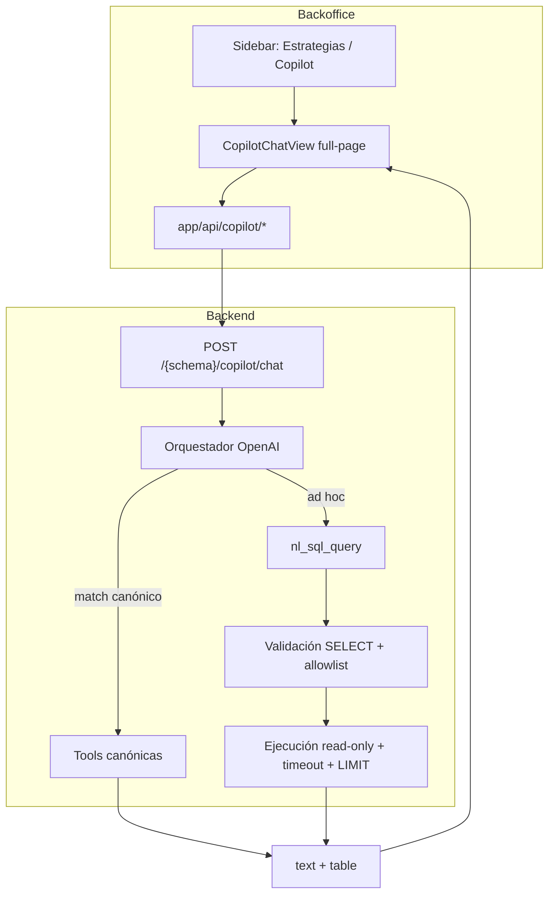

# 027 — Copilot: hablar con los datos (rediseño v1)

**Estado:** Diseño aprobado (borrador para implementación)  
**Fecha:** 2026-08-02  
**Repos:** `suplai-platform` (este doc), `backend-supabase`, `product-management-app`  
**Ramas sugeridas:** `feat/copilot-nl-data-chat`  
**Supersede parcial:** acceso/UI y superficie de artefactos de [001-suplai-copilot.md](./001-suplai-copilot.md); no invalida el contrato de ventas de 042.

---

## Objetivo

Reposicionar **Suplai Copilot** como un chat full-page (look ChatGPT) bajo **Estrategias**, siempre disponible para todos los tenants, enfocado en **hablar con los datos**: respuesta clara en texto + tabla simple. Deprecar mapas, PDF, charts ruidosos y acciones write (agenda) hasta una fase posterior.

## Decisiones de diseño técnico (con el *por qué*)

| Decisión | Elección | Por qué | Alternativa descartada |
|----------|----------|---------|------------------------|
| Motor de datos | Híbrido: tools canónicas + fallback NL→SQL | Tools dan números con contrato de ventas auditado; NL→SQL cubre preguntas ad hoc sin explotar el catálogo de tools | Solo tools (rígido) o solo NL→SQL (pierde métricas canónicas) |
| Acceso UI | Ítem de sidebar debajo de Estrategias, pantalla completa | Discovery claro; deja de competir con el resto del BO como drawer | Panel lateral / tab dentro de Estrategias |
| Look & feel | Estilo ChatGPT (thread + composer + chats recientes) | Claridad al “hablar con datos”; menos ruido visual | Canvas de artefactos multi-panel |
| Respuesta UI | Texto + tabla simple opcional | Suficiente para decidir; charts/mapas/PDF molestan hoy | Artefactos ricos (map, chart, download, action_preview) |
| Disponibilidad | Siempre on para tenants logueados | Feature de producto para todos; sin rollout por flag | `copilot_enabled` / env kill-switch |
| LLM | OpenAI (infra actual del Copilot) | Reusa keys y orquestador; menos churn operativo | Claude/Anthropic solo para SQL |
| Alcance datos NL→SQL | Core comercial tenant + lectura `core` (agente) | Cubre ventas + preguntas del agente WhatsApp | Solo ventas, o allowlist de todo el schema |
| API | Reusar `POST /{schema}/copilot/chat` + historial | Menos riesgo; auth/SSE/persistencia ya existen | Endpoint greenfield `/nl-query` |
| Schema en SQL | Siempre del tenant autenticado (path/auth) | El LLM nunca elige schema | Schema en body o inferido por el modelo |

## Alcance explícito

### Incluido (v1)

- Nav: ítem **Copilot** debajo de Estrategias; vista full-page ChatGPT-like.
- Eliminar tab lateral (`CopilotShell` / edge trigger) y layout shift asociado.
- Quitar gates `metadata.copilot_enabled` y checks equivalentes en backend/front (sin env kill-switch).
- Tools canónicas activas: `sales_top_products`, `sales_largest_order`, `sales_compare_periods`, `sales_time_series`, `metrics_agent_summary`.
- Nueva tool `nl_sql_query`: generar SELECT → validar → ejecutar read-only → explicar.
- Allowlist tablas tenant: `pedidos`, `items_pedido`, `productos`, `contactos` (+ listas de precio si el DDL estable lo permite).
- Allowlist `core`: tablas de conversaciones/métricas del agente necesarias (solo SELECT; `search_path` fijado por backend).
- Respuesta: texto + artefacto `table` opcional; front ignora el resto.
- Persistencia de conversaciones existente (por usuario, retención actual).

### Fuera de alcance (v1)

- Charts, mapas embebidos, PDF/Brevo, `agenda_create` / action preview.
- Mostrar SQL al usuario (“Ver consulta”).
- Claude/Anthropic, cuotas por tenant, secuencias multi-paso (Fase 3 histórica).
- Sniffer/Kommo.
- Rediseño del módulo Estrategias (campañas) en sí.

## Arquitectura



### Flujo por turno

1. Usuario envía pregunta en el chat full-page.
2. Orquestador OpenAI ve tools canónicas + `nl_sql_query`.
3. Si elige tool canónica → SQL/service existente (contrato ventas 042).
4. Si ad hoc → `nl_sql_query`: DDL reducido → SQL → `validate_sql` → execute read-only → explicación NL.
5. Front renderiza `content` + `table` si hay filas; descarta map/chart/download/action_preview.

### Seguridad NL→SQL

- Solo `SELECT` / `WITH`; sin multi-statement; blocklist de keywords DML/DDL.
- Allowlist de tablas; schema/search_path fijado por backend.
- `statement_timeout`, `LIMIT` filas (ej. 200), preferible sesión `default_transaction_read_only`.
- Conexión vía pooler `6543`, `statement_cache_size=0`, pools mínimos (reglas workspace).

## Orden de implementación

| Orden | Repo | Entrega |
|------:|------|---------|
| 1 | `backend-supabase` | Quitar gate tenant; reducir tools; implementar `nl_sql_query` + validación/ejecución; respuesta solo text+table |
| 2 | `product-management-app` | Nav bajo Estrategias; `CopilotChatView`; remover shell lateral y gates; render solo texto+tabla |
| 3 | `suplai-platform` | Este spec + índice 001 actualizado; evals/casos si aplica |

Merge: **backend → backoffice**.

## Migración de base de datos

Sin migración de BD obligatoria para v1.

- No se requieren tablas nuevas si se reutilizan `core.copilot_*` existentes.
- Opcional/ops: rol Postgres read-only + `GRANT SELECT` por schema tenant/`core` (infra, no migración de app). Documentar en runbook al implementar.
- Se puede dejar de usar `copilot_reports` / pending actions sin dropear tablas en v1 (deprecación suave).

## Plan de prueba en CI/CD

- Backend: tests unitarios de `validate_sql` (casos: SELECT ok, INSERT fail, multi-statement, tabla fuera de allowlist, `NO_SE_PUEDE`).
- Backend: test de orquestación con mock LLM — tool canónica vs ruta `nl_sql_query`.
- Mantener/ajustar `scripts/copilot-evals` / pytest existentes que asuman artefactos map/PDF: marcar skipped o actualizar expectativas a text+table.
- Front: sin e2e obligatorio en v1; typecheck/lint del PR.
- Checks verdes en ambos PRs antes de merge.

## Plan de prueba humana (antes del PR)

**Servicios**

| Servicio | Puerto |
|----------|--------|
| Backend | `8000` |
| Backoffice | `3000` |

```bash
# Terminal 1
cd backend-supabase && source venv/bin/activate
uvicorn main:app --reload --host 0.0.0.0 --port 8000

# Terminal 2
cd product-management-app
BACKEND_URL=http://localhost:8000 npm run dev
```

**Tenant:** cualquiera con pedidos/contactos reales (ej. `demo` / `gonzales`).

**Checklist**

1. Loguearse en `http://localhost:3000` — **no** aparece tab lateral Copilot.
2. En sidebar, debajo de Estrategias, abrir **Copilot**.
3. Empty state con sugerencias; enviar “productos más vendidos del mes” → texto + tabla (tool canónica).
4. Pregunta ad hoc (ej. “¿cuántos contactos hay por localidad?”) → texto + tabla vía NL→SQL o mensaje claro si no se puede.
5. Intentar algo write (“borrá un pedido”) → rechazo / no se puede.
6. Verificar otro tenant: Copilot visible sin tocar metadata.
7. Confirmar que Estrategias (campañas) sigue funcionando igual.

## Criterios de aceptación

- [ ] Copilot accesible desde sidebar bajo Estrategias para todo tenant logueado.
- [ ] Sin panel lateral global ni dependencia de `copilot_enabled`.
- [ ] UI full-page estilo chat; respuesta = texto + tabla opcional.
- [ ] Tools canónicas listadas responden con datos reales del tenant.
- [ ] NL→SQL valida y ejecuta solo SELECT sobre allowlist; schema scoped por auth.
- [ ] Map/PDF/chart/agenda no aparecen en la UI nueva.
- [ ] PRs backend + backoffice mergeables en ese orden.

## Referencias

- Índice histórico: [001-suplai-copilot.md](./001-suplai-copilot.md)
- Diseño companion: [../superpowers/specs/2026-08-02-copilot-hablar-con-datos-design.md](../superpowers/specs/2026-08-02-copilot-hablar-con-datos-design.md)
- Guía producto previa (parcialmente obsoleta en acceso/artefactos): [../suplai-copilot-guia-completa.md](../suplai-copilot-guia-completa.md)
