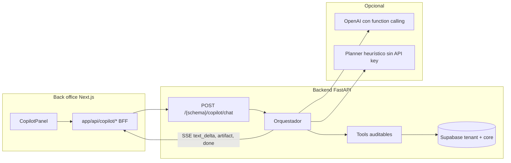

# Suplai Copilot — Guía completa (producto, uso y capacidades)

**Versión del documento:** 2026-06-04  
**Audiencia:** operadores del back office, gerencia comercial, capacitación, marketing y sistemas de IA que explican el producto.  
**Estado del producto:** Fases 0, 1 y 2 implementadas; Fase 3 (secuencias multi-paso) en diseño.

---

## 1. Resumen ejecutivo

**Suplai Copilot** es el asistente de inteligencia comercial integrado en el **back office** de Suplai Sales (panel web donde la distribuidora configura catálogo, clientes, agendas y métricas). Permite hacer preguntas en lenguaje natural sobre **ventas, clientes, territorio y desempeño del agente WhatsApp**, y recibir respuestas con **números verificados**, **tablas**, **gráficos**, **mapas** e incluso **informes PDF** — sin navegar módulo por módulo ni armar reportes a mano.

No es el chat de WhatsApp que usan los puntos de venta. No reemplaza al **agente conversacional** que atiende pedidos por Meta. **Complementa** el dashboard, el mapa comercial y la agenda: concentra en una conversación lo que antes exigía saltar entre pantallas.

**Promesa de valor en una frase:** *“Preguntá en español (o portugués/inglés) y obtené respuestas de negocio con datos reales de tu distribuidora, listas para decidir o compartir.”*

---

## 2. Para quién es y cuándo usarlo

### 2.1 Perfiles que más se benefician

| Perfil | Casos típicos |
|--------|----------------|
| **Gerente comercial / dueño** | Comparar mes vs mes, ver top de productos, exportar PDF para reunión |
| **Operador de back office** | Consultar pedido grande del mes, clientes en mapa por categoría, resumen del agente |
| **Equipo de marketing / campañas** | Crear envíos de agenda (plantillas Meta) con preview y confirmación |
| **Implementador Suplai** | Validar que métricas del Copilot coinciden con pedidos confirmados del tenant |

### 2.2 Cuándo usar Copilot vs otras herramientas Suplai

| Necesidad | Herramienta recomendada |
|-----------|-------------------------|
| Probar cómo responde el bot WhatsApp a un mensaje | **Conversaciones → Agent Chat Preview** (no es Copilot) |
| Ver KPIs fijos del dashboard | **Dashboard / Métricas** (legacy; ranking de productos puede diferir del Copilot hasta unificación) |
| Explorar mapa con filtros manuales | **Mapa comercial**; Copilot puede **mostrar un mapa embebido** en la conversación |
| Programar envíos recurrentes con UI clásica | **Agenda**; Copilot puede **crear agenda** con confirmación explícita |
| Recomendaciones ML de combos | **Sales Engine** (futuro: integración opcional vía tool) |
| Análisis de chats vendedor en Kommo | **Sniffer** — **fuera de alcance** del Copilot |

---

## 3. Dónde está y cómo se abre

### 3.1 Ubicación en el back office

- **Nombre visible:** Suplai Copilot  
- **Acceso:** pestaña lateral fija en el borde derecho de la pantalla (ícono con destellos / “Copilot”), visible en todo el back office cuando está habilitado.  
- **Panel:** se desliza desde la derecha; puede **expandirse** para ver chat y artefactos con más espacio.  
- **Idiomas de interfaz:** español, portugués e inglés (respuestas del asistente siguen el idioma configurado en el panel).

### 3.2 Requisitos para que aparezca

1. La distribuidora debe tener **`copilot_enabled: true`** en metadata (`public.distribuidoras`). Por defecto está **deshabilitado** hasta rollout por tenant.  
2. El servidor backend debe tener Copilot activo globalmente (`COPILOT_ENABLED`).  
3. El usuario debe estar **logueado** en el back office con el mismo esquema (`x-schema-name`) que el resto del panel.  
4. Migraciones de base en schema **`core`**: tablas `copilot_conversations`, `copilot_messages`, `copilot_reports`, `copilot_pending_actions`, `copilot_action_log`.

Si no está habilitado, el usuario no ve el acceso o recibe mensaje de que Copilot no está disponible para su distribuidora.

---

## 4. Qué NO es (límites claros para capacitación)

- **No** chatea con clientes finales por WhatsApp.  
- **No** accede a conversaciones de **Kommo / Sniffer**.  
- **No** inventa cifras: los números salen de **consultas auditables** a la base (tools), no de “imaginación” del modelo.  
- **No** ejecuta SQL libre generado por la IA.  
- **No** comparte historial entre usuarios del mismo tenant: cada operador ve **solo sus conversaciones**.  
- **No** modifica pedidos masivamente ni estados de pedido vía chat (fuera de alcance MVP).  
- **No** incluye (aún) **secuencias multi-paso** de seguimiento automático (Fase 3).  
- Algunas tools del catálogo extendido (`orders_list`, `order_detail`, `predict_replenishment_top`, `agenda_update`) están **documentadas en spec** pero **no todas implementadas** en el runtime actual; la lista de la sección 6 refleja lo **disponible hoy**.

---

## 5. Cómo funciona (explicación en dos niveles)

### 5.1 Nivel usuario (sin tecnicismos)

1. Escribís una pregunta o elegís una **pregunta sugerida**.  
2. El sistema interpreta qué datos necesita (productos más vendidos, comparación de meses, mapa de clientes, etc.).  
3. Consulta **tu base de pedidos y clientes** con reglas fijas de negocio (ver sección 7).  
4. Te responde con **texto breve** y, debajo, **artefactos visuales** (tabla, gráfico, mapa, botones de PDF o confirmación).  
5. Podés seguir preguntando en la misma conversación, generar un **PDF del análisis** o **confirmar una acción** (agenda) si el asistente lo propone.

### 5.2 Nivel técnico (para IA de soporte o implementadores)



- **Runtime del LLM:** solo en **backend** (secretos, auditoría). El navegador **nunca** llama a OpenAI.  
- **Sin `OPENAI_API_KEY`:** el backend usa un **planner heurístico** por palabras clave; las mismas tools y artefactos funcionan (útil en dev o contingencia).  
- **Con OpenAI:** una ronda de **function calling** elige tools; los resultados se transforman en artefactos; el texto final se compone de forma **determinística** a partir de los datos (no se confía en el modelo para inventar KPIs).  
- **Persistencia:** conversaciones y mensajes en `core.copilot_*`, keyed por `tenant_id` + `user_id`. Retención **90 días**.  
- **Acciones de escritura:** flujo `dry_run` → `confirm_token` (TTL 10 min, un solo uso) → `POST .../actions/confirm` → registro en `copilot_action_log`.

---

## 6. Capacidades por fase (qué puede hacer hoy)

### Fase 0 — Analítica conversacional (MVP)

**Lectura de datos** con tools dedicadas:

| Capacidad | Qué responde | Artefactos típicos |
|-----------|--------------|-------------------|
| **Top productos** | Ranking por cantidad UMV, monto o pedidos distintos | KPI + tabla |
| **Mayor pedido** | Cliente y monto del pedido más alto en el periodo | KPI + tabla |
| **Resumen agente** | Conversaciones, carritos, pedidos confirmados del agente WhatsApp | Fila de KPIs |
| **Comparar periodos** | Este mes vs anterior (o ventanas configuradas) con % de variación | KPIs con delta |
| **Serie temporal** | Evolución de monto y cantidad de pedidos por día/semana/mes | Gráfico de línea |

**UX adicional:** historial de conversaciones propias, chips de preguntas sugeridas, disclaimer de métricas bajo cada respuesta numérica.

**Preguntas sugeridas integradas (ES):**

1. ¿Cuál fue el producto más vendido el mes pasado?  
2. ¿Quién hizo el pedido más grande el último mes?  
3. Resumen del agente esta semana  
4. Compará ventas de este mes vs el anterior  

### Fase 1 — Informes, mapa y periodos

| Capacidad | Descripción |
|-----------|-------------|
| **Mapa embebido** | Clientes geolocalizados (GeoJSON), colores por categoría: VIP, CHURN_RISK, LOST, DEFAULT |
| **Comparación de periodos** | Resolución de fechas en servidor (“último mes”, “trimestre anterior”) |
| **PDF** | Botón “Generar informe PDF” a partir de la conversación con artefactos |
| **Descarga PDF** | Enlace de descarga vía proxy autenticado |
| **Email PDF** | Envío al **email del usuario logueado** vía Brevo (opcional; si falla el mail, el PDF sigue disponible para descarga) |

**Ejemplos de lenguaje natural:**

- “Mostrá en mapa clientes en riesgo de churn del vendedor 5”  
- “Evolución mensual de ventas últimos 6 meses”  
- “Generá un informe PDF de este análisis y enviámelo por mail”

### Fase 2 — Acciones con confirmación (agenda)

| Capacidad | Descripción |
|-----------|-------------|
| **Crear agenda** | Envío programado a **grupo** o **cliente** con **plantilla Meta** (recurrente o puntual) |
| **Preview** | Artefacto `action_preview` con resumen (destino, días, hora, plantilla) |
| **Confirmar / Cancelar** | Sin confirmación explícita **no** se crea nada en `{schema}.agenda` |
| **Auditoría** | Cada confirmación guarda `user_id`, `user_email`, payload y resultado |

**Importante para capacitación:** todos los roles del back office pueden confirmar en v1; la trazabilidad es por **email del operador**, no por matriz de permisos.

**Ejemplo de pedido:**

> “Creá agenda recurrente los martes a las 10:00 para el grupo 3 con la plantilla [UUID]”

El asistente devuelve preview → el usuario pulsa **Confirmar** → mensaje de éxito con ID de agenda y “Acción registrada por {email}”.

**Token de confirmación:** válido **10 minutos**, un solo uso. Si expira, hay que pedir la agenda de nuevo.

### Fase 3 — Próximamente (no disponible)

- **Secuencias de seguimiento multi-paso** (audiencia + pasos con delays y condiciones).  
- Diseño previsto: el Copilot arma la secuencia en preview; tras confirmación se persiste y activa (posible integración con n8n / workers existentes).  
- En UI puede mostrarse como “Próximamente”.

---

## 7. Contrato de ventas (cómo interpretar los números)

Esta sección es crítica para confianza del usuario y para que una IA de soporte no contradiga al producto.

### 7.1 Qué cuenta como “venta”

- Solo pedidos en estado **`confirmado`**.  
- **No** hace falta que el pedido esté **`descargado`** al ERP para contarlo.  
- Pedidos cancelados/anulados **no** entran.  
- Si el usuario pide explícitamente “solo descargados”, es un filtro especial documentado en la respuesta (no es el default).

### 7.2 Cantidades y montos

| Concepto | Definición |
|----------|------------|
| **Cantidad vendida** | Suma de `cantidad_solicitada` en ítems (UMV — unidad de medida de venta) |
| **Precio** | `precio_unitario` aplicado en el pedido (promociones ya reflejadas) |
| **Monto de línea** | precio_unitario × cantidad_solicitada |
| **“Más vendido” (default)** | Orden por **cantidad UMV**, no por “cantidad de filas en la base” |

### 7.3 Listas de precios

El ranking puede incluir **desglose por lista de precios** del ítem (nombre de lista cuando existe). Eso explica por qué el mismo SKU puede tener montos distintos según canal/lista.

### 7.4 Diferencia con el dashboard clásico

Hasta unificación explícita, el **dashboard legacy** (SPEC-029) puede rankear productos por **conteo de filas** en `items_pedido`. **Suplai Copilot usa exclusivamente el contrato SPEC-042.** Si un usuario compara números Copilot vs dashboard, explicar esta diferencia — no es un bug del Copilot.

### 7.5 Texto de disclaimer (mostrado en UI)

> Ventas según pedidos **confirmados** en Suplai. Cantidades en UMV; montos con el precio aplicado en cada línea (incluye promociones). Listas de precios según el ítem del pedido.

Versión corta para voz en video: *“Los números son pedidos confirmados en Suplai, con las cantidades y precios reales de cada línea.”*

---

## 8. Artefactos: el “canvas” de resultados

Debajo del chat, el Copilot apila **artefactos** validados (no HTML arbitrario del modelo).

| Tipo | Qué muestra | Cuándo aparece |
|------|-------------|----------------|
| **kpi_row** | Tarjetas con etiqueta, valor y opcional % vs periodo anterior | Top producto, mayor pedido, comparación |
| **table** | Tabla con columnas definidas | Rankings, listas de pedidos |
| **chart** | Barras, líneas o torta (Recharts) | Series temporales |
| **map** | Google Maps con pins por categoría de cliente | Consultas de territorio / VIP / churn |
| **download** | Estado del PDF (generando / listo) + botón descargar | Tras generar informe |
| **action_preview** | Resumen de agenda + Confirmar / Cancelar | Fase 2 write |
| **markdown** | Texto simple (errores o confirmaciones) | Mensajes auxiliares |

**Seguridad:** el cliente valida esquemas (Zod); tipos desconocidos se rechazan; markdown sin HTML crudo no confiable.

---

## 9. Flujos paso a paso (guiones para capacitación)

### 9.1 Consulta de ventas

1. Abrí Suplai Copilot desde la pestaña derecha.  
2. Tocá “¿Cuál fue el producto más vendido el mes pasado?” o escribí tu variante (“top 10 por facturación últimos 90 días”).  
3. Esperá “Analizando…” — podés ver texto aparecer en streaming.  
4. Revisá KPI + tabla; leé el disclaimer.  
5. Opcional: preguntá “compará con el mes anterior” en la misma conversación.

### 9.2 Mapa comercial desde el chat

1. Preguntá: “Mostrá clientes VIP en el mapa” o “clientes en riesgo de churn”.  
2. Revisá el mapa embebido y la leyenda de colores.  
3. Para edición fina o filtros avanzados, abrí el **Mapa comercial** del menú principal.

### 9.3 Informe PDF y email

1. Después de una o más respuestas con datos, usá **“Generar informe PDF”**.  
2. Cuando esté listo, aparece artefacto de descarga.  
3. **Descargar** guarda el PDF en tu equipo.  
4. **Enviar a mi email** usa el correo de tu usuario en Suplai (si no tenés email cargado, solo descarga).  
5. Si Brevo falla, el PDF sigue disponible — reintentá descarga.

### 9.4 Crear agenda con confirmación

1. Pedí en lenguaje natural: grupo o cliente, días, hora, UUID de plantilla Meta.  
2. Revisá el bloque amarillo de **preview** (destino, tipo, plantilla, días, hora).  
3. **Confirmar** solo si está correcto; **Cancelar** descarta sin cambios.  
4. Tras éxito, verificá en el módulo **Agenda** y el mensaje de auditoría con tu email.

---

## 10. Privacidad, historial y cumplimiento

| Tema | Comportamiento |
|------|----------------|
| **Historial** | Por usuario; otro operador del mismo tenant **no** ve tus chats |
| **Retención** | **90 días**; job de limpieza elimina mensajes antiguos |
| **Auditoría write** | `copilot_action_log` con quién confirmó qué y cuándo |
| **Datos enviados al LLM** | Mensaje del usuario + contexto tenant/locale; **no** se envían secretos del tenant; resultados numéricos vienen de tools locales |
| **Cuotas LLM** | Sin límite por tenant en v1 (telemetría preparada para v2) |

---

## 11. Catálogo ampliado de preguntas (piloto y marketing)

Usar como chips, guiones de video o evaluaciones de calidad:

1. ¿Producto más vendido del trimestre calendario anterior? (cantidad y monto)  
2. ¿Cliente con el pedido más grande el último mes?  
3. Compará ventas confirmadas este mes vs el anterior (monto y cantidad de pedidos).  
4. Top 10 productos por facturación últimos 90 días.  
5. Evolución mensual de pedidos confirmados (últimos 6 meses).  
6. ¿Cuántas conversaciones iniciadas y cuántos pedidos confirmados esta semana? (agente)  
7. Performance de plantilla Meta X en el último mes.  
8. Clientes inactivos que no respondieron plantillas.  
9. Mostrá en mapa clientes CHURN_RISK.  
10. Generá PDF del análisis de este chat y enviámelo por mail.  
11. Creá agenda recurrente martes 10:00 grupo Z con plantilla W.

**Tips para mejores respuestas:**

- Indicá **periodo** (“mes pasado”, “últimos 90 días”, “este mes vs anterior”).  
- Para mapas, mencioná **categoría** (VIP, churn) o **vendedor** si aplica.  
- Para agenda, incluí **ID de grupo/cliente**, **días/hora** y **UUID de plantilla Meta**.  
- Si la respuesta es vacía, acotá fechas o verificá que existan pedidos **confirmados** en ese rango.

---

## 12. Mensajes clave para marketing y video

### 12.1 Propuesta de valor (30 s)

*“Suplai Copilot es tu analista comercial dentro del back office: preguntás en tu idioma y obtenés tablas, gráficos y mapas con datos reales de tus pedidos confirmados — sin Excel, sin diez pantallas. Cuando necesitás compartir, generás un PDF o te lo mandás por email. Y si querés programar un envío de WhatsApp, lo preparás en el chat y lo confirmás con un clic, quedando registrado quién lo hizo.”*

### 12.2 Tres pilares para campaña

1. **Confianza en los datos** — ventas = confirmados; cantidades en UMV; precios reales de línea.  
2. **Velocidad de decisión** — de pregunta a gráfico en segundos.  
3. **Acción responsable** — nada se escribe en agenda sin preview y confirmación auditada.

### 12.3 Objeciones frecuentes (FAQ)

**¿Reemplaza al agente WhatsApp?**  
No. El agente atiende PdV; el Copilot ayuda al equipo interno a analizar y operar.

**¿Los números pueden estar mal?**  
El Copilot no inventa cifras; si hay diferencia con un reporte viejo del dashboard, suele ser por definición distinta de “más vendido” (ver sección 7.4).

**¿Puede borrar o cambiar pedidos?**  
No en el MVP. Solo creación de agenda con confirmación.

**¿Funciona sin internet / sin OpenAI?**  
Requiere conexión al backend Suplai. Sin API key de OpenAI igual responde vía planner heurístico con las mismas consultas.

**¿Por qué no veo el Copilot?**  
Tu distribuidora puede no tener el flag activado; contactá a implementación Suplai.

**¿Kommo o conversaciones de vendedores?**  
No; eso es otro producto (Sniffer).

---

## 13. Activación e implementación (referencia interna)

```sql
-- Activar Copilot para un tenant (ejemplo)
UPDATE public.distribuidoras
SET metadata = metadata || '{"copilot_enabled": true}'::jsonb
WHERE schema_name = 'tu_schema';
```

Migraciones backend (orden): `33_copilot_tables.sql`, `34_copilot_reports.sql`, `35_copilot_actions.sql`.

Variables de entorno relevantes: `COPILOT_ENABLED`, `OPENAI_API_KEY`, `OPENAI_MODEL`, `BREVO_API_KEY`, `COPILOT_REPORT_FROM_EMAIL`.

---

## 14. Roadmap visible al usuario

| Fase | Estado | Beneficio |
|------|--------|-----------|
| 0 | Entregado | Chat + lectura + tablas/gráficos/KPI |
| 1 | Entregado | PDF, email, mapa, comparación y series |
| 2 | Entregado | Crear agenda con confirmación y audit log |
| 3 | Diseño | Secuencias automáticas de seguimiento |

Evolución esperada: unificar métricas dashboard ↔ Copilot; tools de detalle de pedido y ML; cuotas de uso por tenant; matriz de permisos opcional para writes.

---

## 15. Glosario

| Término | Significado |
|---------|-------------|
| **UMV** | Unidad de medida de venta en ítems de pedido |
| **Pedido confirmado** | Estado que cuenta como venta en Copilot |
| **Artefacto** | Bloque visual estructurado (tabla, gráfico, mapa, etc.) |
| **Tool** | Función backend que consulta datos con reglas fijas |
| **BFF / Proxy** | Capa Next.js que reenvía auth al backend sin exponer secretos |
| **Tenant / schema** | Distribuidora aislada en PostgreSQL (`gonzales`, `demo`, …) |
| **Plantilla Meta** | Plantilla aprobada de WhatsApp Business para envíos de agenda |

---

## 16. Instrucciones para la IA que capacita usuarios

Al explicar Suplai Copilot a humanos:

1. Empezá por **para quién es** (equipo interno del distribuidor) y **dónde se abre** (pestaña derecha del back office).  
2. Enfatizá **pedidos confirmados** y el disclaimer antes de interpretar rankings.  
3. Mostrá **un ejemplo concreto** (producto más vendido mes pasado) y señalá tabla + KPI.  
4. Separá siempre de **Agent Chat Preview** (WhatsApp de prueba).  
5. Para acciones, insistí en **Confirmar** y en la **auditoría por email**.  
6. Si el usuario no ve Copilot, derivá a **habilitación por tenant**, no a “error de login”.  
7. No prometas Fase 3 ni integraciones Sniffer/Kommo como disponibles hoy.  
8. Usá tono práctico: “preguntá como le hablarías a un analista”, con periodos claros.

---

## Referencias técnicas

- Índice: `platform/docs/specs/001-suplai-copilot.md`  
- Backend: `backend-supabase/docs/specs/041-suplai-copilot-plataforma.md`, `042-suplai-copilot-contrato-ventas.md`  
- UI: `product-management-app/doc/specs/039-suplai-copilot-ui-artefactos.md`  
- Router: `backend-supabase/routers/copilot.py`  
- Tools: `backend-supabase/services/copilot/tools.py`  
- UI shell: `product-management-app/components/copilot/CopilotShell.tsx`

---

*Documento generado para alimentar asistentes de capacitación, guiones de video y material de difusión. Actualizar cuando cambien fases o tools implementadas.*
